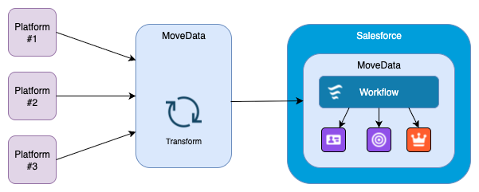

# Architectural Overview

## Overview 

MoveData operates as a modern, cloud-native integration platform specifically architected to bridge the gap between fundraising platforms and Salesforce environments for nonprofit organisations. Our platform transforms the complex challenge of data synchronisation into a seamless, automated process that respects your organisation's unique business rules whilst maintaining the highest standards of data integrity and security.

Built on enterprise-grade infrastructure and designed with nonprofit workflows in mind, MoveData eliminates the traditional barriers that prevent organisations from having real-time, accurate fundraising data in their Salesforce CRM. Rather than requiring manual data entry, complex custom development, or inflexible point-to-point integrations, MoveData provides a sophisticated yet user-friendly platform that automatically handles the intricacies of data transformation, validation, and integration.

The architecture leverages industry-leading cloud services to provide scalable, secure, and reliable data processing capabilities. Every component has been designed with the understanding that nonprofit organisations need both technical excellence and operational simplicity - delivering enterprise-level capabilities through intuitive interfaces that empower users rather than overwhelm them.

## How MoveData works. 

MoveData's architecture follows a sophisticated three-stage lifecycle that transforms every meaningful fundraising interaction into actionable Salesforce data. This process operates continuously, handling everything from individual small donations to large-scale campaign activities with equal precision and reliability.

The platform's event-driven architecture ensures that each transaction is processed individually, maintaining complete data integrity and enabling real-time responsiveness. Unlike traditional batch processing systems, MoveData's approach means your Salesforce data reflects current supporter activity immediately, enabling timely stewardship and responsive fundraising operations.

### Data Processing Architecture

<figure><figcaption></figcaption></figure>

The MoveData platform processes fundraising data through a sophisticated three-stage lifecycle:

### Stage 1: Data Ingestion

The first stage captures every meaningful interaction from your fundraising ecosystem, creating a comprehensive foundation for data processing. This stage operates with intelligent redundancy and error handling to ensure no important fundraising activity is missed.

* **Real-time API Events**: Instant notification processing as transactions occur in fundraising platforms. These push-based integrations provide immediate notification when supporters take action, whether making a donation, registering for an event, or updating their profile information.
* **Scheduled Polling**: Regular data retrieval for platforms with API limitations, configurable from 10 minutes to 24 hours based on your organisation's needs and platform capabilities. This method includes intelligence to minimise unnecessary data transfer whilst ensuring complete coverage of all fundraising activities.
* **File Processing**: Batch upload capabilities for historical or bulk data import, supporting both one-time data migration and regular file-based integrations. The system includes sophisticated parsing capabilities that can handle various file formats, custom field mappings, and data validation to ensure quality imports.

### Stage 2: Transformation Engine


For detailed information, see [platform-architecture.md](architectural-overview/platform-architecture.md "mention")


The transformation stage represents the sophisticated intelligence layer of MoveData's architecture, where raw fundraising platform data is converted into standardised formats, ready to be dispatched to MoveData's Salesforce handlers. This stage handles the complex business logic required to map diverse fundraising platform structures into consistent, actionable data.

* **Data Assembly**: Consolidation of primary event data, supporting information, supporter context, and campaign attribution into comprehensive notification packages. The system intelligently assembles related information from multiple API endpoints or data sources to create complete, contextual notifications that require no external dependencies for processing.
* **Field Mapping**: Automated conversion of platform-specific data fields to MoveData standards using sophisticated mapping logic that understands fundraising platform conventions and Salesforce data requirements. This includes handling of complex field types, currency conversion, date format standardisation, and custom field mappings.
* **Data Validation**: Comprehensive quality checks that ensure data integrity throughout the transformation process. This completeness verification helps ensure every notification is ready for successful processing.
* **Standardisation**: Creation of uniform notification format for consistent processing across all fundraising platforms and Salesforce configurations. This standardisation layer ensures that regardless of the source platform, data arrives in Salesforce in a predictable, high-quality format.

### Stage 3: Salesforce Execution


For detailed information, see [salesforce-architecture.md](architectural-overview/salesforce-architecture.md "mention")


The final stage represents where standardised notifications are transformed into actual Salesforce records through sophisticated business rule processing and native Salesforce integration capabilities. This stage ensures that data not only arrives in Salesforce but aligns to your organisation's specific processes and requirements.

* **Native Lightning Application**: A purpose-built Salesforce Lightning app that provides complete visibility into notifications processed by MoveData and the resulting Salesforce records created. Users can view detailed notification histories, track the transformation from fundraising platform events to Salesforce data, and monitor the status of record creation processes. The application enables teams to verify that donations, contacts, campaigns, and other records have been created correctly, whilst providing comprehensive audit trails showing exactly how fundraising platform data became Salesforce records.
* **MoveData Extensions**: Purpose-built components for donation processing, commerce support, and data model compatibility that work seamlessly with Standard Salesforce, NPSP (Nonprofit Success Pack), and Nonprofit Cloud architectures. These extensions handle the complex logic required to create appropriate record types, establish proper relationships, and apply nonprofit-specific business rules without requiring custom development.
* **Custom Business Rules**: Configurable Lightning Flows for organisation-specific requirements that can be easily modified with limited technical expertise. These flows enable complex data transformation, conditional processing, integration with external systems, and custom notification workflows tailored to your organisation's unique processes.

