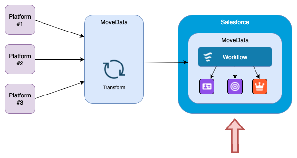

# Salesforce Architecture

<figure><figcaption></figcaption></figure>

## Overview

MoveData is built to run within Salesforce as a managed package, providing a comprehensive integration platform designed exclusively for nonprofits. The architecture supports extensive configuration and customisation pathways including Apex and Lightning Flow extensibility, enabling organisations to implement business rules tailored to their specific needs.

The platform operates as a native Salesforce application that transforms fundraising platform events into actionable Salesforce data. The following architecture ensures seamless integration with your existing Salesforce environment whilst maintaining the flexibility to adapt to unique organisational requirements.

## Core Architecture Components

### Salesforce Managed Package

MoveData operates as a Salesforce managed package, which provides several key advantages:

* **Native Integration**: Runs natively entirely within your Salesforce org
* **Data Integrity**: Rolls back changes when an error occurs
* **Security**: Leverages Salesforce's enterprise-grade security model
* **Upgrades**: Updates and improvements delivered through the managed package
* **Customisation**: Full access to Salesforce's declarative customisation tools

### Schema-Driven Processing

MoveData employs a schema-driven approach that standardises data from diverse fundraising platforms into unified structures, delivering significant operational and cost benefits for nonprofit organisations.

**Standardisation Benefits:**

Rather than building separate integrations for each fundraising platform's unique data format, MoveData transforms all incoming data into standardised schemas. This approach provides several critical advantages:

* **Reduced Integration Complexity**: A single set of business rules handles data from multiple platforms, eliminating the need to develop and maintain platform-specific processing logic
* **Lower Maintenance Costs**: Updates to business rules apply across all integrated platforms simultaneously, rather than requiring separate modifications for each integration
* **Faster Implementation**: New platform integrations leverage existing schema processing, dramatically reducing setup time from weeks to hours
* **Consistent Data Quality**: Standardised validation and transformation rules ensure uniform data quality regardless of source platform

**Core Schema Types:**

* **Donation Schema**: Processes individual gifts, recurring donations, matched gifts, tributes, pledges and fundraiser registrations from fundraising platforms into consistent Salesforce donation records
* **Commerce Schema**: Handles ticket sales, merchandise, and event registrations across different platforms, creating uniform commerce records in Salesforce

**Cost and Complexity Reduction:**

This schema-driven architecture means that adding an additional fundraising platform requires minimal additional effort compared to traditional point-to-point integrations. The standardisation layer absorbs platform differences, allowing your organisation to focus on fundraising strategy rather than technical integrations.

### Extension Architecture

**Deployment and Maintenance Benefits:**

The extension architecture delivers significant operational advantages:

* **Rapid Implementation**: Extensions install with pre-configured business rules, field mappings, and processing logic, reducing setup time from weeks to hours
* **Feature Upgrades**: Extensions receive continuous improvements and new features through managed package updates, ensuring your integrations stay current with platform developments
* **Best Practice Implementation**: Extensions incorporate nonprofit industry best practices and lessons learned from hundreds of implementations

**Extensibility and Customisation:**

Each extension serves as a foundation that can be extended with complimentary flow:

* **Lightning Flow Integration**: Add additional flows to the existing processing logic using MoveData's execution pipeline.
* **Business Rule Customisation**: Implement unique organisational requirements whilst maintaining the benefits of standardised processing
* **Modular Enhancement**: Combine multiple extensions or add custom components to create comprehensive processing pipelines

This approach ensures that organisations can deploy proven solutions immediately whilst retaining the flexibility to adapt and evolve their integrations as requirements change.

**Out-of-the-box Extensions:**

MoveData's modular extension system provides out-of-the-box support for different Salesforce data models:

* **NPSP Fundraising and Donations Extension**: Comprehensive processing for Nonprofit Success Pack environments
* **Nonprofit Cloud Extension**: Native support for Salesforce's purpose-built nonprofit solution
* **Commerce Extension**: Specialised handling for ticketing and product sales

If the above extensions are not suitable, custom handlers using Apex and Lightning Flows can be developed.

## Notification Processing Pipeline

Please refer to [Processing Pipelines](processing-pipelines.md) for more information how MoveData processes a notification.

## Customisation Framework

### Externalised Business Rules

MoveData's architecture leverages Salesforce Lightning Flows for business rule implementation:

* **Declarative Configuration**: Visual Lightning Flow builder for complex business logic
* **Organisational Customisation**: Tailored rules specific to nonprofit requirements
* **Turnkey Templates**: Pre-built flows for common nonprofit scenarios
* **Full Extensibility**: Business logic & rules are externalise as Flows to support custom rules

## Performance and Scalability

### Efficient Processing

* **Batch Processing**: Handles high-volume events efficiently
* **Intelligent Caching**: Reduces database queries through smart caching strategies

### Error Handling and Recovery

* **Comprehensive Logging**: Detailed execution logs for troubleshooting
* **Automatic Retry**: Intelligent retry mechanisms for transient failures
* **Manual Replay**: Ability to reprocess failed notifications
* **Exception Management**: Graceful handling of data quality issues

## Security and Compliance

### Salesforce Security Model

MoveData leverages Salesforce's enterprise security framework:

* **Field-Level Security**: Respects existing field access controls
* **Object Permissions**: Integrates with Salesforce permission sets
* **Sharing Rules**: Maintains data visibility requirements
* **Audit Trails**: Comprehensive logging for compliance requirements

### Data Protection

* **Encryption**: Data transmitted to Salesforce is encrypted in transit
* **Access Controls**: Role-based access to integration functionality
* **Compliance**: Supports GDPR, CCPA, and other privacy regulations

## Monitoring and Maintenance

The MoveData Lightning Application provides comprehensive monitoring capabilities:

* **Notification Dashboard**: Real-time view of processing status
* **Execution Logs**: Detailed logs on each notification
* **Error Reporting**: Immediate notification of processing issues
