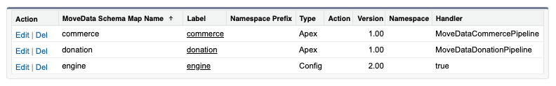
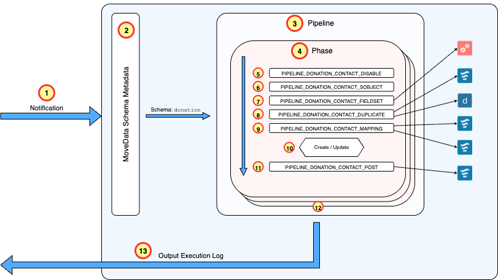

# Processing Pipelines

MoveData's processing pipeline system provides a flexible, metadata-driven framework for transforming standardised notifications into Salesforce records. Pipelines define the sequence of operations required to process different types of data (donations, commerce, etc) and can be customised to meet specific organisational requirements.

## Pipeline Registration Process

Pipelines are registered through the MoveData Schema Mapping system, which connects standardised notification schemas to their appropriate processing pipelines.

### Metadata-Driven Configuration

The platform uses Salesforce Custom Metadata Types for configuration management:

* **Schema Mapping**: `movedata__Movedata_Schema_Map__mdt` defines processing pipelines
* **Pipeline Configuration**: `movedata__MoveData_Pipeline__mdt` controls phase behaviour

These keys for these entries can be found in the Reference for each extension.

### Schema Mapping

<figure><figcaption></figcaption></figure>

Each MoveData extension registers its processing capabilities by creating entries in the `movedata__Movedata_Schema_Map__mdt` custom metadata type. These entries define:

* **Schema Type**: The standardised notification schema (e.g., 'donation', 'commerce')
* **Pipeline Class**: The pipeline (Apex class) responsible for processing notifications of this schema type

**Pipeline Discovery:** When a notification arrives, MoveData uses the schema type to lookup the appropriate pipeline:

1. **Schema Identification**: The notification's schema type is extracted from the incoming data
2. **Metadata Lookup**: MoveData queries `movedata__Movedata_Schema_Map__mdt` to find active pipelines for this schema
3. **Pipeline Selection**: The appropriate pipeline class is identified and instantiated
4. **Processing Initiation**: The pipeline begins processing the notification through its defined phases

**MoveData Extensions:** When a MoveData extension is installed, a pipeline is registered to handle respective schema type.

### Pipeline Architecture

Each processing pipeline follows a consistent multi-phase architecture that ensures comprehensive data processing:

**Phase-Based Processing:** Pipelines are organised into logical phases that handle different aspects of the notification.  For example, for fundraising donations, the Donation pipeline has five phases: the Account, Contact, Campaign, Recurring and Donation phases.

**Phase Orchestration:** The pipeline engine coordinates phase execution:

* **Sequential Processing**: Phases execute in a defined order to maintain data dependencies.  For example, an Account must be created before a Contact.
* **Conditional Execution**: Phases only execute if relevant data is present in the notification
* **Error Handling**: Phases can halt processing based on configuration
* **Audit Logging**: Each phase execution is logged for troubleshooting and compliance

### Pipeline Configuration

Individual pipeline phases can be extensively configured through the `movedata__MoveData_Pipeline__mdt` metadata type:

**Phase Control Settings:**

* **Enable/Disable**: Individual phases can be enabled or disabled without affecting the entire pipeline
* **SObject Override**: The target Salesforce object for a phase can be overridden (e.g., using Person Accounts instead of Contacts)
* **Field Dependencies**: Fieldsets can be specified to ensure required fields are loaded during processing
* **Business Logic**: Apex and Lightning Flows are specified to handle business logic for specific actions within a phase such as mapping data or post-upsert.

### Extension-Provided Pipelines

MoveData extensions provide pre-built pipelines optimised for different schemas or domains.  These are:

* Fundraising and Donations &#x20;
* Commerce

Whilst rare, organisations can develop custom handlers for schemas using Apex.

## Example: Notification Processing Pipeline

The diagram below illustrates the processing of a MoveData notification, using a donation notification processed by the NPSP Fundraising and Donations extension as an example.

<figure><figcaption></figcaption></figure>

### Processing Flow

1. **Notification Dispatch**: A notification is dispatched to the MoveData engine hosted within Salesforce, triggered by events from integrated fundraising platforms.
2. **Schema Identification**: The engine interrogates the notification to identify the schema type. In this example, the notification uses the donation schema.
3. **Pipeline Registration Lookup**: A lookup into the MoveData Schema Metadata (`movedata__Movedata_Schema_Map__mdt`) identifies that the donation schema has a pipeline registered by the NPSP Fundraising and Donations extension.
4. **Phase Initialisation**: The appropriate pipeline is loaded and begins processing the notification through its defined phases (Account, Contact, Campaigns, Recurring Donations, Donations).  The notification has no account but contains the Contact who made the donation. The pipeline triggers the Contact phase and begins working through the provided data.
5. **Enable / Disabled Checked**: The pipeline checks the MoveData Pipeline Metadata (`movedata__MoveData_Pipeline__mdt`) to see if the Contact phase is disabled. It is not, so the pipeline advances to the next action.
6. **Determine SObject Type**: The pipeline checks the MoveData Pipeline Metadata to see if the SObject used in the Contact phase is overridden. This can be done by noting the SObject in the metadata or trigger a flow to dynamically determine the SObject type.  In this example, there is no entry so pipeline defaults to `Contact` SObject type.
7. **Fieldset Loading**: The pipeline reads the MoveData Pipeline Metadata to identify any fieldsets that need to be loaded. If fieldset references exist, they instruct the pipeline which fields to retrieve from Salesforce when matching existing records, ensuring all fields referenced in flows are preloaded to prevent execution failures.  If you reference a field in a flow / decision and depend on it's data, you need to ensure it has been preloaded.
8. **Duplicate Detection**: MoveData performs comprehensive duplicate checking using Lightning Flows and Salesforce Duplicate Rules to determine if an existing record matches the incoming data. MoveData will attempt to match on existing keys and if there is no match, will execute the organisation's Salesforce Duplicate Rules.
9. **Populate Record**: Regardless of whether an existing record is found, mapping rules execute to apply additions and changes to the Contact record. This stage contains the majority of business logic and field transformation rules.
10. **Record Persistence**: The processed record is returned from the mapping action, and the pipeline performs an `upsert` operation to persist the Contact data to Salesforce.
11. **Post-Processing Activities**: Following the `upsert`, additional actions handle post-processing requirements such as linking the contact record to other objects and creating related child records.
12. **Phase Progression**: The pipeline advances to the next phase once all contact entries in the notification have been processed successfully. In this scenario, the pipeline would proceed to address Campaign information in the notification.
13. **Completion and Logging**: Once all phases have been processed successfully, MoveData persists execution logs and results, marking the notification as successful and providing comprehensive audit trails.
