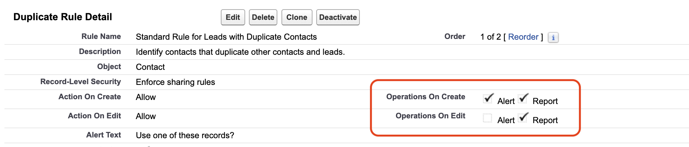

# Duplicate Rules

## Understanding Duplicate Management with MoveData

MoveData intelligently works with your existing Salesforce duplicate rules to maintain data quality whilst ensuring seamless integration of fundraising platform data. Rather than bypassing your duplicate detection, MoveData leverages Salesforce's powerful duplicate management system to identify existing records and append new data appropriately.

Proper duplicate rule configuration is essential for maintaining data quality whilst enabling seamless fundraising platform integration. Following these guidelines ensures your Salesforce org remains clean and organised whilst automatically processing supporter data from your fundraising activities.

This approach ensures that when a donor makes multiple donations across different platforms or timeframes, their information is consolidated as a single record rather than creating multiple duplicate entries in your Salesforce org.

### How MoveData Handles Record Matching

<figure><figcaption></figcaption></figure>

MoveData employs a two-stage matching process to identify existing records:

**Stage 1: Platform Unique Identifier Matching**

When your fundraising platform provides a unique identifier for contacts or accounts (such as a donor ID), MoveData stores this value against the corresponding Salesforce record. In subsequent integrations, MoveData first attempts to match using this platform-specific identifier, ensuring perfect accuracy for returning supporters.

**Stage 2: Salesforce Duplicate Rules**

If no match is found using the platform's unique identifier, MoveData executes your configured Salesforce duplicate rules. This allows Salesforce to determine whether a matching record exists based on the criteria you've established (typically email address, name combinations, or other identifying information).

When Salesforce identifies a matching record, MoveData updates the existing record rather than creating a new one. If no match is found, MoveData creates a new record to represent the supporter from your fundraising platform.

## Duplicate Rule Configuration Requirements

For MoveData to function correctly with your duplicate rules, specific configurations are required based on how Salesforce handles different rule actions:

### **Report vs Alert Rules**

<figure><figcaption></figcaption></figure>

#### **Report Rules (Required for MoveData)**

Rules configured with `Operation on Create` and `Operation on Edit` set to `Report` allow processing to continue whilst informing MoveData when potential duplicates are detected. MoveData then uses the matched record identified by Salesforce, ensuring data consolidation without interrupting the integration flow.

#### **Alert Rules (Must Exclude MoveData)**


**Critical Configuration Requirement**: The MoveData Authorised User must be excluded from all Alert duplicate rules and included under Report duplicate rules for successful integration processing.


Rules configured with `Operation on Create` and `Operation on Edit` set to `Alert` terminate processing when duplicates are encountered. This causes MoveData integrations to fail because Salesforce stops processing the notification entirely.

## Configuration Steps

These steps guide you through configuring the Salesforce Duplicate Rules in a way that can be programatically used by MoveData and continue to work for your users.

### **Preparation**

* Identify the Authorised User in MoveData's Settings
* View the Authorised User in Setup → Users → Users.  Record the `alias` of the user.

### **Step 1: Review Existing Duplicate Rules**

1. **Navigate to Setup**: Go to Setup → Duplicate Management → Duplicate Rules
2. **Audit current rules**: Review all active duplicate rules for Contacts, Accounts, and any other relevant objects
3. **Identify rule types**: Note which rules are configured as `Alert` vs `Report`
4. **Check rule scope**: Ensure rules cover the objects MoveData will be creating or updating

### **Step 2: Exclude MoveData from Alert Rules**

We need to ensure MoveData does not trigger any duplicate rules with `Alert` actions enabled.  For any duplicate rules configured with `Alert` actions:

1. **Edit the duplicate rule**: Click on the rule name to access configuration
2. **Add exclusion criteria**: In the rule conditions, add a condition to exclude the MoveData Authorised User
3. **Use alias condition**: Add a condition where `User: Alias not equal to movedata` (or your specific MoveData user alias)
4. **Save and activate**: Ensure the rule remains active with the new exclusion

### **Step 3: Configure Report Rules for MoveData**


If you only have Alert rules but wish for these to also be run by MoveData, clone them and create `Report` versions.


You may wish for MoveData to trigger rules for MoveData.  To do this, you need to ensure MoveData can access Report-level duplicate rules:

1. **Review Report rules**: Identify existing rules configured with `Report` actions to be used by MoveData.
2. **Verify scope**: Ensure these rules apply to the MoveData Authorised User (they typically apply to all users by default)

## Advanced Configuration Options

### **Disable Platform Key Matching**

If you prefer to rely solely on Salesforce duplicate rules rather than platform unique identifiers for contacts and accounts:

1. **Navigate to MoveData Settings**: Open the MoveData app → Settings
2. **Navigate to Correct MoveData Extension**: Click the tab for the relevant MoveData Extension (eg. Donations & Fundraising).
3. **Configure Contact settings**: Go to Accounts panel → Disable Platform Key Match → Select "True: Skip Platform Key"
4. **Configure Account settings**: Go to Contacts panel → Disable Platform Key Match → Select "True: Skip Platform Key"

This configuration is useful when you have fundraisers making donations on behalf of users.  Often, they will be passed to MoveData with the on behalf of name but with the fundraiser's key, resulting in a change to the fundraiser's contact record.

## Testing Your Configuration

**Validation Steps**

1. **Create test records**: Use the MoveData integration to process a small sample of data
2. **Verify duplicate detection**: Send the same supporter information multiple times to confirm existing records are updated rather than duplicated
3. **Check rule execution**: Review the duplicate rule entry in the execution logs to ensure rules are firing correctly
4. **Monitor notifications**: Use the MoveData app to confirm successful processing without errors

## **Common Issues and Solutions**

**Integration failures due to Alert rules:**

* Solution: Verify MoveData Authorised User is excluded from all Alert duplicate rules

**Unexpected duplicate creation:**

* Solution: Review Report rule criteria to ensure appropriate matching fields are configured
