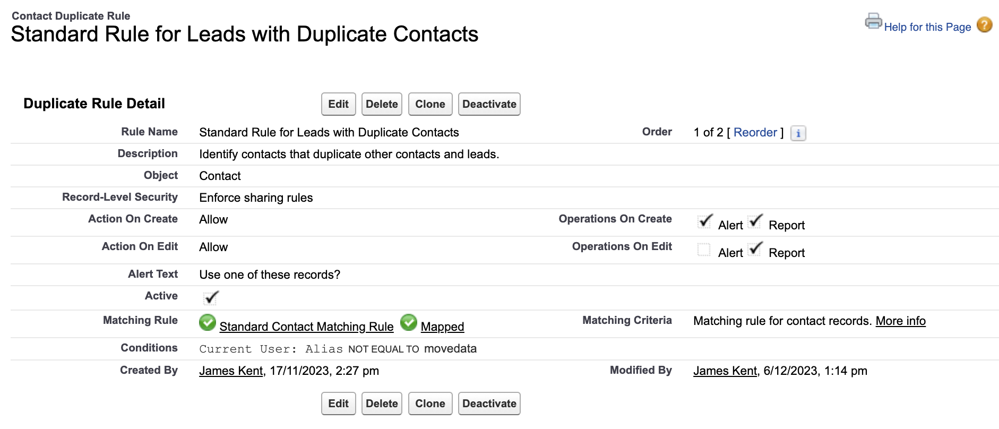

# Duplicate Rules

## How does MoveData use the Salesforce Duplicate Rules? 

When your Source Platform provides a unique identifier for Contact or Account records, MoveData will save that value against the associated record and match on that unique identifier going forward.

If a match is not determined from the Source Platform's unique identifier, MoveData will run your Salesforce Duplicate Rules whereby Salesforce will determine if a matching record already exists based on the information issued by your Source Platform. If Salesforce reports a match then MoveData will use that matched record, otherwise MoveData will create a new record to represent the Contact or Account issued by your Source Platform.

Importantly, the MoveData Authorised User cannot run duplicate rules where `Operation on Create` and/or `Operation on Edit` is set to `Alert`. This is because `Alert` instructs Salesforce to terminate processing where a matched record is encountered, and in a MoveData context this results in a failure since Salesforce terminates the processing of the notification.

As such, the MoveData Authorised User must only run rules where `Operation on Create` and/or `Operation on Edit` is set to `Report`. In this configuration, Salesforce will inform MoveData when a matched record exists and allow the processing of the notification to continue. In this scenario, MoveData will use the matched record reported by Salesforce.

Note

* Exclude the MoveData Authorised User from all rules where `Operation on Create` and/or `Operation on Edit` are set to `Alert`
* Include the MoveData Authorised User under applicable rules where `Operation on Create` and/or `Operation on Edit` are set to `Report`
* If you wish to disable functionality to match on the Source Platform's unique identifier (so that only the Salesforce Duplicate Rules run) you can do so in `Settings → Accounts → Disable Platform Key Match → True: Skip Platform Key` and `Settings → Contacts → Disable Platform Key Match → True: Skip Platform Key`. This is useful in scenarios where the the Source Platform bases their unique identifier on email only but in Salesforce you want to match on some other combination (e.g. First Name, Last Name, Email).

### Exclude MoveData Authorised User from Alert duplicate rules 

The below example demonstrates how to exclude an `Alert` rule from applying against the MoveData Authorised User. This is achieved using the `Alias` of the executing user (which in this example is `movedata`) and a `not equal to` condition.

<figure><figcaption></figcaption></figure>

### Include MoveData Authorised User under Report duplicate rules 

There is no explicit need to include the MoveData Authorised User under `Report` rules because, in the absence of any specific conditions, these will apply against all users by default. However, if you wish to narrow the a `Report` rule to apply only against the MoveData Authorised User, you can use the `equals` condition to restrict accordingly.

<figure><figcaption></figcaption></figure>

### What if I only have Alert duplicate rules? 

In scenarios where you only have `Alert` rules and do not have `Report` rules you can clone your `Alert` rules to create new versions configured to `Report`. Following the examples above, the MoveData Authorised User should be included under the `Report` rules and excluded from the `Alert` rules.
