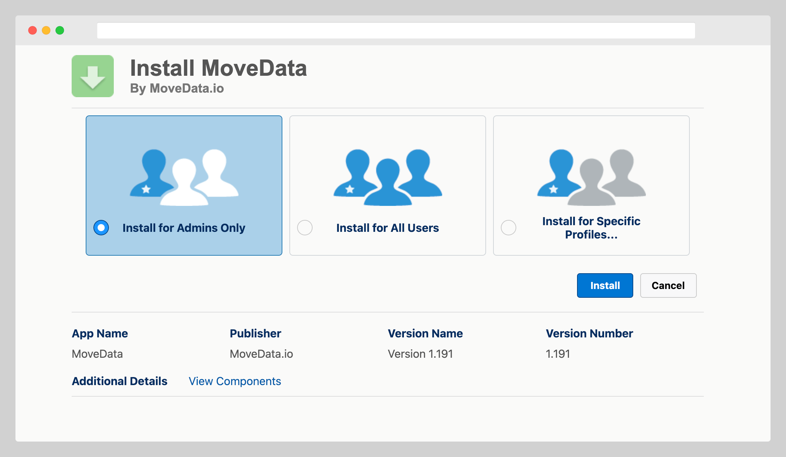
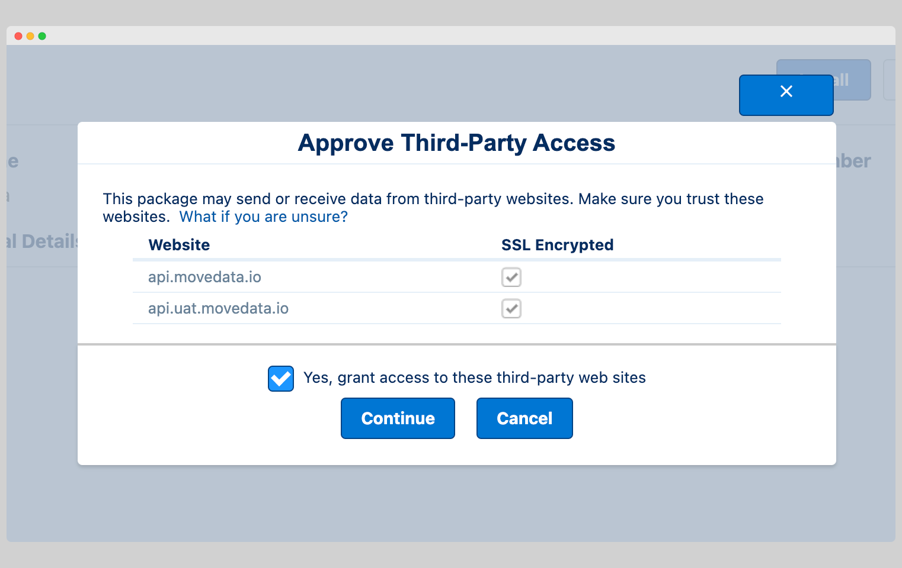
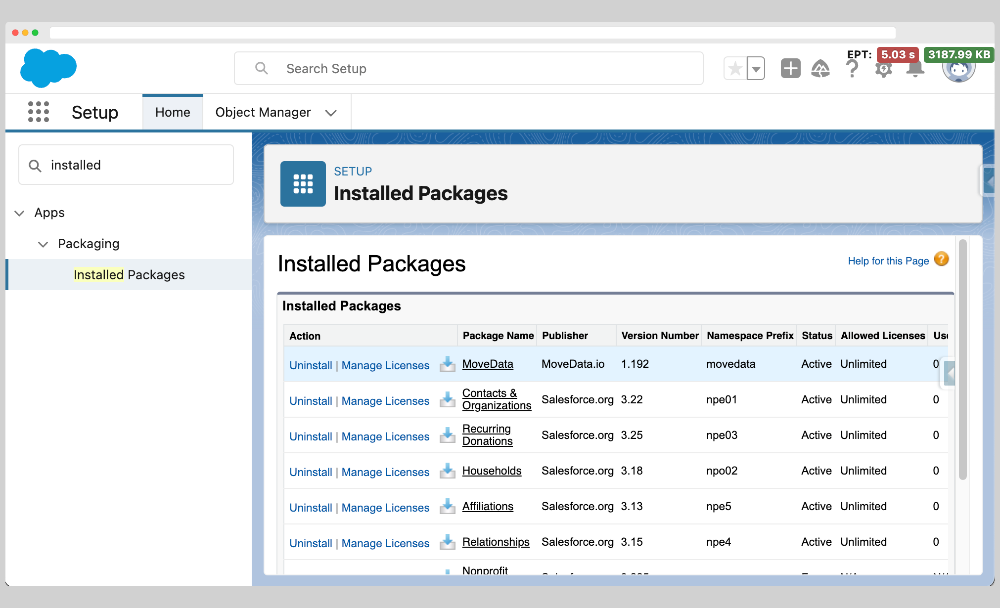

# Install MoveData

## Overview

Installing MoveData is the first step in setting up your automated fundraising data integration with Salesforce. This guide covers the complete installation process, from accessing the installer through to verifying successful installation in your org.


**Recommended**: Install MoveData in a Sandbox environment first to test your integration before deploying to Production.


**Time Required:** 10-15 minutes\
**Prerequisites:** Salesforce Administrator permissions or "Download AppExchange Packages" permission

## Installation Methods

### Method 1: Direct Installation

The fastest way to install MoveData is through our direct installer link:

**Installation Link:** [https://api.movedata.io/installer/app](https://api.movedata.io/installer/app)

### Method 2: Salesforce AppExchange

MoveData is also available through the official Salesforce AppExchange:

**AppExchange Link:** [MoveData on AppExchange](https://appexchange.salesforce.com/appxListingDetail?listingId=a0N4V00000GmPK3UAN)

## Step-by-Step Installation Process

### Step 1: Access the Installer

1. **Navigate to the installation link**: Visit [https://api.movedata.io/installer/app](https://api.movedata.io/installer/app)
2. **Choose your environment**:
   * Select **"Install in Sandbox"** for testing (recommended)
   * Select **"Install in Production"** only after thorough testing
3. **Authenticate**: Log in with your Salesforce Administrator credentials

### Step 2: Configure Installation Settings

Once authenticated, you'll see the Salesforce Package Installation screen:

<figure><figcaption></figcaption></figure>

#### Installation Audience

**Recommended Setting:** Select **"Install for Admins Only"**

This ensures:

* MoveData is initially accessible only to System Administrators
* Controlled rollout to your team
* Simplified permission management during initial setup

#### Security Settings

<figure><figcaption></figcaption></figure>

You will need to grant access to the MoveData endpoints to continue.

**Remote Site Access:** MoveData requires permission to connect to its servers for:

* Real-time data synchronisation
* Platform integrations
* Support and monitoring capabilities

This connection is essential for MoveData functionality, so click **"Continue"** when prompted.

### Step 3: Complete Installation

1. **Start Installation**: Click **"Install"** to begin the process
2. **Wait for Completion**: Installation typically takes 5-15 minutes
   * You'll see a progress indicator
3. **Installation Notification**: You'll receive an email confirmation when installation is complete

### Step 4: Verify Installation

#### Check Installed Packages

<figure><figcaption></figcaption></figure>

1. **Navigate to Setup**: Go to Setup → Installed Packages
2. **Locate MoveData**: You should see "MoveData" listed under installed packages
3. **Review Details**: Click on MoveData to view installation details and manage licenses

#### Access MoveData Application

1. **Open App Launcher**: Click the nine-dot grid icon in Salesforce
2. **Search for MoveData**: Type "MoveData" in the search box
3. **Launch Application**: Click on the MoveData app to open it

## Installation Verification Checklist

After installation, verify these components are present:

* [ ] **MoveData Package**: Visible under Setup → Installed Packages
* [ ] **MoveData App**: Available in the App Launcher
* [ ] **Permission Sets**: MoveData permission sets created

## Troubleshooting Common Installation Issues

### Permission Errors During Installation

**Possible Causes:**

* Insufficient user permissions

**Solutions:**

* Ensure you have System Administrator permissions or similar that allow you to install Salesforce packages.

### Package Not Visible After Installation

**Possible Causes:**

* Installation still in progress
* Browser cache issues
* App visibility settings

**Solutions:**

* Check if installation email has been received
* Check under Setup -> Deployment Status to see if the install is in progress, successful or failed.

## Next Steps

Once MoveData is successfully installed:

1. **Complete Setup Wizard**: The configuration wizard will guide you through initial setup
2. **Install Extensions**: Choose appropriate extensions for your Salesforce data model (NPSP or Nonprofit Cloud)
3. **Configure Settings**: Review and adjust default settings for your organisation
4. **Set Up Integrations**: Connect your fundraising platforms
