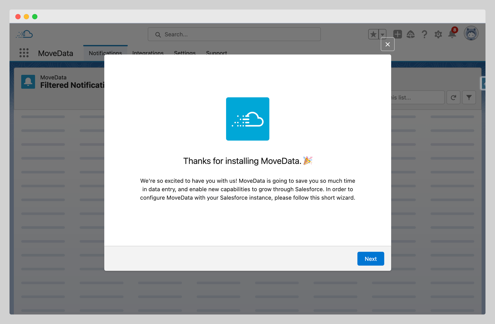
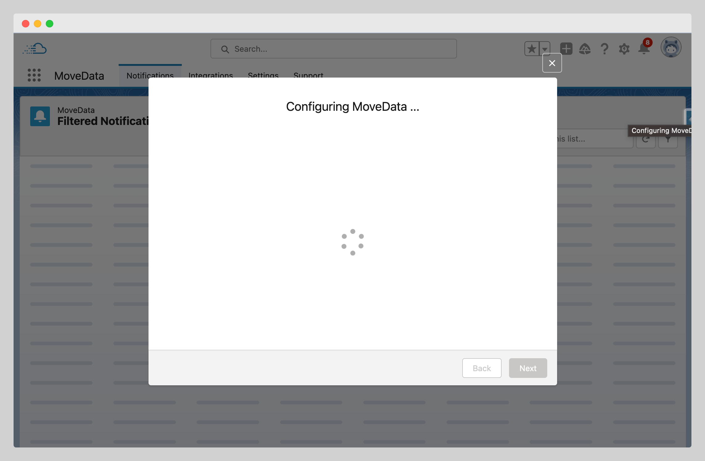
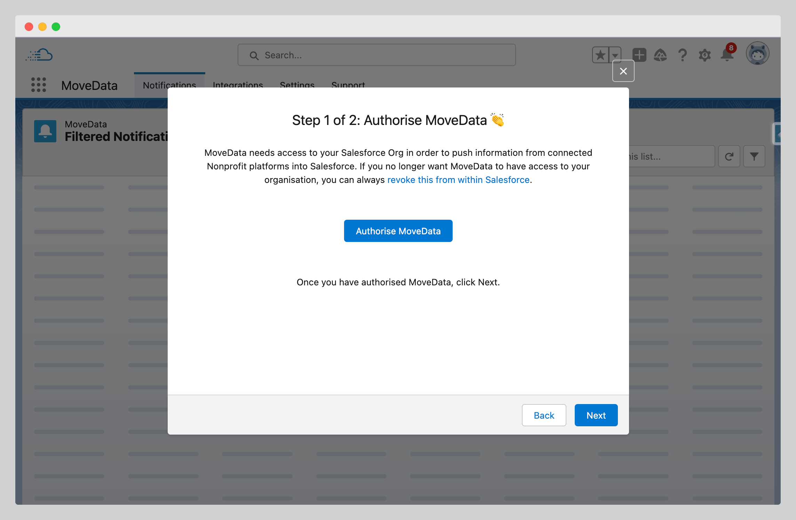
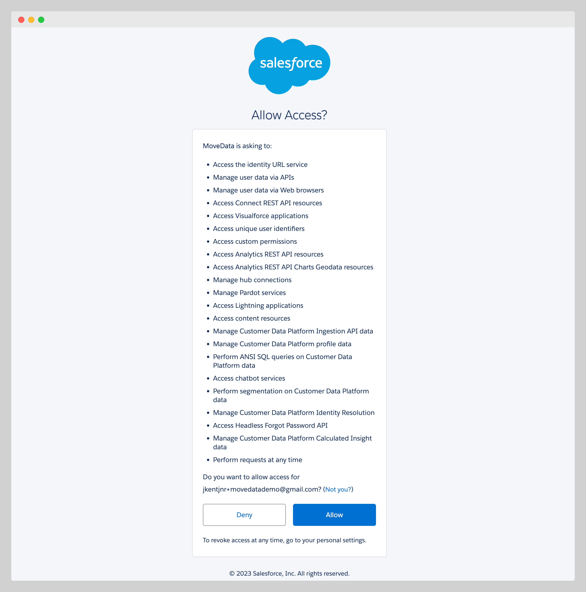
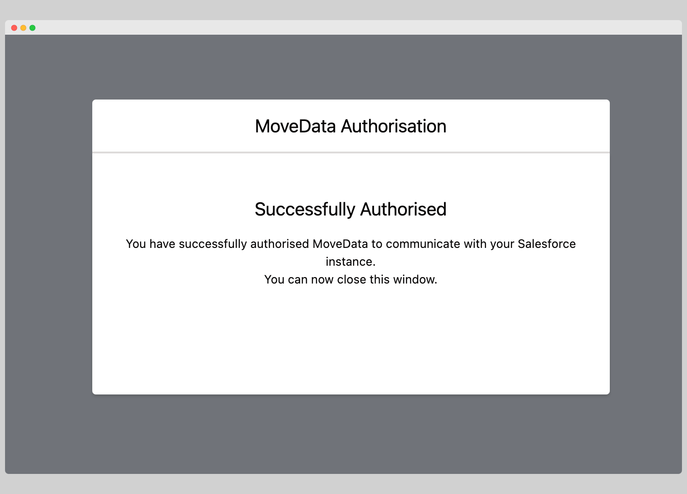
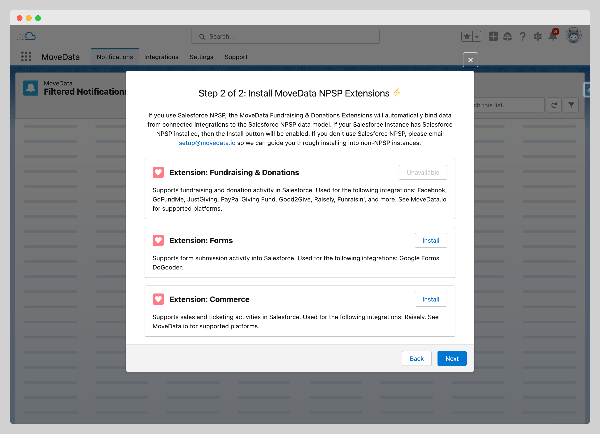
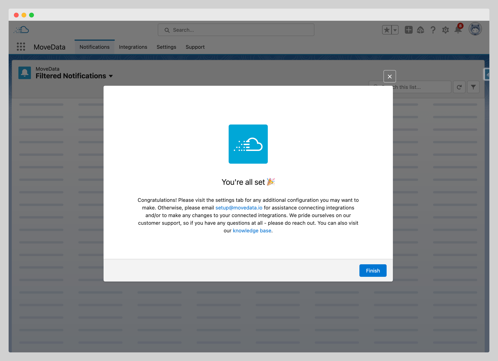

# Setup Wizard

## Overview

After installing MoveData, the setup wizard guides you through essential configuration steps to prepare your integration for fundraising data synchronisation. This automated process handles authorisation, extension installation, and initial configuration to ensure MoveData works seamlessly with your Salesforce environment.


**Automatic Launch**: The setup wizard launches automatically when you first open MoveData after installation.&#x20;


**Time Required:** 10-15 minutes\
**Prerequisites:** MoveData successfully installed and Salesforce Administrator permissions

## Setup Wizard Process

### Step 1: Launch MoveData Application

#### Access MoveData

1. **Open App Launcher**: Click the nine-dot grid icon in Salesforce
2. **Search for MoveData**: Type "MoveData" in the search field
3. **Launch Application**: Click on the MoveData app
4. **Configuration Wizard**: The setup wizard should appear automatically

#### Initial Configuration Screen

<figure><figcaption></figcaption></figure>

The wizard welcome screen provides an overview of the setup process:

* **Authorisation**: Grant MoveData permissions to access Salesforce
* **Extension Installation**: Install data model extensions
* **Basic Configuration**: Review initial settings

Click **"Next"** to begin the configuration process.

### Step 2: Automatic Configuration

<figure><figcaption></figcaption></figure>

#### System Configuration

MoveData automatically configures core system components:

**Configuration Tasks:**

* **Permission Sets**: Creating user permissions for MoveData access
* **Custom Settings**: Establishing default configuration values
* **Data Model Setup**: Preparing objects and relationships
* **Security Settings**: Configuring secure access protocols

**Timeline:** This automatic configuration typically takes 2-3 minutes to complete.


**Please Wait**: Don't close your browser or navigate away during automatic configuration. The system will indicate when this step is complete.


### Step 3: Authorise MoveData

#### OAuth Authorisation Process

<figure><figcaption></figcaption></figure>

MoveData requires explicit permission to access your Salesforce data for:

* **Data Synchronisation**: Writing fundraising data to Salesforce objects
* **Duplicate Detection**: Reading existing records for matching
* **Relationship Management**: Creating connections between contacts, campaigns, and opportunities
* **Monitoring and Logging**: Tracking integration performance and errors

#### Grant Authorisation

<figure><figcaption></figcaption></figure>

1. **Click "Authorise MoveData"**: This opens the OAuth permission screen
2. **Review Permissions**: The popup displays requested access levels:
   * Read and write access to standard and custom objects
   * Access to user information for audit trails
   * Permission to perform data operations on your behalf
3. **Allow Access**: Click "Allow" to grant permissions
4. **Return to Salesforce**: The popup closes and returns you to the wizard

#### Successful Authorisation

<figure><figcaption></figcaption></figure>

Once authorisation is complete, you'll see:

* **"Successfully Authorised" message**: Confirms OAuth connection is established
* **Next button enabled**: Allows progression to extension installation

Click **"Next"** to continue to extension installation.

### Step 4: Install Extensions

<figure><figcaption></figcaption></figure>

#### Understanding MoveData Extensions

Extensions provide data model compatibility and business logic for different types of fundraising data:

**Available Extensions:**

| Extension                   | Purpose                                                | Compatible With           |
| --------------------------- | ------------------------------------------------------ | ------------------------- |
| **Fundraising & Donations** | Processes donations, campaigns, and supporter data     | NPSP                      |
| **Commerce**                | Handles event registrations, product sales, and orders | NPSP, Standard Salesforce |
| **Nonprofit Cloud**         | Enhanced support for Nonprofit Cloud features          | Nonprofit Cloud only      |

#### Extension Detection

The wizard automatically detects your Salesforce configuration:

* **Available**: Extension is compatible and ready for installation&#x20;
* **Unavailable**: Missing dependencies (e.g., NPSP not installed)
* **Installed**: Extension is already present in your org

#### Installation Process

1. **Select Extensions**: Click the install button for your chosen extensions
2. **Confirm Installation**: Review the extension details and click "Install"
3. **Wait for Completion**: Installation takes 5-15 minutes per extension
4. **Verify Success**: Installed extensions show "Installed" status


**Install Later**: If you skip extension installation now, you can install them later via MoveData → Settings → Extensions.


### Step 5: Complete Setup

<figure><figcaption></figcaption></figure>

#### Finish Configuration

Once extensions are installed:

1. **Review Installation Summary**: The wizard displays completed configuration steps
2. **Click "Finish"**: Completes the setup wizard process
3. **Access MoveData**: You're now ready to configure integrations

#### Post-Setup Verification

After completing the wizard, verify these components:

* [ ] **OAuth Connection**: "Successfully Authorised" status maintained
* [ ] **Extensions Installed**: Required extensions show "Installed" status
* [ ] **MoveData Accessible**: Application opens without errors
* [ ] **Settings Available**: Configuration options are accessible

## Next Steps

With the setup wizard complete, you're ready to:

1. **Configure Settings**: Review and adjust default MoveData settings
2. **Setup Duplicate Rules**: Configure Salesforce duplicate detection for clean data
3. **Assign Permissions**: Grant access to team members who need MoveData
4. **Create Integrations**: Connect your fundraising platforms

## Extension Resources

For detailed information about specific extensions:

* **MoveData Extensions Guides**: Comprehensive extension documentation
* **Extension Release Notes**: Latest features and compatibility updates
