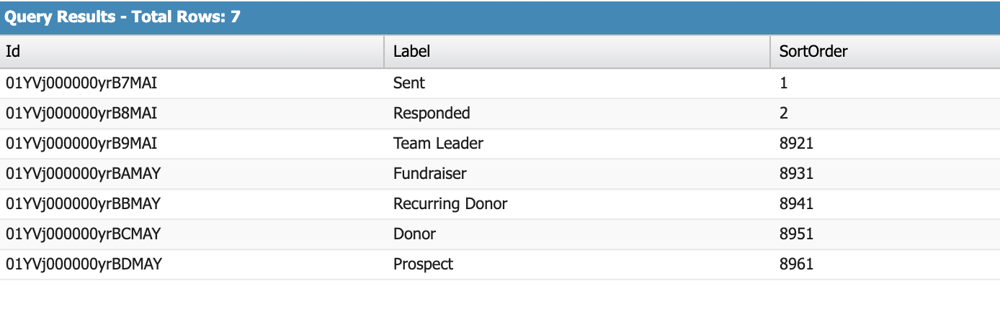

# Campaign Member Status Errors


Metadata

* group=Extension
* category=Non-Profit Success Pack
* extension=npsp
* tags=campaign members,campaign members status


The MoveData' Non-Profit Success Pack (NPSP) extensions enable customers to create campaign members relating to a relationship such as Donor, Team Member, Team Leader, etc. If a campaign has many existing campaign member statuses, it is possible that the following error is encountered: `A Campaign Member status already a specified sort order. Please specify a different sort order to create this Campaign Member status.`.

## What is the Campaign Member Status sort order? 

When a campaign member status is created, it is assigned a sort order to ensure the ordering of campaign member statuses is presented as expected.

<figure><figcaption></figcaption></figure>

`SOQL Query: SELECT Id, Label, SortOrder FROM CampaignMemberStatus WHERE CampaignId = '{CampaignId}'`

Out of the box, the NPSP extensions adds five campaign member statuses with predefined sort orders; these range from 8921 to 8961 to minimise overlap with existing statuses.

## Can I rename a MoveData-created Campaign Member Status? 

Yes and no.

You cannot rename a campaign member status via the campaign member status list view. MoveData looks up the campaign member using the name given to a Campaign Member status. If it is looking the name `Recurring Donor` and doesn't encounter it, it will try to create a new campaign member status named `Recurring Donor` with a sort order of `8941`. As an example, if `Recurring Donor` had been renamed to `Monthly Donor` , then MoveData will try and recreate the `Recurring Donor` status and get an issue due to the sort order already being taken.

The values used by MoveData to create the Campaign Member Statuses can be modified but this has to be done before MoveData is live.

## How do I resolve the sort order issue? 

There are two main reasons this error is occurring. The first is because a MoveData-governed status has been renamed. The second is because another process is creating statuses that overlap.

The majority of times, the failure will be due to renaming. To resolve this, please revert the renamed status back to its original name or create a new campaign member with the original name.

If you think the failure is occurring due to another process, such as an integrated marketing tool, then you will need to work through this and determine if it can be changed or whether MoveData Campaign Member Statuses need to be switched off.
