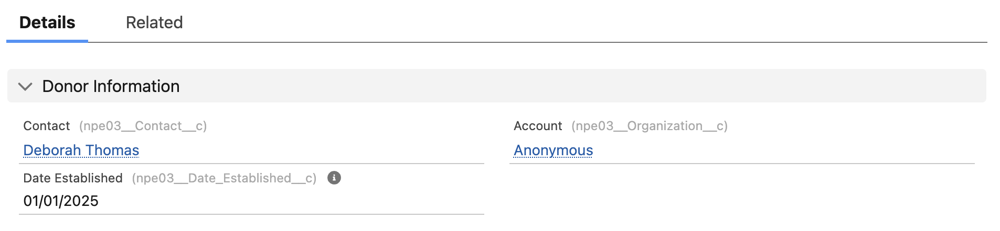
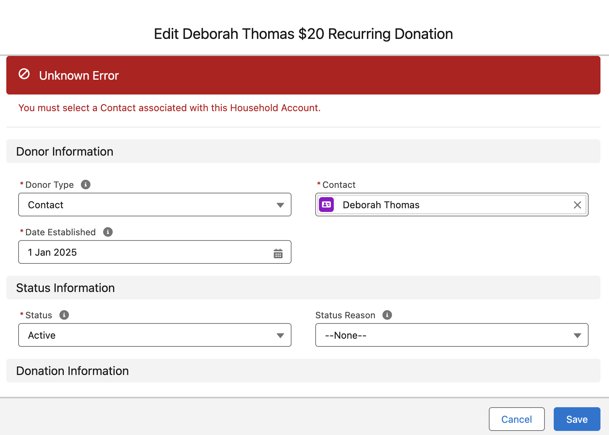

# You must select a Contact associated with this Household Account (Anonymous Account)


Metadata

* category=NPSP
* extension=npsp
* tags=recurring,contact,merge


Sometimes Salesforce will error with the message `You must select a Contact associated with this Household Account`.

### Context 

* You have merged two contacts
* One of the merged contacts is the owner of a recurring donation record
* When you merge, the recurring donation record is left with an Account of Anonymous

<figure><figcaption></figcaption></figure>

### Error 

If you open the recurring donation in Salesforce, and attempt to save it without making any changes, you will notice the same error the integration encounters:

<figure><figcaption></figcaption></figure>

### Solution 

To fix this in Salesforce you need to update the account to the matching household account. In practice, you cannot do this easily because when you do this, Salesforce will error with the message `You can't change the Household Account or Contact on a Recurring Donation that has Closed Opportunities`.

To get around this you need to:

1. Update child opportunities with a stage of `Closed Won` to a non-Closed stage (e.g. `Pledged`)
2. Update the account to the correct household account
3. Update child opportunities you changed to `Pledged` back to `Closed Won`

You will then be able to reprocess your notification through MoveData and the information will save without error.
