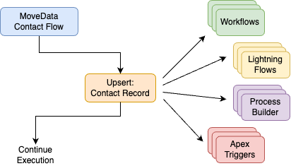
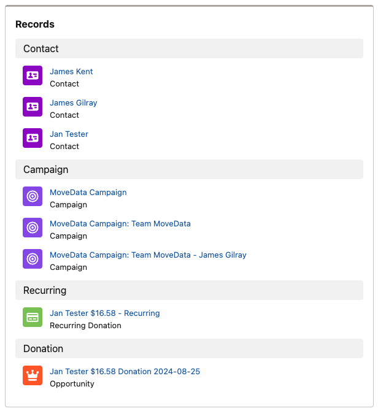
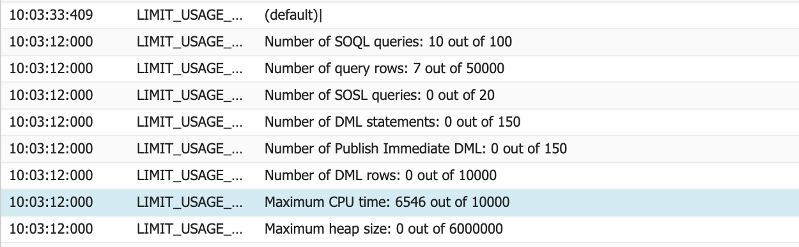

# Apex CPU time limit exceeded


Metadata

* category=Technical
* subtitle=An overview of Apex CPU time limit exceeded error
* integration=all
* tags=apex,cpu,timeout,limit,governor



Please Note: Regardless of where an "Apex CPU time limit exceeded" error is thrown, it is system-wide execution error. An error message noting this error in any MoveData component is almost exclusively occurring due to other flows, workflows rules, managed packages and Apex triggers consuming too many Salesforce resources earlier in the execution.

This is not a MoveData support issue; but rather a system configuration issue that needs review. This guide is intended to assist you and your Salesforce partner in working through this issue, however, this is beyond the scope of product support.



This is a technical article. You will need an intermediate technical knowledge of Salesforce. If you require assistance, we recommend forwarding this article to your Salesforce partner.


## Overview 

When working with Salesforce, you must work within a set of limits for each transaction called [Governor Limits](https://developer.salesforce.com/docs/atlas.en-us.apexcode.meta/apexcode/apex_gov_limits.htm). While there are numerous limits, there is one that relates to execution time. While a transactions overall time is unlimited, Salesforce mandates that a transaction is only allowed 10,000 milliseconds (10 seconds) of execution or CPU time.

## Process 

When a notification is processed by MoveData, it will execute in a number of phases. For donations, this will be to create/update all accounts, followed by contacts, campaigns, recurring donations and then opportunities / donation records. Each of these phases will execute a small number of statements to gather information and complete the "upsert" of a record.

When a records is updated or created, it isn't uncommon that a Salesforce instance will have a number of record-based actions that will run. These actions can be Process Builder jobs, Lightning Flows, Workflow Rules, Apex Triggers, Trigger Handlers and the like.

<figure><figcaption></figcaption></figure>

The above diagram illustrates the compounding nature of an insert or an update. In this example, a MoveData contact flow has run and is resulting a contact record being "upserted". This action results in any workflows, Lightning Flows, Process Builder jobs and Apex triggers running.

_This is a normal behaviour; where this becomes problematic is when there are a large suite of record-triggered actions connected._

Each of these triggered actions will consume a suite of resources. It's easy to see how this can compound and quickly become an issue completing all required tasks within the Salesforce governor limits.

### MoveData Extensions 

MoveData authors a number of extension packages that integrate with specific data models, such as the Non-Profit Success Pack (NPSP) and Non-Profit Cloud (NPC). These are optimised out-of-the-box to ensure they produce a low number of SOQL and DML executions.

We cannot provide specific numbers on CPU execution times as these are dependant on the data being processed, we have included a complex example as a point of reference.

<figure><figcaption></figcaption></figure>

Using the out-of-the-box NPSP extensions, the above transaction results in three contacts, three campaigns, a recurring subscription with a child donation. Creating all records from scratch, MoveData uses \~65% of the available CPU time. Where the campaigns and contacts already existed, this dropped to \~45% of the limit.

<figure><figcaption></figcaption></figure>

## Components 


**Related Article**: [Too many SOQL queries: 101](too-many-soql-queries-101.md)


Due to the diverse system-wide contributors to this issue, there is no universal method to address the problem. To address this issue, you must take the same approach as recommended to address another governor limit issue around [SOQL queries](https://intercom.help/movedata/en/articles/9227358-too-many-soql-queries-101). Please refer to this article for more information.
