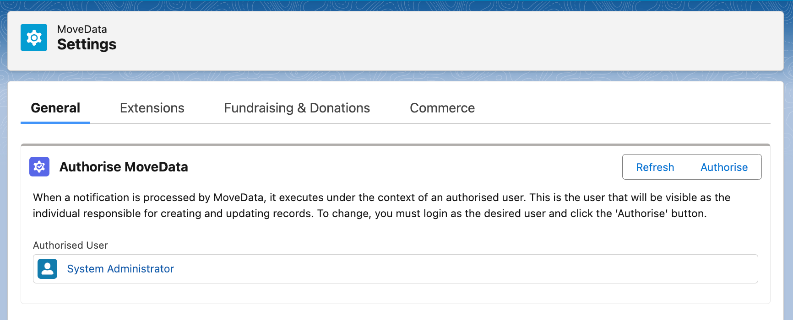
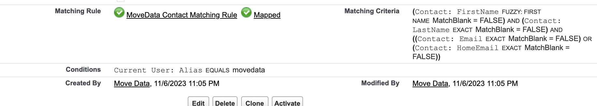

# Change the MoveData Authorised User


**Related Articles**

We recommend reviewing this article alongside:

* [About the MoveData Authorised User](about-the-movedata-authorised-user.md)


Over time your organisation may need to change the MoveData authorised user. To do so:

* Log in as the new user you intend to authorise MoveData under
* Open MoveData from the App Launcher and click `Settings`
* Follow [these instructions](about-the-movedata-authorised-user.md) to authorise MoveData under the new user

<figure><figcaption></figcaption></figure>

When updating the MoveData authorised user, there are some additional things you should be aware of:

### Access to MoveData Permission Sets 

The incoming user should have access to the MoveData Permission Sets. To assign access:

1. Open Setup → Permission Sets and find the MoveData Permission Sets. These will be `MoveData Application`, and `MoveData NPSP Extensions` (if you use NPSP) or `MoveData NPC Extensions` (if you use Nonprofit Cloud)
2. Open the Permission Set and click `Manage Assignments` then `Add Assignment`
3. Assign the incoming user to the permission set

### Same Minimum Permissions 

The incoming user should have the same minimum permissions as the outgoing user. For example, if the outgoing user has read and write permissions for a field being set by the integration, and the incoming user does not have read and write permissions for that field, then the integration will error when switched over to the incoming user (because the incoming user does not have read and write permissions to that field).

In most scenarios, if you ensure the incoming user uses the same profile as the outgoing user you should be OK.

### Same Duplicate Rule Conditions 

Duplicate rule conditions may be exist for the outgoing user. When changing the authorised user we recommend you review your duplicate rule conditions and, if needed, update to reflect the incoming user.

In practice this typically involves modifying any include / exclude logic to reference the incoming user instead of the outgoing user. For example, if you have a condition that the duplicate rule runs under the outgoing user's alias of `movedata`, and the incoming user has an alias of `newuser`, then you would update the condition by changing the alias from `movedata` to `newuser`.

<figure><figcaption></figcaption></figure>

You can find more information on how MoveData works with Duplicate and Matching Rules here.
