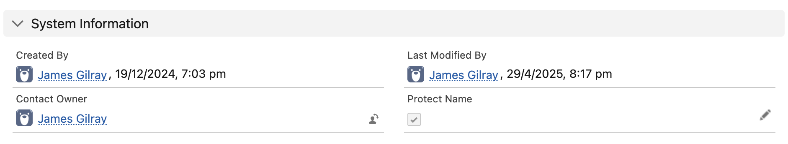

# Protect Contact Fields


Metadata

* category=general
* tags=data,protect


Occasionally, you may want to protect a contact from being overwritten by your MoveData integration. Built into our extensions, we have support for protecting the record using the following configurations:

* Protect First Name / Last Name
* Protect First Name / Last Name + Email / Address / Phone
* Protect Record

These can be configured by navigating to the correct extension within the MoveData settings.

<figure><figcaption></figcaption></figure>

Once the appropriate level is selected, you will need to enable this protection on a contact. This is done by ensuring "Protect Name" is checked on the record. If this is checked, the desired level of protection will be enforced on any notifications involving the contact.
