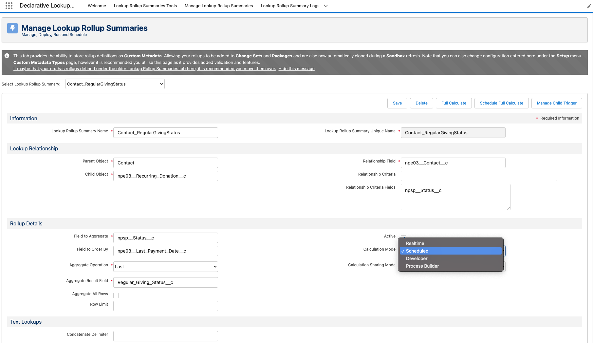

# Too many SOQL queries: 101 (dlrs)


Metadata

* category=Technical
* subtitle=A guide for Too many SOQL queries: 101 (dlrs)
* integration=all
* tags=apex,soql,101,dlrs,limit,governor


When MoveData creates or updates records in Salesforce this may cause other processes to initiate.

Your Salesforce Org is governed by [Apex Governor Limits](https://developer.salesforce.com/docs/atlas.en-us.salesforce_app_limits_cheatsheet.meta/salesforce_app_limits_cheatsheet/salesforce_app_limits_platform_apexgov.htm) and in this scenario, your the available governor limits are being exceeded which causes Salesforce to terminate the processing of your notification.

There are many different ways to approach this issue, but for DLRS-related errors we find the easiest solution is to:

* Open `Declarative Lookup Rollup Summaries` from the App Launcher
* Navigate to `Manage Lookup Rollup Summaries`
* For each available option under `Select Lookup Rollup Summary` set `Calculation Mode` to `Scheduled`

<figure><figcaption></figcaption></figure>
