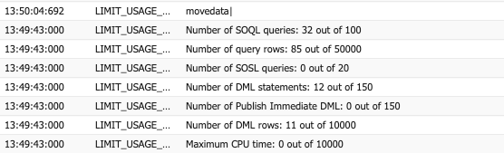
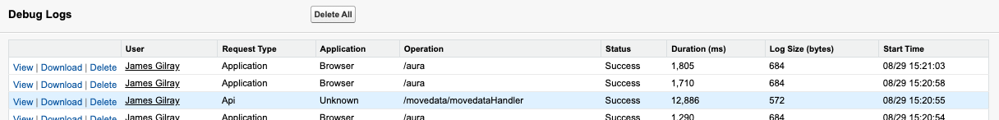
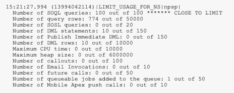

# Too many SOQL queries: 101


Please Note: Regardless of where a "Too many SOQL queries: 101" error is thrown, it is system-wide execution error. An error message noting this error in any MoveData component is almost exclusively occurring due to other flows, workflows rules, managed packages and Apex triggers consuming too many Salesforce resources earlier in the execution.

This is not a MoveData support issue; but rather a system configuration issue that needs review. This guide is intended to assist you and your Salesforce partner in working through this issue, however, this is beyond the scope of product support.



This is a technical article. You will need an intermediate technical knowledge of Salesforce. If you require assistance, we recommend forwarding this article to your Salesforce partner.


## Overview 

When working with Salesforce, you must work within a set of limits for each transaction called [Governor Limits](https://developer.salesforce.com/docs/atlas.en-us.apexcode.meta/apexcode/apex_gov_limits.htm). One limit that is breached more often than others relates to the number of SOQL executions; a limit where an execution cannot perform more than 100 SOQL database queries. These queries are typically consumed by triggers which process the creation or updating of records like contacts, campaigns, and opportunities.

## Process 

When a notification is processed by MoveData, it will execute in a number of phases. For donations, this will be to create/update all accounts, followed by contacts, campaigns, recurring donations and then opportunities / donation records. Each of these phases will execute a small number of SOQL and DML statements to gather information and complete the "upsert" of a record.

When a records is updated or created, it isn't uncommon that a Salesforce instance will have a number of record-based actions that will run. These actions can be Process Builder jobs, Lightning Flows, Workflow Rules, Apex Triggers, Trigger Handlers and the like.

<figure><figcaption></figcaption></figure>

The above diagram illustrates the compounding nature of an insert or an update. In this example, a MoveData contact flow has run and is resulting a contact record being "upserted". This action results in any workflows, Lightning Flows, Process Builder jobs and Apex triggers running.

_This is a normal behaviour; where this becomes problematic is when there are a large suite of record-triggered actions connected._

Typically, each of these actions has to:

* execute multiple SOQL to figure out if they need to act
* execute multiple SOQL statements to construct a change
* create or update additional records - which trigger any additional record-triggered actions

It's easy to see how this can compound and quickly become an issue completing all required tasks within the Salesforce governor limits.

### MoveData Extensions 

MoveData authors a number of extension packages that integrate with specific data models, such as the Non-Profit Success Pack (NPSP) and Non-Profit Cloud (NPC). These are optimised out-of-the-box to ensure they produce a low number of SOQL and DML executions.

We cannot provide specific numbers on SOQL and DML executions as these very depending on the data being processed, we have included a complex example as a point of reference.

<figure><figcaption></figcaption></figure>

Using the out-of-the-box NPSP extensions, the above transaction results in three contacts, three campaigns, a recurring subscription with a child donation.

<figure><figcaption></figcaption></figure>

This complex transaction requires 32 SOQL queries and 12 DML statements.

## Components 

Due to the diverse system-wide contributors to this issue, there is no universal method to address the problem. This section will talk through the contributors to this issue.

### Salesforce Workflows 


Legacy - [Retired by Salesforce](https://help.salesforce.com/s/articleView?id=001096524\&type=1)


Salesforce Workflows are a legacy approach to implement business rules. These were superseded by Salesforce Flows. These actions aren't especially efficient but really put a dent into a transaction's limits when used at scale. These should be migrated to Lightning Flows or, if required, Apex code.

We would note that if you use the Workflow to Flows migration tool, you will still need to optimise the resulting flows.

### Process Builder 


Legacy - [Retired by Salesforce](https://help.salesforce.com/s/articleView?id=001096524\&type=1)


Process Builder was the precursor to Lightning Flows. It is straightforward to use; however, this ease of use results in a large number of unnecessary requests. These should be migrated to Lightning Flows or, if required, Apex code.

### Apex Triggers 

When well written, Apex triggers (along with Apex code in general) are the most efficient business logic solution you can implement. When done badly, they suffer from similar inefficiency as the discussed workflow options. Often, this code will belong to a managed package and will not be visible. The best way to gauge the efficiency of a trigger is to monitor is via the debug log, which is discussed later on.

### Record-Triggered Lightning Flows 

There are many permutations to Lightning Flows but the contributor to this SQL 101 issue are record-triggered flows. When configured to run when a record is created and/or updated, these will use up limits within the transaction.

There are methods to minimise this impact. Using record-triggered flow configured for Fast Field Updates, will give you less functionality but have a minor impact on limits.

Even better is flagging the flow to `Run Asynchronously`. This will ensure the flow runs in a seperate transaction after the current transaction has successfully completed. The downside is that if the asynchronous flow fails, it will not be able to rollback the original transaction.

Where possible, applying `Entry Conditions` is highly recommended. This will prevent flows executing in every scenario, conserving limit resources.

## Managed Packages 

### Declarative Lookup Rollup Summaries 

One package that can considerably impact the SQL 101 issue is Declarative Lookup Rollup Summaries (dlrs). More on this can be found in this [knowledge base article](https://intercom.help/movedata/en/articles/9297652-too-many-soql-queries-101-dlrs).

## Diagnosis 

The primary way to diagnose SQL 101 issues is to use the Debug Logs. If you have a notification in MoveData that consistently triggers a SQL 101 error, we would recommend you setup a Debug Log via Setup (Environments -> Logs -> Debug Logs). More on how to work with Event Logs can be found [here](https://help.salesforce.com/s/articleView?id=sf.code_monitoring_debug_logs.htm\&type=5) and on Salesforce Trailhead.

<figure><figcaption></figcaption></figure>

Once debugging is setup, open the failing MoveData notification and click `Reprocess`. Once the notification has failed, return to the debug log and view a log entry with the operation named `/movedata/movedataHandler`&#x20;

<figure><figcaption></figcaption></figure>

Within the debug logs, you can work top to bottom reviewing how the limits are increasing throughout the transaction grouped by package / namespace. Look for the `LIMIT_USAGE_FOR_NS` entry in the logs. This is the most important metric for seeing where the limits are jumping (and in which package which can be helpful).

Other useful entries are `FLOW_CREATE_INTERVIEW`; these detail when a Lightning Flow begins and end. Entries beginning with `CODE_UNIT` will often refer to Apex triggers and entries beginning with `WF_` refer to legacy Workflow jobs.

Stepping through these entries and monitoring the limits will enable you to figure out where the jumps in limits are occurring.

## Advanced Options 

Below details how to configure some MoveData flows to run asynchronously. This can be useful in reducing limits within the transaction.

### Solution: Run some MoveData Post-Upsert Jobs Asynchronously 


**Related Article**: [Run Campaign Post and Donation Post Asynchronously](https://docs.movedata.io/en/articles/9563222)


It is possible to configure the MoveData Campaign Post and Donation Post Flows to run asynchronously. Enabling this moves these Flows (and associated Extension Flows) out of the MoveData execution and into their own transaction, which can provide SOQL relief in the form of:

* MoveData Campaign Post and Donation Post Flows are not subject to the SOQL limits of the core transaction
* Non-MoveData triggers which run against records created or updated by these flows are not subject to the SOQL limits of the core transaction

In a practical sense, this can provide SOQL relief where your processes are creating or updating records on the basis of Campaign, Campaign Member, or Opportunity records being created or updated.

\
