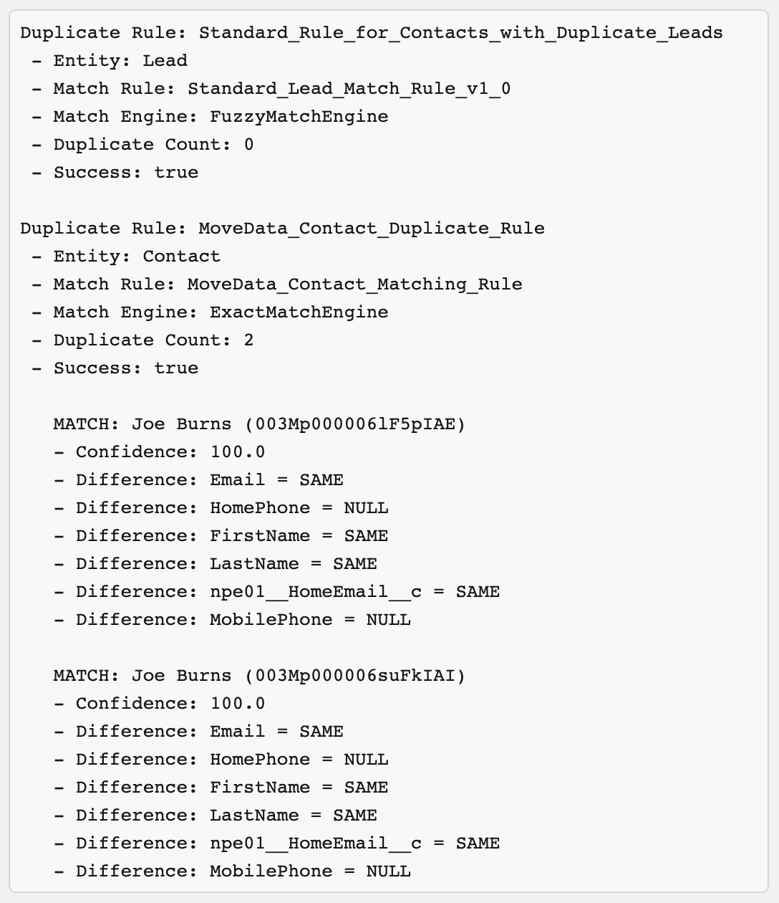
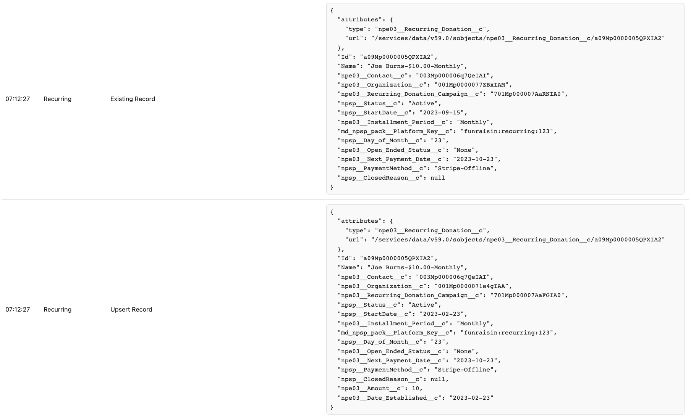
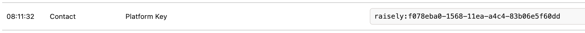
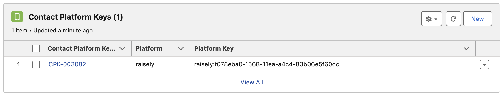

# You can't change the Household Account or Contact on a Recurring Donation with Closed Opportunities

Over time, and typically due to manually modifying records in Salesforce, a scenario can occur where the source platform issues information which is different to the contact or account assigned to your recurring donation.

In this scenario, MoveData will act on the data being issued by the source platform, which can result in a contact or account being matched or created which is different to the one assigned to your recurring donation. If your recurring donation has closed opportunities, this can trigger the `You can't change the Household Account or Contact on a Recurring Donation that has Closed Opportunities` error and the notification will fail to process into Salesforce.

### Worked Example <a href="#h_4b00ace5a5" id="h_4b00ace5a5"></a>

You have a recurring donation in your source platform owned by a contact with the following information:

| First Name | Joe                                             |
| ---------- | ----------------------------------------------- |
| Last Name  | Smith                                           |
| Email      | [joesmith@gmail.com](mailto:joesmith@gmail.com) |

When MoveData encounters the recurring donation from your source platform, it will match against an equivalent contact with the same information, or create a new contact if no matched contact is determined.

Related Article

* [Step 4: Configure Duplicate Rules (5min)](https://intercom.help/movedata/en/articles/9144672-step-4-configure-duplicate-rules-5min)

For various reasons, you assign the recurring donation to another contact in Salesforce and delete the contact created by MoveData out of Salesforce. The contact you choose to assign to has the following information:

| First Name | Joseph                                            |
| ---------- | ------------------------------------------------- |
| Last Name  | Smith-Brown                                       |
| Email      | [joe@smith-brown.com](mailto:joe@smith-brown.com) |

Assuming you do not update the equivalent information in the source platform, the next time the recurring donation is processed the source platform will issue the originally supplied information:

```
    "firstName": "Joe",
    "lastName": "Smith",
    "email": "joesmith@gmail.com",
```

Depending on how your duplicate rules are configured, this may result in an inability for MoveData to match to the newly assigned contact, and result in MoveData matching or re-creating the originally assigned contact and attempting to assign to your existing recurring donation.

If your recurring donation has closed opportunities, this can trigger the `You can't change the Household Account or Contact on a Recurring Donation that has Closed Opportunities` error and the notification will fail to process into Salesforce.

### Other Possible Causes <a href="#h_7f47f2b3ff" id="h_7f47f2b3ff"></a>

#### Multiple “Same” Contacts detected by Duplicate Rules <a href="#h_a23ba48c9d" id="h_a23ba48c9d"></a>

The same error can also occur when the duplicate rules detect multiple contacts due to two or more of the same records being present. MoveData will use the first duplicate with the highest confidence rating as determined by Salesforce.

In the below example, two identical records have been detected with the same confidence. The `You can't change the Household Account or Contact on a Recurring Donation that has Closed Opportunities` error will produce if the first contact (`003Mp000006lF5pIAE`) is different to the existing contact on the Recurring Donation record (`003Mp000006suFkIAI`).

<figure><figcaption></figcaption></figure>

#### Different Contact or Organisation Account <a href="#h_374d772fae" id="h_374d772fae"></a>

The same error can also occur when the Account changes. For example:

* The account on your record is a household account and, based on the information supplied by the source platform, the account is updated to the supplied organisation account, or
* The account on your record is an organisation account and, based on the information supplied by the source platform, the account is updated to a different organisation account

In both scenarios, the `You can't change the Household Account or Contact on a Recurring Donation that has Closed Opportunities` error will produce due to the supplied account (`001Mp0000071e4gIAA`) being different to the existing account on the Recurring Donation record (`001Mp0000077ZBxIAM`).

<figure><figcaption></figcaption></figure>

### Remediation <a href="#h_3a594443e4" id="h_3a594443e4"></a>

To remediate this error:

* Ensure your duplicate rules are matching the same contact and/or account record as located on the recurring donation
* Ensure there are no duplicates records of the same contact or account
* Ensure the existing contact and/or account have the same key as present in the notification (see below)
* Update data on the desired record (either Salesforce or source platform) to ensure the duplicate detection returns a valid match

#### Matching to Existing Contacts and Accounts via Keys <a href="#h_7ec139e73c" id="h_7ec139e73c"></a>

You can also add mapping to match to existing Contact and Account records via `Platform Key`. To do this:

* Open the execution log for the failing notification
* Observe the generated platform key:

<figure><figcaption></figcaption></figure>

* Add `Platform Key` as a related list on your Contact Page Layout
* Add the generated platform key to your existing contact:

<figure><figcaption></figcaption></figure>

MoveData will now match against your existing contact via key. Reprocessing the notification will cause MoveData to match to the originally assigned contact and therefore not trigger the `You can't change the Household Account or Contact on a Recurring Donation that has Closed Opportunities` error.
