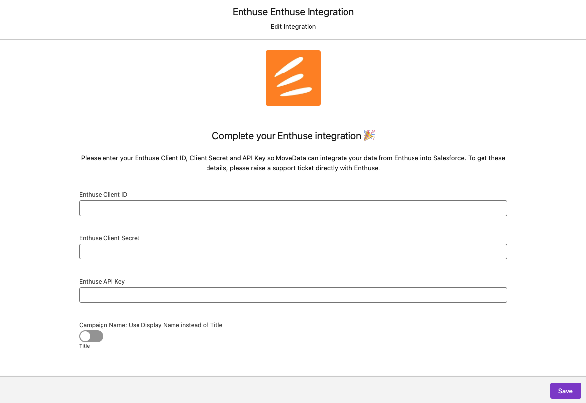

# Enthuse

### Overview

The MoveData Enthuse integration provides seamless, automated synchronisation between your Enthuse fundraising platform and Salesforce. This comprehensive integration ensures that all donation activities, supporter data, campaign information, and recurring donations are automatically transferred to your Salesforce environment, eliminating manual data entry whilst maintaining complete data accuracy.

**Key Benefits:**

* **Automated synchronisation** of all Enthuse fundraising activities via polling
* **Intelligent campaign hierarchy** management including events, teams, and individual fundraisers
* **Advanced financial tracking** including fees and Gift Aid
* **Recurring donation management** with schedule tracking and status updates
* **Marketing preference** synchronisation for GDPR compliance

### Integration Summary

| Field     | Value                                        |
| --------- | -------------------------------------------- |
| Product   | [https://enthuse.com/](https://enthuse.com/) |
| Method    | Pull (Polling)                               |
| Frequency | Configurable (10 minutes to 24 hours)        |

### Demonstration Video



### Supported Modes

Logic is required to map Enthuse notifications to your Salesforce data. To quickly and easily do so we recommend using one of the supported MoveData Extensions.


We do not currently integrate information from Enthuse's `Events` product (which has a completely separate API)


| Extension                 | Supported |
| ------------------------- | --------- |
| Fundraising and Donations | ✅         |
| Commerce                  | ❌         |


The Fundraising and Donations Extension is relevant to processing fundraising activity and donation information into Salesforce


### Setup

**Enthuse API Credentials**

To set up the Enthuse integration, you will need three credentials from Enthuse:

1. **Client ID** - Your OAuth application client identifier
2. **Client Secret** - Your OAuth application secret key
3. **API Key** - Your Enthuse reporting API access key

To obtain these credentials, please raise a support ticket directly with Enthuse requesting API access for your MoveData integration.

**MoveData Enthuse Configuration**

<figure><figcaption></figcaption></figure>

1. Open the MoveData app in Salesforce and select the **Integrations** tab
2. Click **New Integration** and select **Enthuse** from the list of available integrations
3. Add a descriptive name for your integration and click **Save**
4. Enter your Enthuse credentials in the configuration screen:
   * **Enthuse Client ID**: Your OAuth client identifier
   * **Enthuse Client Secret**: Your OAuth client secret
   * **Enthuse API Key**: Your reporting API key
5. Configure additional options as needed (see Configurable Options below)
6. Click **Save** to complete the setup

The integration will automatically begin synchronising data based on your configured schedule.

### Configurable Options

| Option                                  | Description                                                                                                                                   |
| --------------------------------------- | --------------------------------------------------------------------------------------------------------------------------------------------- |
| **Production Environment**              | Toggle between Enthuse production and sandbox environments. When disabled, uses Enthuse's sandbox environment for testing.                    |
| **Use Display Name**                    | Controls campaign naming for fundraising pages. When enabled, uses the supporter's display name; when disabled, uses the page title.          |
| **Ignore Address2 when United Kingdom** | Enthuse pushes a duplicate of the city name in the Address2 field when the address is for the UK.  Toggling this to true, ignores this value. |
| **Data Synchronisation Interval**       | Frequency of data polling (configurable from 10 minutes to 24 hours)                                                                          |
| **Data Delay Buffer**                   | Time offset for data retrieval to ensure complete records (default: 24 hours)                                                                 |

### Data Migration

Data Migration is available upon request. This is a custom service provided by MoveData and is delivered by MoveData Professional Services.

* Requires access to Enthuse's reporting API
* Historical data available based on your Enthuse data retention policies
* Configurable date ranges for initial data import

### Additional Field Mappings

Where possible, all fields are mapped to the appropriate schemas. Often there are fields that do not fit explicitly into a schema and these are appended as custom fields. Enthuse custom codes are automatically included in fundraiser and team records.

**Custom Fields**

Enthuse allows organisations to add custom codes to fundraising pages for additional tracking and reporting. MoveData automatically includes these in the resulting notification schema.

**Custom Code Mapping**: Custom codes are mapped using the pattern `code{CodeName}` where special characters are removed from the code name.

**Example**: A custom code named "Nominal Code" with value "LM:U/4900" becomes:

```
custom.codeNominalCode = "LM:U/4900"
```

### Reference

The following custom fields are automatically included in MoveData notifications:

**Contact Custom Fields**

| Attribute Name             | Description                  | Example                |
| -------------------------- | ---------------------------- | ---------------------- |
| `enthuseIsFund`            | Supporter is a fundraiser    | `true`                 |
| `enthuseIsDonor`           | Supporter has made donations | `true`                 |
| `enthuseUserGuid`          | Enthuse User GUID            | `abc123def-456...`     |
| `enthuseSupporterCurrency` | Supporter's currency         | `GBP`                  |
| `enthuseTotalFundsRaised`  | Total amount raised          | `1250.00`              |
| `enthuseLifeTimeGiftAid`   | Lifetime Gift Aid claimed    | `312.50`               |
| `enthuseLastDonationDate`  | Date of last donation        | `2024-01-15T10:30:00Z` |
| `allowedToContact`         | Marketing permission granted | `true`                 |
| `emailOptIn`               | Email marketing permission   | `true`                 |
| `phoneOptIn`               | Phone marketing permission   | `false`                |
| `smsOptIn`                 | SMS marketing permission     | `false`                |
| `postOptIn`                | Postal marketing permission  | `false`                |

**Campaign Custom Fields**

| Attribute Name                | Description                          | Example                        |
| ----------------------------- | ------------------------------------ | ------------------------------ |
| `enthuseOfflineDonationCount` | Number of offline donations recorded | `25`                           |
| `enthuseGiftaidAmount`        | Total Gift Aid amount                | `256.33`                       |
| `code{CustomCodeName}`        | Dynamic custom code fields           | `codeNominalCode: "LM:U/4900"` |

**Donation Custom Fields**

| Attribute Name       | Description                              | Example                                  |
| -------------------- | ---------------------------------------- | ---------------------------------------- |
| `enthusePaymentGuid` | Enthuse Payment Transaction GUID         | `a22b95cd-e05a-4953-ac0a-d44ada37deb5`   |
| `enthuseCheckoutId`  | Enthuse Checkout ID                      | `161472`                                 |
| `transactionType`    | Type of transaction                      | `Payment`, `Refund`                      |
| `productType`        | Product type                             | `Fundraising`                            |
| `paymentType`        | Payment type                             | `Donation`                               |
| `serviceFee`         | Platform service fee                     | `0.13`                                   |
| `giftaidAmount`      | Gift Aid amount claimed                  | `2.50`                                   |
| `giftaidFee`         | Gift Aid processing fee                  | `0.13`                                   |
| `giftaidHmrcStatus`  | HMRC submission status                   | `false`                                  |
| `giftingAmount`      | Amount processed under gifting fee model | `10.00`                                  |
| `donorCoveredAmount` | Amount of fees covered by donor          | `0.62`                                   |
| `paymentFeeModel`    | Fee model used                           | `Gifting`, `DonorFeeCover`               |
| `context`            | Integration context                      | `campaign`, `diy`, `direct`, `recurring` |
| `contextCampaign`    | Is part of a formal campaign             | `true`                                   |
| `contextDiy`         | Is a DIY fundraising page                | `false`                                  |
| `contextDirect`      | Is a direct donation                     | `false`                                  |
| `contextRecurring`   | Is a recurring donation                  | `false`                                  |

**Recurring Donation Custom Fields**

| Attribute Name | Description              | Example                                   |
| -------------- | ------------------------ | ----------------------------------------- |
| `status`       | Enthuse recurring status | `Active`, `Failed`, `Cancelled`, `Paused` |

#### UK-Specific Features

**Gift Aid Processing**

The Enthuse integration includes comprehensive Gift Aid support for UK charities:

* **Automatic Gift Aid Calculation**: Gift Aid amounts are automatically calculated and tracked
* **HMRC Submission Tracking**: Monitor which donations have been submitted to HMRC
* **Gift Aid Fee Tracking**: Separate tracking of Gift Aid processing fees
* **Compliance Reporting**: Built-in fields for Gift Aid compliance and audit requirements

**Fee Models**

Enthuse supports multiple fee models that are automatically detected and processed:

* **Gifting Model**: Fees absorbed by the charity
* **Donor Fee Cover**: Donor covers processing fees
* **Platform Fees**: Separate tracking of platform vs. gateway fees

**Authentication**

The integration uses OAuth2 client credentials flow to authenticate with Enthuse's API.

### Other Resources

**Enthuse API Documentation:**\
[https://enthuse.readme.io/](https://enthuse.readme.io/)

**Enthuse Support:**\
Contact Enthuse directly for API access requests and platform-specific questions.

**MoveData Support:**\
Visit [docs.movedata.io](https://docs.movedata.io) for additional integration guides and support resources.
