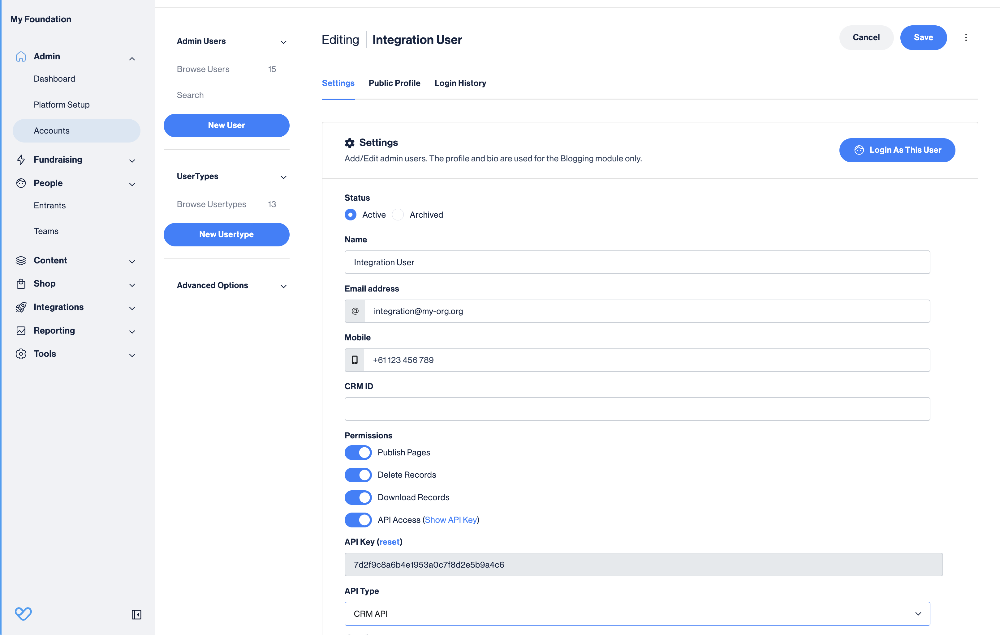
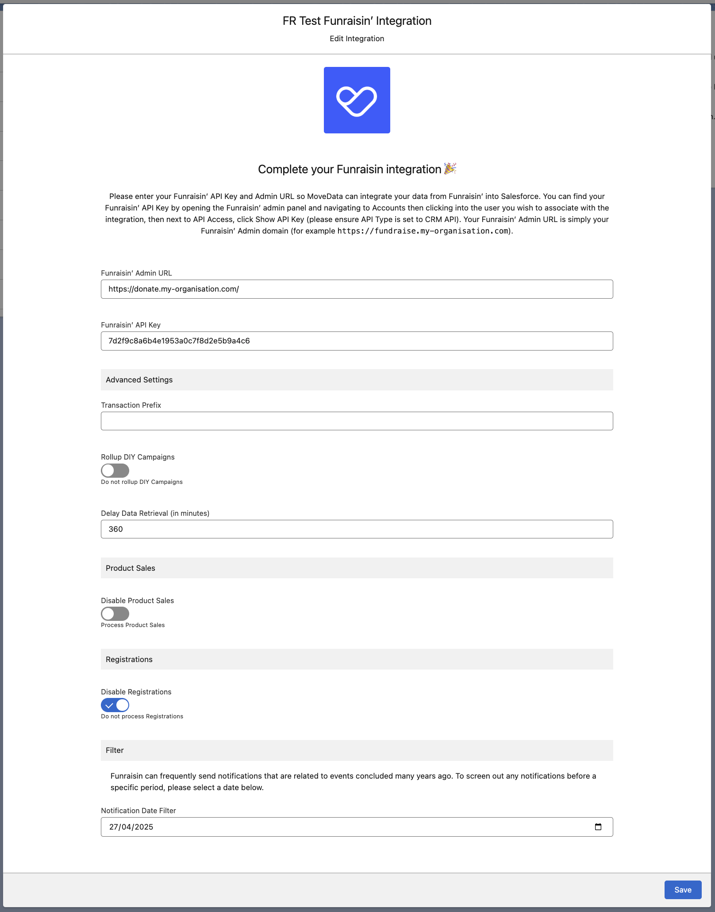

# Funraisin'

## Overview

The MoveData Funraisin integration provides comprehensive, automated synchronisation between your Funraisin fundraising platform and Salesforce. This powerful integration ensures that all donation activities, supporter registrations, event data, sales transactions, raffles, and ticketing information are automatically transferred to your Salesforce environment, eliminating manual data entry whilst maintaining complete data accuracy.

### Key Benefits

* **Comprehensive data synchronisation** covering donations, events, teams, members, sales, and raffles
* **Flexible polling intervals** configurable from 10 minutes to 24 hours
* **Intelligent dependency resolution** ensuring complete data relationships
* **Advanced campaign hierarchy** management for complex fundraising structures
* **Multi-domain support** for both fundraising and commerce activities

## Integration Summary

| Field     | Value                                            |
| --------- | ------------------------------------------------ |
| Product   | [https://funraisin.com/](https://funraisin.com/) |
| Method    | Pull (Polling)                                   |
| Frequency | Configurable (10 minutes to 24 hours)            |

## Supported Modes

Logic is required to map Funraisin notifications to your Salesforce data. To quickly and easily do so we recommend using one of the supported MoveData Extensions.

| Extension                 | Supported |
| ------------------------- | --------- |
| Fundraising and Donations | ✅         |
| Ticketing and Commerce    | ✅         |


* The Fundraising and Donations Extension is relevant to processing fundraising activity and donation information into Salesforce
* The Ticketing and Commerce Extension is relevant to processing order, sales, raffle, and ticket information into Salesforce


## Setup



### Funraisin API Credentials

To set up the Funraisin integration, you will need your Funraisin API credentials:

1. **API Endpoint** - Your Funraisin platform URL (e.g., `https://fundraise.your-organisation.org`)
2. **API Key** - Your Funraisin API access key (32-character hexadecimal string)

<figure><figcaption></figcaption></figure>

To obtain these credentials, please follow the below steps:

1. Log into your Funraisin Management Admin site (e.g., `https://fundraise.your-organisation.org/management`)
2. Open the user your wish to user for the integration by selecting **Admin → Accounts**
3. Ensure **API Access** is enabled
4. Copy the 32-digit API Key

### MoveData Funraisin Configuration Screen

<figure><figcaption></figcaption></figure>

Enter your Funraisin API Endpoint & API Key. Referring to the Funraisin Configurable Options, complete your configuration and click **Save** to continue.

The integration will automatically begin synchronising data based on the default polling schedule of 10 minutes.

## Configurable Options

| Option                    | Description                                                                                                   |
| ------------------------- | ------------------------------------------------------------------------------------------------------------- |
| **API Endpoint**          | The Funraisin URL for your organisation. ie. `https://fundraise.your-organisation.org`                        |
| **API Key**               | Your Funraisin API access key (32-character hexadecimal string)                                               |
| **Transaction Prefix**    | A prefix to add to each platform key. Required for multiple Funraisin integrations to prevent key collisions. |
| **Rollup DIY Campaign**   | Merge DIY events into parent campaigns rather than creating separate campaigns (default: false)               |
| **Polling Interval**      | Frequency of data synchronisation (configurable from 10 minutes to 24 hours). Requires a support ticket.      |
| **Data Delay Retrieval**  | Time offset for data retrieval to ensure complete records (default: null, configurable in minutes)            |
| **Disable Product Sales** | Skip processing of sales/merchandise transactions (default: false)                                            |
| **Disable Registrations** | Skip processing of event registrations/tickets (default: false)                                               |
| **Timezone**              | Timezone for date/time processing (default: Australia/Sydney). Requires a support ticket.                     |
| **Date Filter**           | Exclude records created before specified date (format: YYYY-MM-DD)                                            |

## Data Migration

Data Migration is available upon request. This is a custom service provided by MoveData and is delivered by MoveData Professional Services.

* Requires API access to your Funraisin platform
* Historical data available based on your Funraisin data retention policies
* Configurable date ranges for initial data import
* Supports all data types: donations, events, teams, members, sales, raffles, and registrations

## Supported Types

The Funraisin integration supports comprehensive data synchronisation across multiple domains:

**Core Fundraising Data:**

* **Events/Campaigns** - Fundraising events and campaigns
* **Teams** - Team-based fundraising groups
* **Members** - Individual fundraisers and supporters
* **Team Members** - Individual fundraising pages within events
* **Donations** - One-time and recurring donations
* **Recurring Donations** - Subscription-based giving schedules

**Commerce Data:**

* **Sales** - Merchandise and product sales
* **Products** - Product catalogue items
* **Product Options** - Variations and customisations

**Raffle Data:**

* **Raffles** - Raffle campaigns and draws
* **Raffle Sales** - Raffle ticket purchases
* **Raffle Tickets** - Individual raffle entries

**Event Management:**

* **Registrations** - Event registrations and ticket purchases
* **Tickets** - Event ticket types and pricing
* **Participant Options** - Registration add-ons and customisations

**Supporting Data:**

* **Organisations** - Corporate fundraising accounts
* **Pages** - Fundraising page templates
* **Themes** - Campaign categorisation
* **Transactions** - Payment processing records
* **Promo Codes** - Discount and promotion tracking

## Additional Field Mappings

Where possible, all fields are mapped to the appropriate schemas. Often there are fields that do not fit explicitly into a schema and these are appended as custom fields. Funraisin custom fields and questions are dynamically included in the resulting notification schema.

**Custom Field Naming Convention:**

* Standard fields use the prefix `Funraisin_`
* Funraisin Custom fields follow the pattern `Funraisin_Custom_{FieldName}`
* Question responses are included in the `questions` entity where applicable

## Reference

Below is a sample of some of the custom fields are automatically included in MoveData notifications. As mentioned, this is dynamically generated from the Funraisin API responses.

**Contact Custom Fields (Members)**

| Attribute Name                 | Description                        | Example                            |
| ------------------------------ | ---------------------------------- | ---------------------------------- |
| `Funraisin_MemberId`           | Funraisin Member ID                | `9574`                             |
| `Funraisin_MemberHash`         | Unique member hash                 | `cce17a7ccf7db7f7a1b4b7fb1f3a5d9f` |
| `Funraisin_MRegoNumber`        | Member registration number         | `REG-BCFNZ9574`                    |
| `Funraisin_FbuserId`           | Facebook User ID                   | `123456789`                        |
| `Funraisin_GoogleUserId`       | Google User ID                     | `google123`                        |
| `Funraisin_AppleUserId`        | Apple User ID                      | `apple456`                         |
| `Funraisin_MFname`             | First name                         | `Peter`                            |
| `Funraisin_MLname`             | Last name                          | `Piper`                            |
| `Funraisin_MEmail`             | Email address                      | `peter@example.com`                |
| `Funraisin_MUsername`          | Platform username                  | `peterpiper`                       |
| `Funraisin_MDob`               | Date of birth                      | `1985-05-15`                       |
| `Funraisin_MGender`            | Gender                             | `M`, `F`, `O`                      |
| `Funraisin_MLanguage`          | Preferred language                 | `EN`                               |
| `Funraisin_MPhoneMobile`       | Mobile phone number                | `21659888`                         |
| `Funraisin_MPhoneMobileSuffix` | Mobile phone country code          | `+64`                              |
| `Funraisin_MOptin`             | General marketing opt-in           | `true`                             |
| `Funraisin_MOptinEmail`        | Email marketing consent            | `true`                             |
| `Funraisin_MOptinSms`          | SMS marketing consent              | `false`                            |
| `Funraisin_MOptinPost`         | Postal marketing consent           | `true`                             |
| `Funraisin_MOptinPhone`        | Phone marketing consent            | `false`                            |
| `Funraisin_CrmMemberId`        | Salesforce Contact ID              | `0039o000003le1cAAA`               |
| `Funraisin_GatewayCustomerRef` | Payment gateway customer reference | `cus_PTq5WeBEK9kyOL`               |

**Campaign Custom Fields (Events)**

| Attribute Name            | Description            | Example                       |
| ------------------------- | ---------------------- | ----------------------------- |
| `Funraisin_EventId`       | Funraisin Event ID     | `479`                         |
| `Funraisin_EventKey`      | URL-friendly event key | `pinkribbonwalk-christchurch` |
| `Funraisin_EventCode`     | Event code             | `PRW-CHR24`                   |
| `Funraisin_EventName`     | Event name             | `Pink Ribbon Walk 2024`       |
| `Funraisin_EventType`     | Event type             | `online`, `offline`, `diy`    |
| `Funraisin_EventTarget`   | Fundraising target     | `200000.00`                   |
| `Funraisin_EventDate`     | Event date             | `2024-09-30`                  |
| `Funraisin_EventLocation` | Event location         | `Sydney`                      |
| `Funraisin_StTeams`       | Teams allowed          | `true`                        |
| `Funraisin_StFundraising` | Fundraising enabled    | `true`                        |
| `Funraisin_StDonations`   | Donations enabled      | `true`                        |
| `Funraisin_EventStatus`   | Event status           | `1` (active)                  |
| `Funraisin_CrmEventId`    | Salesforce Campaign ID | `701Ol00000LEvSBIA1`          |

**Campaign Custom Fields (Teams)**

| Attribute Name          | Description             | Example             |
| ----------------------- | ----------------------- | ------------------- |
| `Funraisin_TeamId`      | Funraisin Team ID       | `245`               |
| `Funraisin_TName`       | Team name               | `Super Fundraisers` |
| `Funraisin_TTarget`     | Team fundraising target | `5000.00`           |
| `Funraisin_TotalRaised` | Amount raised to date   | `3250.50`           |
| `Funraisin_CaptainId`   | Team captain member ID  | `9574`              |

**Campaign Custom Fields (Fundraisers)**

| Attribute Name            | Description                   | Example                    |
| ------------------------- | ----------------------------- | -------------------------- |
| `Funraisin_HistoryId`     | Fundraiser page ID            | `9814`                     |
| `Funraisin_MemberId`      | Associated member ID          | `9574`                     |
| `Funraisin_MTarget`       | Individual fundraising target | `750.00`                   |
| `Funraisin_MPageTitle`    | Fundraising page title        | `Supporting a Great Cause` |
| `Funraisin_IsFundraising` | Is actively fundraising       | `true`                     |
| `Funraisin_TotalRaised`   | Amount raised                 | `425.00`                   |
| `Funraisin_PoNumber`      | Purchase order number         | `REG-BCFNZ68239`           |

**Donation Custom Fields**

| Attribute Name            | Description           | Example                          |
| ------------------------- | --------------------- | -------------------------------- |
| `Funraisin_DonationId`    | Funraisin Donation ID | `12345`                          |
| `Funraisin_DAmount`       | Donation amount       | `50.00`                          |
| `Funraisin_DFee`          | Platform fee          | `2.50`                           |
| `Funraisin_DonationType`  | Donation type         | `online`, `offline`, `recurring` |
| `Funraisin_DStatus`       | Donation status       | `success`, `refund`, `pledge`    |
| `Funraisin_DEmail`        | Donor email           | `donor@example.com`              |
| `Funraisin_DFname`        | Donor first name      | `John`                           |
| `Funraisin_DLname`        | Donor last name       | `Smith`                          |
| `Funraisin_DOrganisation` | Donor organisation    | `ACME Corp`                      |
| `Funraisin_DAnonymous`    | Anonymous donation    | `true`                           |
| `Funraisin_DOptin`        | Marketing opt-in      | `true`                           |

**Recurring Donation Custom Fields**

| Attribute Name          | Description           | Example                                     |
| ----------------------- | --------------------- | ------------------------------------------- |
| `Funraisin_ScheduleId`  | Recurring schedule ID | `789`                                       |
| `Funraisin_Frequency`   | Payment frequency     | `monthly`, `weekly`, `yearly`               |
| `Funraisin_Status`      | Schedule status       | `0` (paused), `1` (active), `2` (cancelled) |
| `Funraisin_NextPayment` | Next payment date     | `2024-02-15`                                |

**Commerce Schema Fields**

**Order Custom Fields:**

| Attribute Name         | Description                      | Example               |
| ---------------------- | -------------------------------- | --------------------- |
| `Funraisin_SaleId`     | Sale transaction ID              | `113`                 |
| `Funraisin_PoNumber`   | Purchase order number            | `SHOP-BCFNZ68287`     |
| `Funraisin_SubTotal`   | Subtotal before tax and delivery | `7.50`                |
| `Funraisin_Gst`        | Tax amount                       | `1.07`                |
| `Funraisin_Delivery`   | Delivery charge                  | `5.00`                |
| `Funraisin_TotalFee`   | Platform fees                    | `0.47`                |
| `Funraisin_PromoId`    | Applied promo code ID            | `12`                  |
| `Funraisin_CardBrand`  | Payment card brand               | `visa`                |
| `Funraisin_CardNumber` | Masked card number               | `xxxx-****-****-5217` |

**Product Custom Fields:**

| Attribute Name          | Description         | Example                         |
| ----------------------- | ------------------- | ------------------------------- |
| `Funraisin_ProductId`   | Product ID          | `5`                             |
| `Funraisin_ProductType` | Product type        | `product`, `ticket`, `donation` |
| `Funraisin_ProductSlug` | URL slug            | `pink-ribbon-walk-drink-bottle` |
| `Funraisin_ProductCost` | Cost price          | `3.00`                          |
| `Funraisin_IsDonation`  | Is donation product | `false`                         |
| `Funraisin_GstFree`     | GST/tax exempt      | `false`                         |

**Raffle Custom Fields:**

| Attribute Name          | Description               | Example                 |
| ----------------------- | ------------------------- | ----------------------- |
| `Funraisin_RaffleId`    | Raffle ID                 | `25`                    |
| `Funraisin_RaffleName`  | Raffle name               | `Grand Prize Draw 2024` |
| `Funraisin_TicketPrice` | Ticket price              | `10.00`                 |
| `Funraisin_MaxTickets`  | Maximum tickets available | `1000`                  |
| `Funraisin_DrawDate`    | Draw date                 | `2024-12-15`            |

#### Context Classification

MoveData automatically classifies notifications with context information to help with business rule processing. These are true/false fields.

| Context Type | Description                             |
| ------------ | --------------------------------------- |
| `event`      | Activity within a formal campaign/event |
| `page`       | Individual fundraising page activity    |
| `diy`        | DIY/self-created fundraising activity   |
| `direct`     | Direct donations to the platform        |
| `recurring`  | Recurring/subscription donations        |

#### Advanced Features

**Dependency Resolution:** The integration automatically identifies and resolves data dependencies, ensuring complete relationship mapping between events, teams, members, donations, and related records.

**Intelligent Caching:** Advanced caching mechanisms prevent duplicate API calls and optimise performance for large data sets.

**Error Handling:** Comprehensive error handling with automatic retry logic and detailed logging for troubleshooting.

**Date Filtering:** Configurable date filters allow you to exclude historical records and focus on recent activity.

**Custom Field Support:** Dynamic mapping of Funraisin custom fields and questions to Salesforce custom fields.

## Other Resources

**Funraisin Developer Support:**\
[https://support.funraisin.co/developers](https://support.funraisin.co/developers)

**Funraisin API:**\
[https://support.funraisin.co/blog/connecting-to-your-funraisin-api](https://support.funraisin.co/blog/connecting-to-your-funraisin-api)
