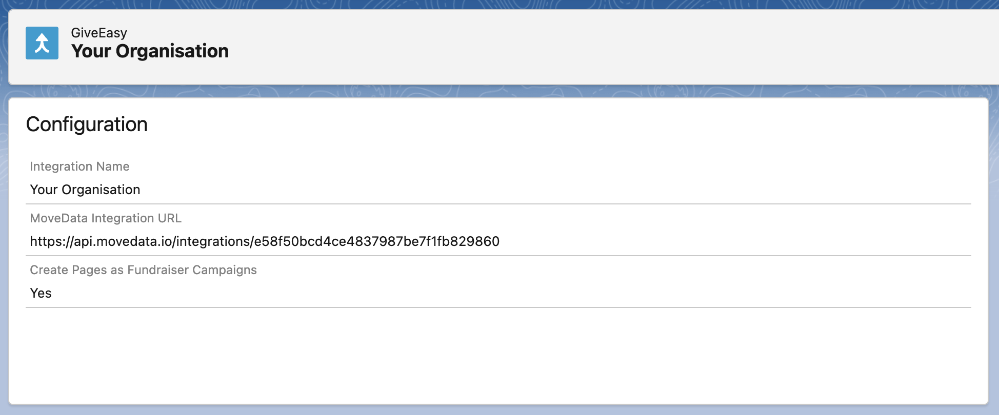

# GiveEasy

## Overview

The MoveData GiveEasy integration provides seamless, real-time synchronisation between your GiveEasy fundraising platform and Salesforce. This comprehensive integration ensures that all donation activities, supporter data, campaign information, and fundraising page activities are automatically transferred to your Salesforce environment, eliminating manual data entry whilst maintaining complete data accuracy.

### Key Benefits

* **Real-time webhook synchronisation** of all GiveEasy donation activities
* **Intelligent campaign hierarchy** management supporting campaigns and fundraising pages
* **Advanced UTM tracking** with comprehensive marketing attribution
* **Multi-payment gateway support** including Stripe, PayPal, and Apple Pay
* **Comprehensive fee handling** for both donor-paid and charity-paid scenarios

## Integration Summary

| Field     | Value                                          |
| --------- | ---------------------------------------------- |
| Product   | [https://giveeasy.org/](https://giveeasy.org/) |
| Method    | Push (Webhooks)                                |
| Frequency | Real-Time                                      |

## Supported Modes

Logic is required to map GiveEasy notifications to your Salesforce data. To quickly and easily do so we recommend using one of the supported MoveData Extensions.

| Extension                 | Supported |
| ------------------------- | --------- |
| Fundraising and Donations | ✅         |
| Commerce                  | ❌         |


The Fundraising and Donations Extension is relevant to processing fundraising activity and donation information into Salesforce.


## Setup

To set up the GiveEasy integration, you will need to configure webhooks in your GiveEasy platform to send donation events to MoveData.

### MoveData GiveEasy Configuration

<figure><figcaption></figcaption></figure>

1. Open the MoveData app in Salesforce and select the **Integrations** tab
2. Click **New Integration** and select **GiveEasy** from the list of available integrations
3. Add a descriptive name for your integration and click **Save**
4. Copy the **MoveData Integration URL** displayed in the configuration screen
5. Configure your webhook settings as needed (see Configurable Options below)
6. Click **Save** to complete the setup

### GiveEasy Webhook Setup

Contact your GiveEasy administrator or support team to configure webhooks:

1. Provide them with your MoveData Integration URL
2. Verify the webhook is active and sending data to the MoveData endpoint

The integration will automatically begin processing donation events as they occur in your GiveEasy platform.

## Configurable Options

| Option                                   | Description                                                                                                                                                                                                                                                                                                                                                            |
| ---------------------------------------- | ---------------------------------------------------------------------------------------------------------------------------------------------------------------------------------------------------------------------------------------------------------------------------------------------------------------------------------------------------------------------- |
| **Create Pages as Fundraiser Campaigns** | <p><strong>Enabled (default):</strong></p><ul><li>Creates a two-tier campaign hierarchy</li><li>GiveEasy campaigns become top-level campaigns</li><li>GiveEasy fundraising pages become fundraiser campaigns</li></ul><p><strong>Disabled:</strong></p><ul><li>Only campaign-level hierarchy</li><li>Fundraising pages are not created as separate campaigns</li></ul> |

## Data Migration

Data Migration is available upon request. This is a custom service provided by MoveData and is delivered by MoveData Professional Services.

* Requires coordination with GiveEasy for historical data access
* Historical webhook replay may be available depending on GiveEasy's data retention policies
* Custom data export and import processes can be arranged

## Additional Field Mappings

Where possible, all fields are mapped to the appropriate schemas. GiveEasy custom fields and UTM parameters are dynamically included in the resulting notification schema.

### **Campaign Hierarchy**

The GiveEasy integration creates intelligent campaign hierarchies based on your configuration:

**With "Create Pages as Fundraiser Campaigns" Enabled:**

1. **Top Level**: GiveEasy Campaign (if exists) OR Generic "GiveEasy" campaign
2. **Fundraiser Level**: GiveEasy fundraising page

**With "Create Pages as Fundraiser Campaigns" Disabled:**

1. **Campaign Level**: GiveEasy Campaign (if exists) OR Generic "GiveEasy" campaign

### **Payment Gateway Support**

The GiveEasy integration supports multiple payment gateways with comprehensive transaction tracking:

**Stripe Integration:**

* Payment intent tracking for card payments
* Apple Pay processing through Stripe
* Advanced card information processing
* Comprehensive fee breakdown

**PayPal Integration:**

* Capture ID tracking for completed payments
* Merchant information processing
* PayPal-specific fee handling
* Support for pending payments awaiting capture

**Payment Method Detection:**

* Automatic detection of payment types: `card`, `applepay`, `paypal`
* Intelligent payment processor assignment based on gateway

### **Fee Structure Processing**

GiveEasy provides detailed fee breakdown with support for different fee payment models:

**Fee Types:**

* **Platform Fee**: GiveEasy platform charges
* **Gateway Fee**: Payment processor charges
* **Tax**: Applicable taxes on fees
* **Fee Coverage**: Whether donor chose to cover fees

**Fee Payment Models:**

* **Charity Pays** (`CharityPays`): Charity covers all platform fees
* **Donor Pays** (`DonorPays`): Donor covers platform fees, charity pays gateway fees

**Fee Allocation Logic:**

* **Public fees**: When donor covers fees (`platformFeeType === "DonorPays"`)
* **Private fees**: When charity covers fees (`platformFeeType === "CharityPays"`)
* **Gateway fees**: Payment processor charges (allocation depends on fee model)

### **UTM and Marketing Attribution**

GiveEasy provides comprehensive UTM tracking support with automatic marketing entity creation:

**Automatic UTM Detection:**

* UTM campaign, source, medium, content, and term tracking
* Page tags automatically converted to marketing attribution
* Custom tag support for additional tracking parameters

**Marketing Entity Creation:**

* Creates standardised marketing attribution records when UTM parameters are present
* Supports partial UTM data (e.g., only source, medium, campaign)
* Integrates with Salesforce campaign attribution features

## Reference

The following custom fields are automatically included in MoveData notifications:

### **Contact Custom Fields**

There are no custom fields for contacts.

### **Campaign Custom Fields**

**Campaign Records:**

| Attribute Name | Description            | Example                            |
| -------------- | ---------------------- | ---------------------------------- |
| `type`         | GiveEasy campaign type | `"Appeal"`, `"Event"`, `"General"` |

### **Donation Custom Fields**

| Attribute Name        | Description                       | Example                                                                  |
| --------------------- | --------------------------------- | ------------------------------------------------------------------------ |
| `processorToken`      | Payment gateway transaction token | `"8YT11757MG3248140"` (PayPal), `"pi_3RVroaKgwKnuLBcM0WkaObPA"` (Stripe) |
| `stripePaymentIntent` | Stripe payment intent ID          | `"pi_3RVroaKgwKnuLBcM0WkaObPA"`                                          |
| `paypalCaptureId`     | PayPal capture transaction ID     | `"8YT11757MG3248140"`                                                    |
| `isPIIPublic`         | Whether donor info can be public  | `true`, `false`                                                          |
| `ipAddress`           | Donor IP address                  | `"124.190.10.16"`                                                        |
| `userAgent`           | Donor browser user agent          | `"Mozilla/5.0 (iPhone; CPU iPhone OS 18_5 like Mac OS X)"`               |
| `screenSize`          | Device screen size category       | `"Desktop"`, `"Mobile"`, `"Tablet"`                                      |
| `facebookPixel`       | Facebook pixel tracking data      | `"fb.2.1750814146386.517071266419391678"`                                |
| `isLiveMode`          | Whether transaction was live      | `true`, `false`                                                          |

### **Custom Field Processing**

GiveEasy custom fields are automatically processed and included:

**Field Naming Convention:**

* Custom fields use the prefix `field` followed by the capitalised field name
* Special characters and spaces are removed from field names
* Field values are processed based on their type (text, boolean, multi-select)

**Example Custom Field Mapping:**

```json
{
  "customFields": [
    {
      "name": "special interest",
      "values": ["wildlife", "education"]
    }
  ]
}
```

Becomes: `fieldSpecialInterest: "wildlife,education"`

### **UTM Parameter Processing**

UTM parameters from GiveEasy page tags are automatically converted to marketing attribution entries.

### **Data Processing Notes**

**Donor Key Generation:**

* Primary: Uses GiveEasy donor ID when available
* Fallback: Email address converted to alphanumeric key (eg. `johndoegmailcom`)
* Format: Removes special characters and spaces, converts to lowercase

**Anonymous Donation Detection:**

* Filters out placeholder names like "Card Holder"
* Respects donor privacy preferences (`isPIIPublic` flag)
* Maintains audit trail for anonymous donations

**Device and Browser Tracking:**

* Comprehensive user agent string capture
* Device type classification (Desktop, Mobile, Tablet)
* IP address tracking for fraud prevention
* Facebook pixel integration for marketing attribution

## Other Resources

**GiveEasy Platform:**\
[https://giveeasy.org/](https://giveeasy.org/)
