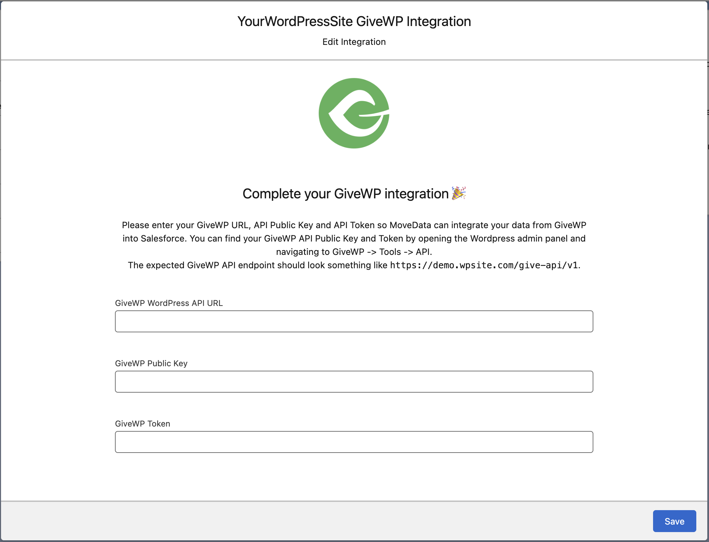
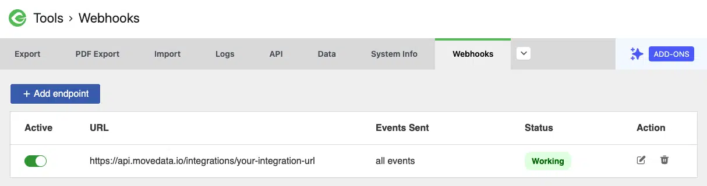

# GiveWP

## Overview

The MoveData GiveWP integration provides seamless, automated synchronisation between your GiveWP WordPress donation plugin and Salesforce. This powerful API integration ensures that all donation activities, donor information, recurring donations, and form data are automatically transferred to your Salesforce environment in real-time, eliminating manual data entry whilst maintaining complete data accuracy.

GiveWP is a WordPress plugin which allows WordPress administrators to easily take one-off and regular donations from their WordPress website. The GiveWP integration for Salesforce operates in real-time and conforms to Salesforce best practices enjoyed by all MoveData customers.

### Key Benefits:

* **Real-time API integration** processing all GiveWP donation activities automatically
* **Comprehensive donor management** with intelligent contact and account creation
* **Full recurring donation support** with subscription lifecycle management
* **Flexible campaign hierarchy** supporting GiveWP forms as Salesforce campaigns

## Integration Summary

| Field     | Value                                      |
| --------- | ------------------------------------------ |
| Product   | [https://givewp.com/](https://givewp.com/) |
| Method    | Push (Webhooks)                            |
| Frequency | Real-Time                                  |

## Supported Modes

Logic is required to map GiveWP notifications to your Salesforce data. To quickly and easily do so we recommend using one of the supported MoveData Extensions.

| Extension                 | Supported |
| ------------------------- | --------- |
| Fundraising and Donations | ✅         |
| Commerce                  | ❌         |


The Fundraising and Donations Extension is relevant to processing donation activity and donor information into Salesforce.


## Setup

### Setup Process

The GiveWP integration setup is straightforward and consists of three main steps:

1. **Retrieve your API Credentials in GiveWP**
2. **Create your GiveWP integration in MoveData**
3. **Add your MoveData Integration URL in GiveWP**

### GiveWP API Configuration (1/2)

To set up the GiveWP integration, you will need to obtain your GiveWP API credentials from your WordPress admin panel.

**Obtaining API Credentials:**

1. **Log into WordPress Admin**: Access your WordPress admin panel
2. **Navigate to GiveWP**: Go to **GiveWP → Tools → API**
3. **Generate API Keys**: Create a new API key with appropriate permissions
4. **Note Your Credentials**: Record your API Public Key and Token

**Required Information:**

* **GiveWP WordPress API URL** - Your WordPress API endpoint (e.g., `https://your-site.com/give-api/v1`)
* **API Public Key** - Your GiveWP API public key (32-character hexadecimal string)
* **API Token** - Your GiveWP API token (32-character hexadecimal string)

### MoveData GiveWP Configuration

<figure><figcaption></figcaption></figure>

1. Open the MoveData app in Salesforce and select the **Integrations** tab
2. Click **New Integration** and select **GiveWP** from the list of available integrations
3. Add a descriptive name for your integration and click **Save**
4. Enter your GiveWP credentials in the configuration screen:
   * **GiveWP WordPress API URL**: Your complete API endpoint URL
   * **GiveWP API Public Key**: Your 32-character public key
   * **GiveWP API Token**: Your 32-character token
5. Configure additional options as needed (see Configurable Options below)
6. Click **Save** to complete the setup

### GiveWP API Configuration (2/2)

**Register Webhooks in GiveWP**

<figure><figcaption></figcaption></figure>

1. **Log into WordPress Admin**: Access your WordPress admin panel
2. **Navigate to GiveWP**: Go to **GiveWP → Tools → Webhooks**
3. **Create your Endpoint**: Enter the MoveData API endpoint with all events

The integration operates via webhooks that are automatically triggered by GiveWP events. Once your integration is configured, GiveWP will send real-time notifications to MoveData when:

* Donations are created or status changes occur
* Donors are created or updated
* Subscriptions are created or modified

## Configurable Options

| Option               | Description                                                                                                                                                                                                                                                                |
| -------------------- | -------------------------------------------------------------------------------------------------------------------------------------------------------------------------------------------------------------------------------------------------------------------------- |
| **Form as Campaign** | Controls whether GiveWP donation forms are mapped to Salesforce campaigns. When enabled (default), creates a campaign hierarchy with GiveWP as the top-level campaign and individual forms as fundraiser campaigns. When disabled, only the top-level campaign is created. |

## Event Processing

The GiveWP integration processes three main types of webhook events:

### Donor Events

* Triggered when donor profiles are created or updated
* Processes donor contact information, addresses, and donation history
* Creates or updates Contact records in Salesforce

### Donation Events

* Triggered when donations are created or status changes occur
* Only processes donations with status "publish" (completed donations)
* Creates Opportunity records linked to appropriate campaigns and contacts

### Subscription Events

* Triggered when recurring donations are created or modified
* Only processes subscriptions with status "active"
* Creates Recurring Donation records with linked donation opportunities

## Data Migration

Data Migration is available upon request. This is a custom service provided by MoveData and is delivered by MoveData Professional Services.

* Requires API access to your GiveWP WordPress installation
* Records will only be imported if available via the GiveWP API
* Historical data available based on your GiveWP data retention policies

## Additional Field Mappings

Where possible, all fields are mapped to the appropriate schemas. Often there are fields that do not fit explicitly into a schema and these are appended as custom fields. GiveWP custom form fields and payment metadata are dynamically included in the resulting notification schema.

### Campaign Hierarchy

The GiveWP integration automatically creates a structured campaign hierarchy in Salesforce:

**Default Structure (Form as Campaign Enabled):**

**Tier 1: GiveWP Platform Campaign**

* **Name**: "GiveWP"
* **Type**: Campaign
* **Purpose**: Top-level container for all GiveWP donation activity

**Tier 2: Form Campaign**

* **Name**: Based on GiveWP form title (e.g., "General Donation Form")
* **Type**: Fundraiser
* **Purpose**: Represents individual donation forms

### Organisation and Contact Handling

The GiveWP integration intelligently handles both individual and organisational donations:

**Individual Donations:**

* Creates Person Contact records for individual donors
* Maps donor information from GiveWP donor profiles when available
* Falls back to donation billing information if donor profile data differs

**Organisation Donations:**

* Detects organisational donations based on company name fields
* Creates Organisation Account records with associated Contact records
* Links the individual contact as the primary contact for the organisation

**Address Processing:**

* Prioritises donor profile addresses over billing addresses
* Creates structured address records with proper country and state mapping
* Handles multi-line addresses appropriately

## Reference

The following custom fields are automatically included in MoveData notifications:

### Contact Custom Fields

| Attribute Name        | Description                    | Example  |
| --------------------- | ------------------------------ | -------- |
| `totalDonationCount`  | Total number of donations made | `5`      |
| `totalDonationAmount` | Total lifetime donation value  | `250.00` |

### Campaign Custom Fields

| Attribute Name  | Description                    | Example                  |
| --------------- | ------------------------------ | ------------------------ |
| `slug`          | GiveWP form URL slug           | `donation-form-2`        |
| `content`       | Form description content       | `Support our mission...` |
| `thumbnail`     | Form thumbnail image available | `false`                  |
| `donationCount` | Number of donations received   | `20`                     |

### Donation Custom Fields

The integration automatically maps all GiveWP payment metadata to custom fields with standardised naming:

| Attribute Name              | Description                   | Example                       |
| --------------------------- | ----------------------------- | ----------------------------- |
| `givePaymentTransactionId`  | Payment transaction ID        | `pi_3RPEjvHL0sT6xNX21cDY4VQp` |
| `givePaymentCurrency`       | Payment currency              | `AUD`                         |
| `givePaymentGateway`        | Payment gateway used          | `stripe_payment_element`      |
| `givePaymentDonorId`        | GiveWP donor ID               | `24`                          |
| `giveDonorBillingFirstName` | Billing first name            | `John`                        |
| `giveDonorBillingLastName`  | Billing last name             | `Smith`                       |
| `givePaymentDonorEmail`     | Donor email address           | `donor@example.com`           |
| `givePaymentDonorPhone`     | Donor phone number            | `+61412345678`                |
| `givePaymentMode`           | Payment mode (live/test)      | `test`                        |
| `givePaymentDonorIp`        | Donor IP address              | `121.45.134.85`               |
| `giveAnonymousDonation`     | Anonymous donation flag       | `0`                           |
| `giveCampaignId`            | GiveWP campaign identifier    | `3`                           |
| `giveDonorBillingCountry`   | Billing country               | `AU`                          |
| `giveDonorBillingAddress1`  | Billing address line 1        | `123 Main Street`             |
| `giveDonorBillingAddress2`  | Billing address line 2        | `Unit 4`                      |
| `giveDonorBillingCity`      | Billing city                  | `Sydney`                      |
| `giveDonorBillingState`     | Billing state/province        | `NSW`                         |
| `giveDonorBillingZip`       | Billing postcode              | `2000`                        |
| `giveDonationComment`       | Donor message                 | `Great cause!`                |
| `giveFeeAmount`             | Platform fee amount           | `25.76`                       |
| `giveFeeDonationAmount`     | Base donation before fees     | `500.00`                      |
| `giveFeeStatus`             | Fee recovery status           | `disabled`                    |
| `giveCompletedDate`         | Donation completion timestamp | `2025-05-16 03:15:19`         |

### Custom Form Field Support

GiveWP supports custom form fields which are automatically mapped to custom fields.  For example, `make_a_business_donation`  maps to `custom.makeABusinessDonation`.

### Recurring Donation Custom Fields

| Attribute Name      | Description                      | Example                                 |
| ------------------- | -------------------------------- | --------------------------------------- |
| `formId`            | Associated GiveWP form ID        | `43`                                    |
| `formName`          | Associated form name             | `Monthly Giving Program`                |
| `initialAmount`     | Initial subscription amount      | `50.00`                                 |
| `subscriptionCount` | Number of payments (0 = ongoing) | `0`                                     |
| `paymentParentId`   | Parent payment ID                | `79`                                    |
| `paymentGateway`    | Payment gateway                  | `paypal-commerce`                       |
| `paymentMode`       | Payment mode (live/test)         | `test`                                  |
| `notes`             | Subscription notes and history   | `Status changed from pending to active` |
| `subscriptionToken` | Gateway subscription token       | `I-C5SB6HY0J8YS`                        |
| `processorToken`    | Payment processor token          | `4UE36038PF537405A`                     |

## Payment Gateway Support

The GiveWP integration supports multiple payment gateways with intelligent processor detection:

**Stripe Integration:**

* Automatically detects Stripe payments via `stripe_payment_element`
* Maps Stripe transaction IDs and payment intents
* Processes Stripe customer IDs and account information

**PayPal Integration:**

* Supports PayPal Commerce Platform
* Maps PayPal transaction IDs and subscription profiles
* Handles PayPal recurring payment processing

**Gateway-Agnostic Processing:**

* Falls back to generic payment processing for unsupported gateways
* Maintains transaction IDs and gateway information
* Preserves all payment metadata for future reference

## Error Handling

**Supported Events:**

* Only processes donations with status "publish" (completed)
* Only processes subscriptions with status "active"
* All other statuses are ignored with appropriate messaging

**Data Validation:**

* Validates API credentials during configuration
* Provides detailed error messages for configuration issues
* Handles missing or malformed webhook data gracefully

**Retry Logic:**

* Implements automatic retry for temporary API failures
* Maintains detailed logging for troubleshooting
* Provides clear error messages for permanent failures

## Other Resources

**GiveWP Documentation:**\
[https://givewp.com/documentation/](https://givewp.com/documentation/)

**GiveWP API Documentation:**\
[https://givewp.com/documentation/developers/api/](https://givewp.com/documentation/developers/api/)

**GiveWP Support:**\
[https://givewp.com/support/](https://givewp.com/support/)
