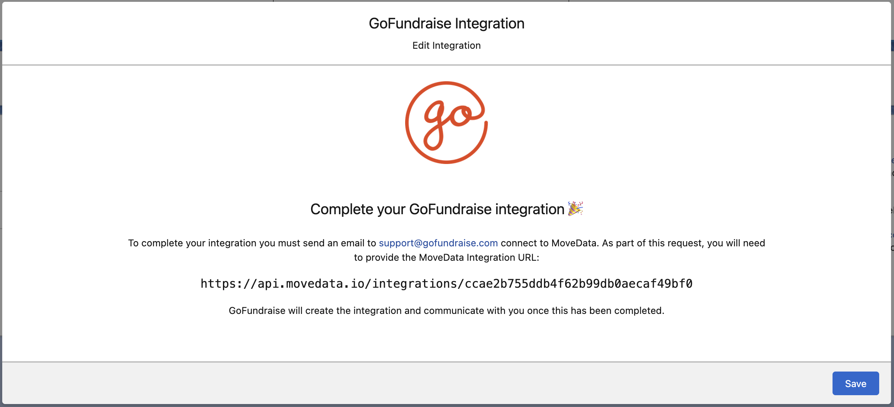

# GoFundraise

## Overview

The MoveData GoFundraise integration provides seamless synchronisation between your GoFundraise fundraising platform and Salesforce. This powerful integration ensures that all donation activities, supporter registrations, campaign data and fundraising activities are automatically transferred to your Salesforce environment, eliminating manual data entry whilst maintaining complete data accuracy.

### Key Benefits

* **Automated data synchronisation** of all GoFundraise activities
* **Intelligent campaign hierarchy** management for peer-to-peer fundraising
* **Advanced financial tracking** including fees, taxes, and currency handling
* **Support for regular giving** and recurring donation management

## Integration Summary

| Field     | Value                                                |
| --------- | ---------------------------------------------------- |
| Product   | [https://gofundraise.org/](https://gofundraise.org/) |
| Method    | Batch Push                                           |
| Frequency | Configured by GoFundraise                            |

## Supported Modes

Logic is required to map GoFundraise notifications to your Salesforce data. To quickly and easily do so we recommend using one of the supported MoveData Extensions.

| Extension                 | Supported |
| ------------------------- | --------- |
| Fundraising and Donations | ✅         |
| Commerce                  | ❌         |


The Fundraising and Donations Extension is relevant to processing fundraising activity and donation information into Salesforce


## Setup

<figure><figcaption></figcaption></figure>

To create your GoFundraise Integration in MoveData:

1. Open the MoveData app and select the **Integrations** tab
2. Click **New Integration** and select **GoFundraise** from the list of available integrations
3. Add a Name for your integration
4. Click **Save** to create the integration
5. **Contact GoFundraise Support**: Email [support@gofundraise.com](mailto:support@gofundraise.com) with your MoveData Integration URL (displayed in the configuration screen)
6. GoFundraise will configure the integration on their end and communicate when setup is complete

## Configurable Options

| Option                     | Description                                                                                                                                                                                  |
| -------------------------- | -------------------------------------------------------------------------------------------------------------------------------------------------------------------------------------------- |
| Donor Information Priority | <p>Billing over Donor - Use billing information when donor and billing details differ (default)</p><p><br>Donor over Billing - Prioritise donor profile information over billing details</p> |

## Data Migration

Data Migration is available upon request. This is a custom service provided by MoveData and is delivered by MoveData Professional Services in partnership with GoFundraise.

* Requires coordination with GoFundraise for historical data exports
* Conditional on the data GoFundraise can make available through their push service

## Reference

The following custom fields are automatically included in MoveData notifications:

**Contact Custom Fields**

| Attribute Name      | Description                 | Example             |
| ------------------- | --------------------------- | ------------------- |
| `fitbitConnected`   | Fitbit Integration Status   | `"true"`, `"false"` |
| `stravaConnected`   | Strava Integration Status   | `"true"`, `"false"` |
| `facebookConnected` | Facebook Integration Status | `"true"`, `"false"` |

**Campaign Custom Fields**

| Attribute Name          | Description                | Example   |
| ----------------------- | -------------------------- | --------- |
| `beneficiaryId`         | GoFundraise Beneficiary ID | `"308"`   |
| `eventCampaignParentId` | Parent Event Campaign ID   | `"15354"` |

**Fundraising Page Custom Fields**

| Attribute Name         | Description                        | Example                           |
| ---------------------- | ---------------------------------- | --------------------------------- |
| `fundraisingEnabled`   | Whether fundraising is enabled     | `"1"` (enabled), `"0"` (disabled) |
| `pageWebTag`           | Unique web identifier for the page | `"TiarnMuir"`                     |
| `leadId`               | Associated lead identifier         | `"598380"`                        |
| `fundraisingMetTarget` | Whether fundraising target was met | `"0"` (not met), `"1"` (met)      |

**Donation Custom Fields**

| Attribute Name           | Description                   | Example                                |
| ------------------------ | ----------------------------- | -------------------------------------- |
| `transactionSource`      | Source of the Transaction     | `"Registration"`, `"Generic Donation"` |
| `transactionProductType` | Type of Product/Service       | `"Tax Deductible Donation"`, `"Other"` |
| `settlementDate`         | Date when funds were remitted | `"2024-06-17"`                         |
| `questionName_1`         | Custom question field name    | `"FormId"`                             |
| `questionValue_1`        | Custom question field value   | `"12447"`                              |

**Event Custom Fields**

| Attribute Name          | Description                     | Example                                    |
| ----------------------- | ------------------------------- | ------------------------------------------ |
| `beneficiaryId`         | GoFundraise Beneficiary ID      | `"308"`                                    |
| `eventCampaignParentId` | Parent Event Campaign ID        | `"15354"`                                  |
| `eventType`             | GoFundraise Event Campaign Type | `"C"` (Campaign), `"I"` (Individual)       |
| `eventDescription`      | Event campaign description      | `"Choosing Hope 2020 - Location Template"` |

**Fundraiser Custom Fields**

| Attribute Name       | Description                        | Example                                   |
| -------------------- | ---------------------------------- | ----------------------------------------- |
| `fundraisingEnabled` | Whether fundraising is enabled     | `true`, `false`                           |
| `pageUrl`            | Direct URL to the fundraising page | `https://example.gofundraise.com.au/page` |
| `pageWebTag`         | Unique web identifier for the page | `my-fundraising-page`                     |

**Team Functionality**

GoFundraise supports team-based fundraising where individual fundraisers can be part of a larger team effort:

| Attribute Name | Description                    | Example                    |
| -------------- | ------------------------------ | -------------------------- |
| `teamName`     | Name of the fundraising team   | `Corporate Challenge Team` |
| `teamUrl`      | URL to the team page           | `https://team.example.com` |
| `teamTarget`   | Team fundraising target amount | `5000.00`                  |

**Transaction Key Format**

Transactions use a composite key format combining Payment ID and Transaction ID:

```
Format: "{TransactionPaymentId}:{TransactionId}"
Example: "7130630:13642918"
```

**Custom Questions Support**

GoFundraise supports custom questions in forms which are automatically mapped to custom fields:

```json
{
  "CustomQuestionName_1": "FormId",
  "CustomQuestionValue_1": "12447",
  "CustomQuestionName_2": "EventRegistration",
  "CustomQuestionValue_2": "Yes"
}
```

These are transformed into MoveData custom fields as:

* `questionName_1` → `"FormId"`
* `questionValue_1` → `"12447"`
* `questionName_2` → `"EventRegistration"`
* `questionValue_2` → `"Yes"`

## Other Resources

**GoFundraise Platform:**\
[https://gofundraise.org/](https://gofundraise.org/)

**GoFundraise Support:**\
[support@gofundraise.com](mailto:support@gofundraise.com)
