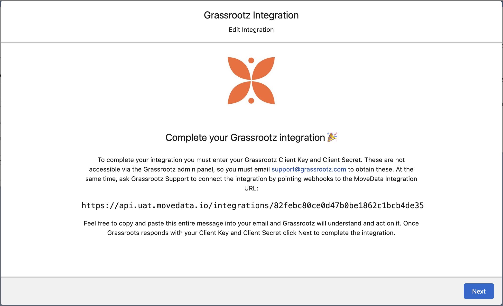
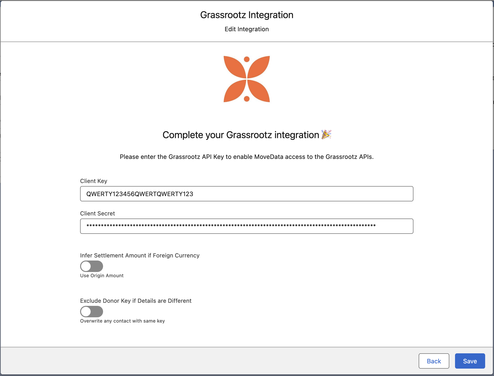

# Grassrootz

## Overview

The MoveData Grassrootz integration provides seamless, real-time synchronisation between your Grassrootz fundraising platform and Salesforce. This powerful integration ensures that all donation activities, supporter registrations, campaign data, team structures, and event information are automatically transferred to your Salesforce environment, eliminating manual data entry whilst maintaining complete data accuracy.

**Key Benefits:**

* **Real-time synchronisation** of all Grassrootz activities via webhooks
* **Complex campaign hierarchy** management (Events → Campaigns → Teams → Fundraisers)
* **Multi-currency support** with intelligent exchange rate handling
* **Achievement tracking** and milestone management
* **Comprehensive financial data** including detailed fee breakdowns

## Integration Summary

| Field     | Value                                                      |
| --------- | ---------------------------------------------------------- |
| Product   | [https://www.grassrootz.com/](https://www.grassrootz.com/) |
| Method    | Push (Webhooks)                                            |
| Frequency | Real-Time                                                  |

## Supported Modes

Logic is required to map Grassrootz notifications to your Salesforce data. To quickly and easily do so we recommend using one of the supported MoveData Extensions.

| Extension                 | Supported |
| ------------------------- | --------- |
| Fundraising and Donations | ✅         |
| Commerce                  | ❌         |


The Fundraising and Donations Extension is relevant to processing fundraising activity and donation information into Salesforce.


## Setup

#### Grassrootz API Access

To set up the Grassrootz integration, you will need to coordinate with Grassrootz support to obtain your API credentials and configure webhook endpoints.&#x20;

#### MoveData Grassrootz Configuration (1/2)

<figure><figcaption></figcaption></figure>

1. Open the MoveData app and select the **Integrations** tab
2. Click **New Integration** and select **Grassrootz** from the list of available integrations
3. Add a Name for your integration
4. Record the MoveData Integration URL
5. Click **Next**, followed by **Cancel**

#### Grassrootz Support

To complete your integration you must enter your Grassrootz Client Key and Client Secret. These are not accessible via the Grassrootz admin panel, so you must email [support@grassrootz.com](mailto:support@grassrootz.com) to obtain these. At the same time, ask Grassrootz Support to connect the integration by pointing their webhooks to the MoveData Integration URL.

#### MoveData Grassrootz Configuration (2/2)

<figure><figcaption></figcaption></figure>

1. Open the Integration in MoveData
2. Edit the configuration and proceed to the second screen in the wizard.
3. Enter the Client Key and Client Secret as communicated by Grassrootz.
4. Configure additional options as needed (see Configurable Options below)
5. Click **Save** to complete the setup

### Configurable Options

| Option                        | Description                                                                                                                                                                                                                                                                                                                                                    |
| ----------------------------- | -------------------------------------------------------------------------------------------------------------------------------------------------------------------------------------------------------------------------------------------------------------------------------------------------------------------------------------------------------------- |
| **Infer Settlement Currency** | <ul><li><strong>Enabled (Default)</strong> - Uses settlement currency (typically AUD) for donation amounts and creates detailed financial breakdowns with exchange rates</li><li><strong>Disabled</strong> - Uses original transaction currency and amounts as charged</li></ul>                                                                               |
| **Exclude Donor Keys**        | 
Used to stop replacing the details of fundraisers who donate on behalf of. 
<ul><li><strong>Enabled</strong> - Excludes donor key information from notifications; prevents overwriting of fundraiser details when donation on behalf of</li><li><strong>Disabled (Default)</strong> - Includes full donor key information in processed data</li></ul> |

## Data Migration

Data Migration is available upon request. This is a custom service provided by MoveData and is delivered by MoveData Professional Services.

* Requires a CSV export of the desired data
* Records will only be imported if available via the Grassrootz API

## Additional Field Mappings

* **Multi-Currency Handling**: The settlement amount isn't provided by Grassrootz.  MoveData automatic perform a currency conversion with using an exchange rate from Grassrootz.
* **Achievement Processing**: Converts Grassrootz achievements into MoveData questions for milestone tracking
* **Campaign Hierarchy**: Intelligent mapping of Events → Campaigns → Teams → Fundraisers
* **Fee Allocation**: Detailed breakdown of platform fees, gateway fees, and tax calculations

### Campaign Hierarchy Support

The Grassrootz integration automatically creates and maintains complex campaign hierarchies:

**Event Level** (Top Level)

* Overall fundraising event (e.g., "HBF Run for a Reason 2024")
* Contains multiple organisation campaigns
* Tracks total event fundraising goals and progress

**Campaign Level** (Organisation Level)

* Individual organisation participation in an event
* Contains teams and individual fundraisers
* Organisation-specific goals and branding

**Team Level** (Optional)

* Groups of fundraisers working together
* Team-specific targets and achievements
* Team managers with full contact details

**Fundraiser Level** (Individual Level)

* Individual fundraising pages
* Personal targets and achievements
* Linked to team (if applicable)

This hierarchy is automatically maintained in Salesforce with proper parent-child relationships between Campaign records.

## Reference

The Grassrootz integration provides extensive custom field mapping to capture the rich metadata available from the platform.

#### Contact Custom Fields

| Attribute Name        | Description                              | Example             |
| --------------------- | ---------------------------------------- | ------------------- |
| `isCustomDisplayName` | Whether contact uses custom display name | `false`             |
| `displayNameOption`   | Display name preference                  | `firstName`         |
| `displayName`         | Custom display name (if used)            | `Dan's Fundraising` |
| `newsletter`          | Newsletter subscription status           | `true`              |

#### Campaign Custom Fields

| Attribute Name                | Description                           | Example                            |
| ----------------------------- | ------------------------------------- | ---------------------------------- |
| `raisedAmount`                | Total amount raised for campaign      | `4276.61`                          |
| `allowsFundraisers`           | Whether campaign supports fundraisers | `true`                             |
| `allowsTeams`                 | Whether campaign supports teams       | `true`                             |
| `allowsFitnessActivities`     | Whether fitness tracking is enabled   | `true`                             |
| `allowedFitnessActivityTypes` | Supported fitness activity types      | `walk, run, swim, cycle, wheel`    |
| `eventTier`                   | Event tier classification             | `primary`, `secondary`, `tertiary` |
| `activePagesCount`            | Number of active fundraising pages    | `16`                               |
| `targetAmount`                | Campaign fundraising target           | `1200000`                          |

#### Team Custom Fields

| Attribute Name           | Description                      | Example   |
| ------------------------ | -------------------------------- | --------- |
| `raisedAmount`           | Total amount raised by team      | `1683.10` |
| `targetAmount`           | Team fundraising target          | `750`     |
| `donationCount`          | Number of donations received     | `34`      |
| `averageDonationAmount`  | Average donation amount          | `49.50`   |
| `fundraisersCount`       | Total number of team fundraisers | `9`       |
| `fundraisersActiveCount` | Number of active fundraisers     | `7`       |

#### Fundraiser Custom Fields

| Attribute Name          | Description                       | Example  |
| ----------------------- | --------------------------------- | -------- |
| `raisedAmount`          | Total amount raised by fundraiser | `214.55` |
| `targetAmount`          | Fundraiser target amount          | `200`    |
| `donationCount`         | Number of donations received      | `6`      |
| `averageDonationAmount` | Average donation amount           | `35.76`  |
| `isAmbassador`          | Ambassador status                 | `false`  |
| `isPublic`              | Whether page is publicly visible  | `true`   |

#### Donation Custom Fields

| Attribute Name           | Description                      | Example                             |
| ------------------------ | -------------------------------- | ----------------------------------- |
| `receiptNumber`          | Grassrootz receipt number        | `H-FUA5917-27716-1519888`           |
| `processor`              | Payment processor used           | `stripe`                            |
| `processorTransactionId` | Payment processor transaction ID | `py_3PHMQOKezavzbH4m0lN7h8jF`       |
| `cardInformationType`    | Payment method type              | `visa`, `bankAccount`, `mastercard` |
| `cardInformationCountry` | Card/account country             | `AU`, `US`                          |
| `cardInformationPan`     | Masked card/account number       | `016263 *****7709`                  |
| `settlementDate`         | Transaction settlement date      | `2024-05-24`                        |
| `source`                 | Donation source                  | `gr-public`                         |
| `timezone`               | Transaction timezone             | `Australia/West`                    |
| `cardMethodType`         | Payment Method Type              | `card`, `apple_pay`, `google_pay`   |

#### Multi-Currency Fields (when inferSettlementCurrency is enabled)

| Attribute Name    | Description                    | Example   |
| ----------------- | ------------------------------ | --------- |
| `exchangeRate`    | Currency exchange rate applied | `1.51914` |
| `originCurrency`  | Original transaction currency  | `USD`     |
| `originAmount`    | Original transaction amount    | `21.85`   |
| `originFee`       | Original fee amount            | `3.69`    |
| `settledCurrency` | Settlement currency            | `AUD`     |
| `settledAmount`   | Settled amount                 | `33.19`   |
| `settledFee`      | Settled fee amount             | `5.61`    |

#### Financial Breakdown Fields

| Attribute Name                        | Description                      | Example |
| ------------------------------------- | -------------------------------- | ------- |
| `donationPaymentPlatformFee`          | Payment platform fee             | `0.96`  |
| `donationPaymentPlatformFeeTax`       | Tax on payment platform fee      | `0.09`  |
| `donationEventOrganizerFee`           | Event organiser fee              | `0.88`  |
| `donationEventOrganizerFeeTax`        | Tax on event organiser fee       | `0.08`  |
| `donationEventOrganizerFeePercentage` | Event organiser fee percentage   | `0.044` |
| `donationSilentFee`                   | Silent fee amount                | `0`     |
| `donationSilentFeeTax`                | Tax on silent fee                | `0`     |
| `donationSilentFeePercentage`         | Silent fee percentage            | `0`     |
| `donationFee`                         | Platform donation fee            | `3.55`  |
| `donationFeeTax`                      | Tax on platform donation fee     | `0.32`  |
| `donationFeePercentage`               | Platform donation fee percentage | `0.05`  |
| `donationNet`                         | Net amount after all fees        | `49.16` |

#### Organisation Custom Fields

| Attribute Name          | Description                | Example                               |
| ----------------------- | -------------------------- | ------------------------------------- |
| `organisationId`        | Grassrootz organisation ID | `467`                                 |
| `organisationName`      | Organisation name          | `Vinnies WA`                          |
| `organisationUrlPrefix` | Organisation URL prefix    | `vinnies-wa`                          |
| `legalName`             | Legal organisation name    | `St Vincent de Paul Society (WA) Inc` |
| `taxId`                 | Organisation tax ID        | `18332550061`                         |
| `currency`              | Organisation base currency | `AUD`                                 |
| `timezone`              | Organisation timezone      | `Australia/West`                      |

### Other Resources

**Grassrootz Platform:**\
[https://www.grassrootz.com/](https://www.grassrootz.com/)
