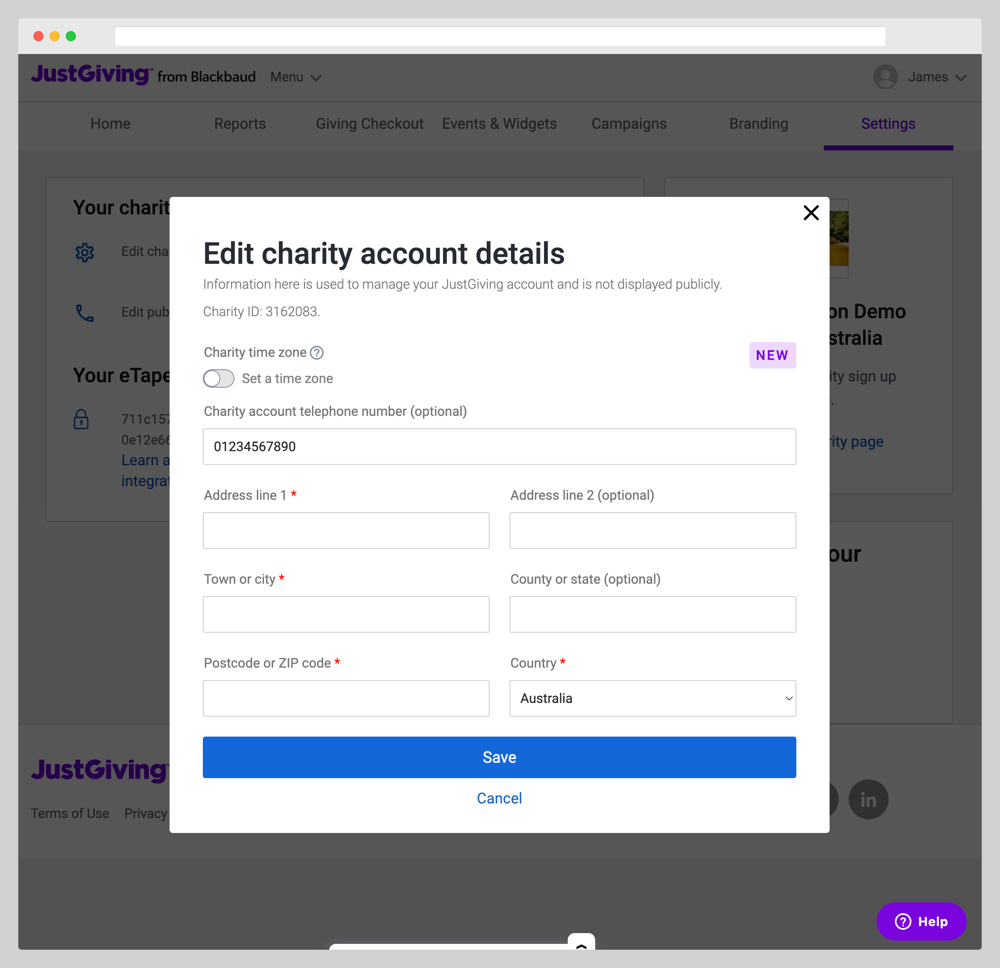
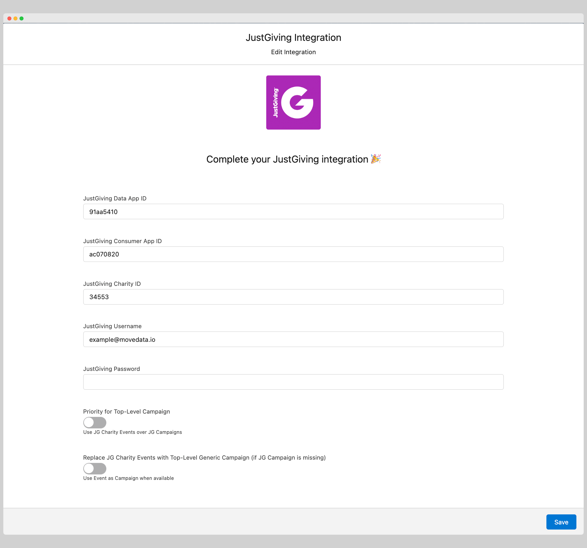

# JustGiving

## Overview

The MoveData JustGiving integration provides seamless, automated synchronisation between your JustGiving fundraising platform and Salesforce. This comprehensive integration ensures that all donation activities, supporter data, campaign information, fundraising pages, and payment data are automatically transferred to your Salesforce environment, eliminating manual data entry whilst maintaining complete data accuracy.

**Key Benefits:**

* **Automated synchronisation** of all JustGiving fundraising activities via scheduled polling
* **Intelligent campaign hierarchy** management including events, campaigns, teams, and individual fundraisers
* **Date filtering capabilities** to exclude historical activity
* **UK Gift Aid support** with comprehensive compliance tracking

## Integration Summary

| Field     | Value                                              |
| --------- | -------------------------------------------------- |
| Product   | [https://justgiving.com/](https://justgiving.com/) |
| Method    | Pull (Polling)                                     |
| Frequency | Configurable (every 12 hours by default)           |

## Demonstration Video



## Supported Modes

Logic is required to map JustGiving notifications to your Salesforce data. To quickly and easily do so we recommend using one of the supported MoveData Extensions.

| Extension                 | Supported |
| ------------------------- | --------- |
| Fundraising and Donations | ✅         |
| Commerce                  | ❌         |


The Fundraising and Donations Extension is relevant to processing fundraising activity and donation information into Salesforce.


## Setup

**JustGiving API Credentials**

To set up the JustGiving integration, you will need four credentials from JustGiving:

1. **Data App ID** - Your JustGiving Data API application identifier
2. **Consumer App ID** - Your JustGiving Consumer API application identifier
3. **Charity ID** - Your organisation's JustGiving charity identifier
4. **Username & Password** - Your JustGiving account credentials

**Obtaining API Credentials:**

To access your Consumer and Data App IDs, contact JustGiving Support ([support@justgivingdeveloper.zendesk.com](mailto:support@justgivingdeveloper.zendesk.com)) requesting access to the Data and Consumer APIs for Production data.

**Finding Your Charity ID:**

<figure><figcaption></figcaption></figure>

1. Log into your JustGiving Admin panel
2. Navigate to **Settings → Your Charity → Edit charity account details**
3. Note your Charity ID from the account details

**MoveData JustGiving Configuration**

<figure><figcaption></figcaption></figure>

1. Open the MoveData app in Salesforce and select the **Integrations** tab
2. Click **New Integration** and select **JustGiving** from the list of available integrations
3. Add a descriptive name for your integration and click **Save**
4. Enter your JustGiving credentials in the configuration screen:
   * **JustGiving Data App ID**: Your Data API application identifier
   * **JustGiving Consumer App ID**: Your Consumer API application identifier
   * **JustGiving Charity ID**: Your charity identifier
   * **JustGiving Username**: Your JustGiving account username
   * **JustGiving Password**: Your JustGiving account password
5. Configure additional options as needed (see Configurable Options below)
6. Click **Save** to complete the setup

The integration will automatically begin synchronising data based on the default schedule of 12 hours.

## Configurable Options

| Option                              | Description                                                                                                                                                                                                                                                                                                                          |
| ----------------------------------- | ------------------------------------------------------------------------------------------------------------------------------------------------------------------------------------------------------------------------------------------------------------------------------------------------------------------------------------ |
| **Priority for Top-Level Campaign** | Controls campaign hierarchy for fundraising pages. When **enabled**, prioritises JustGiving Campaigns over JustGiving Charity Events as the top-level campaign. When **disabled**, prioritises JustGiving Charity Events over JustGiving Campaigns. Often campaigns are more reliable than events for fundraising page organisation. |
| **Notification Date Filter**        | Screens out notifications related to events concluded before a specific date. JustGiving frequently sends notifications for very old events, so this filter helps focus on recent activity. Set a date to exclude any fundraising pages, events, or donations that occurred before this threshold.                                   |
| **Data Synchronisation Interval**   | Frequency of data polling from JustGiving APIs (default: every 12 hours)                                                                                                                                                                                                                                                             |

## Data Migration

Data Migration is available upon request. This is a custom service provided by MoveData and is delivered by MoveData Professional Services.

* Requires access to JustGiving's Data and Consumer APIs
* Records will only be imported if available via the JustGiving API
* Historical data limitations may apply for older records due to JustGiving's data retention policies
* Data structures may have minor variations for older records

## Additional Field Mappings

Where possible, all fields are mapped to the appropriate schemas. Often there are fields that do not fit explicitly into a schema and these are appended as custom fields. JustGiving custom codes are dynamically included in fundraiser and campaign records.

### **Campaign Hierarchy**

The JustGiving integration automatically creates intelligent campaign hierarchies based on your Priority for Top-Level Campaign setting:

**Standard Hierarchy (Campaign Priority Disabled):**

1. **Top Level**: JustGiving Event (if exists and not user-created) OR JustGiving Campaign (if exists) OR Generic "JustGiving" campaign
2. **Team Level**: JustGiving Team (if fundraiser is part of a team)
3. **Fundraiser Level**: Individual JustGiving fundraising page

**Campaign Priority Hierarchy (Campaign Priority Enabled):**

1. **Top Level**: JustGiving Campaign (if exists) OR JustGiving Event (if exists and not user-created) OR Generic "JustGiving" campaign
2. **Team Level**: JustGiving Team (if fundraiser is part of a team)
3. **Fundraiser Level**: Individual JustGiving fundraising page

### **Gift Aid Processing**

The JustGiving integration includes comprehensive Gift Aid support for UK charities:

* **Automatic Gift Aid Detection**: Identifies eligible donations and processes Gift Aid amounts separately
* **Payment Processing**: Handles both transaction payments and Gift Aid payments as distinct records
* **Compliance Tracking**: Maintains full audit trail for Gift Aid submission requirements
* **Fee Allocation**: Separates Gift Aid processing fees from transaction fees

## Reference

The following custom fields are automatically included in MoveData notifications:

**Contact Custom Fields**

| Attribute Name            | Description                     | Example                          |
| ------------------------- | ------------------------------- | -------------------------------- |
| `donorUserId`             | JustGiving Donor User ID        | `65086821`                       |
| `privacyStatementVersion` | Privacy policy version accepted | `JustGiving Privacy Policy v3.0` |
| `privacyStatementAt`      | Date privacy policy accepted    | `2024-05-08T14:22:47.000Z`       |

**Campaign Custom Fields**

**Event Campaigns:**

| Attribute Name  | Description                | Example                |
| --------------- | -------------------------- | ---------------------- |
| `eventId`       | JustGiving Event ID        | `123456`               |
| `eventName`     | JustGiving Event Name      | `London Marathon 2024` |
| `category`      | JustGiving Event Category  | `Running`              |
| `customCode1`   | Event Custom Code 1        | `LM:2024`              |
| `customCode2`   | Event Custom Code 2        | `CHARITY:ABC`          |
| `customCode3`   | Event Custom Code 3        | `REGION:LONDON`        |
| `isOverseas`    | Is Overseas Event Flag     | `false`                |
| `isPromoted`    | Is Promoted Event Flag     | `true`                 |
| `isUserCreated` | Is User Created Event Flag | `false`                |
| `location`      | Event Location             | `London, UK`           |
| `eventType`     | Event Type                 | `Marathon`             |

**Team Campaigns:**

| Attribute Name            | Description               | Example                    |
| ------------------------- | ------------------------- | -------------------------- |
| `inMemoriam_dateOfBirth`  | In Memoriam Date of Birth | `1975-03-15T00:00:00.000Z` |
| `inMemoriam_dateOfDeath`  | In Memoriam Date of Death | `2023-01-20T00:00:00.000Z` |
| `inMemoriam_firstName`    | In Memoriam First Name    | `John`                     |
| `inMemoriam_lastName`     | In Memoriam Last Name     | `Smith`                    |
| `inMemoriam_gender`       | In Memoriam Gender        | `Male`                     |
| `inMemoriam_id`           | In Memoriam ID            | `12345`                    |
| `inMemoriam_name`         | In Memoriam Full Name     | `John Smith`               |
| `inMemoriam_relationship` | Relationship to Deceased  | `Father`                   |
| `inMemoriam_town`         | In Memoriam Town          | `Manchester`               |
| `appeal`                  | Appeal Name               | `General Appeal`           |
| `birthdayName`            | Birthday Fundraiser Name  | `Happy 30th Birthday!`     |
| `campaignCode1`           | Campaign Custom Code 1    | `CAMP:2024`                |
| `campaignCode2`           | Campaign Custom Code 2    | `TYPE:ANNUAL`              |
| `campaignCode3`           | Campaign Custom Code 3    | `GOAL:50K`                 |
| `code1`                   | Fundraising Page Code 1   | `PAGE:001`                 |
| `code2`                   | Fundraising Page Code 2   | `TEAM:ALPHA`               |
| `code3`                   | Fundraising Page Code 3   | `SOURCE:SOCIAL`            |
| `code4`                   | Fundraising Page Code 4   | `SEGMENT:YOUNG`            |
| `code5`                   | Fundraising Page Code 5   | `PRIORITY:HIGH`            |
| `code6`                   | Fundraising Page Code 6   | `REGION:NORTH`             |

**Fundraiser Campaigns:**

| Attribute Name          | Description                       | Example                      |
| ----------------------- | --------------------------------- | ---------------------------- |
| `category`              | Fundraising Page Category         | `Running`                    |
| `eventName`             | Associated Event Name             | `London Marathon 2024`       |
| `eventDate`             | Event Date                        | `2024-04-21T09:00:00.000Z`   |
| `eventExpiryDate`       | Event Expiry Date                 | `2024-05-21T23:59:59.000Z`   |
| `eventIsUserCreated`    | Is User Created Event             | `false`                      |
| `eventCompletionDate`   | Event Completion Date             | `2024-04-21T15:30:00.000Z`   |
| `eventCategory`         | Event Category                    | `Running`                    |
| `totalEstimatedGiftAid` | Estimated Gift Aid Amount         | `250.00`                     |
| `totalRaisedOnline`     | Total Raised Online               | `1420.00`                    |
| `totalRaisedOffline`    | Total Raised Offline              | `580.00`                     |
| `weddingNames`          | Wedding Names (for wedding pages) | `Sarah & James`              |
| `teamId`                | Associated Team ID                | `team-alpha-2024`            |
| `pageGuid`              | Page GUID                         | `1f0d209a-b3db-4fc4-82cd...` |
| `activityType`          | Activity Type                     | `OtherPersonalChallenge`     |
| `apiSource`             | API Source                        | `payment`                    |
| `pageSummary`           | Page Summary                      | `Running for a great cause`  |

**Donation Custom Fields**

| Attribute Name        | Description                     | Example                                 |
| --------------------- | ------------------------------- | --------------------------------------- |
| `apiSource`           | Source of donation data         | `payment`, `paymentGiftAid`, `donation` |
| `paymentRef`          | JustGiving Payment Reference    | `4008853`                               |
| `totalAmount`         | Total Amount including Gift Aid | `12.50`                                 |
| `netAmount`           | Net Amount after fees           | `11.85`                                 |
| `paymentDate`         | Settlement Date                 | `2024-08-29T00:00:00.000Z`              |
| `paymentPaymentRef`   | Payment Reference               | `4008853`                               |
| `paymentType`         | Payment Method Type             | `ApplePay Visa Debit`                   |
| `giftaidAmount`       | Gift Aid Amount                 | `2.50`                                  |
| `giftaidFee`          | Gift Aid Processing Fee         | `0.13`                                  |
| `giftaidPaymentDate`  | Gift Aid Payment Date           | `2024-05-21T00:00:00.000Z`              |
| `giftaidPaymentRef`   | Gift Aid Payment Reference      | `3831096`                               |
| `thirdPartyReference` | Third Party Reference           | `f59d1c0f-a460-ef11-a493-005056aa20e8`  |
| `charityId`           | JustGiving Charity ID           | `11190`                                 |

**Context Classification**

MoveData automatically classifies donations based on their fundraising context:

| Context Field      | Description                     | Example Values                                    |
| ------------------ | ------------------------------- | ------------------------------------------------- |
| `context`          | Primary donation context        | `event`, `campaign`, `diy`, `direct`, `recurring` |
| `contextRecurring` | Is part of recurring donation   | `true`, `false`                                   |
| `contextEvent`     | Is part of formal charity event | `true`, `false`                                   |
| `contextCampaign`  | Is part of charity campaign     | `true`, `false`                                   |
| `contextDiy`       | Is DIY/peer-to-peer fundraising | `true`, `false`                                   |
| `contextDirect`    | Is direct donation to charity   | `true`, `false`                                   |

## Other Resources

**JustGiving Developer Documentation:**\
[https://developer.justgiving.com/](https://developer.justgiving.com/)

**JustGiving API Reference:**\
[https://api.justgiving.com/docs](https://api.justgiving.com/docs)

**JustGiving Developer Support:**\
[support@justgivingdeveloper.zendesk.com](mailto:support@justgivingdeveloper.zendesk.com)
