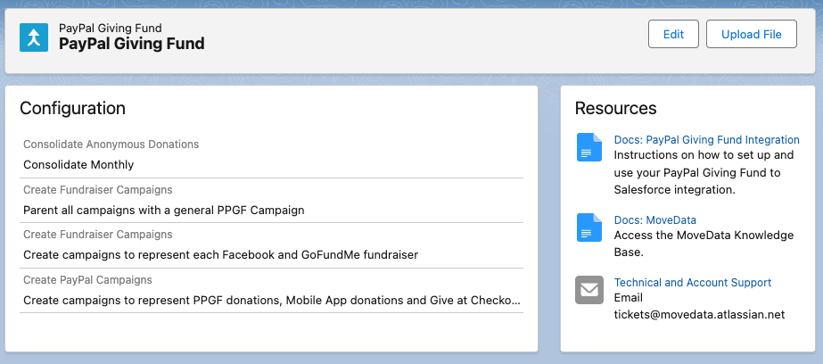

# PayPal Giving Fund

## Overview

The MoveData PayPal Giving Fund integration provides seamless data synchronisation between your PayPal Giving Fund payout reports and Salesforce. This powerful integration processes PayPal Giving Fund donation reports, ensuring that all donation activities and supporter information are automatically transferred to your Salesforce environment, eliminating manual data entry whilst maintaining complete data accuracy.

### Key Benefits

* **Automated CSV processing** of PayPal Giving Fund payout transaction reports
* **Intelligent campaign hierarchy** management for multiple donation sources
* **Advanced financial tracking** including platform fees and settlement dates
* **Anonymous donation aggregation** with flexible consolidation options
* **Multi-platform support** for Facebook, GoFundMe, PayPal donations, and other PPGF sources

## Integration Summary

| Field     | Value                                                  |
| --------- | ------------------------------------------------------ |
| Product   | [https://paypal.com/giving](https://paypal.com/giving) |
| Method    | CSV File Processing                                    |
| Frequency | Manual                                                 |

## Supported Modes

Logic is required to map PayPal Giving Fund notifications to your Salesforce data. To quickly and easily do so, we recommend using one of the supported MoveData Extensions.

| Extension                 | Supported |
| ------------------------- | --------- |
| Fundraising and Donations | ✅         |
| Commerce                  | ❌         |


The Fundraising and Donations Extension is relevant to processing fundraising activity and donation information into Salesforce.


## Setup

### PayPal Giving Fund Report Export

To set up the PayPal Giving Fund integration, you will need to export payout reports from PayPal Giving Fund:

1. Log in to your PayPal Giving Fund charity dashboard
2. Navigate to **Reports** or **Payouts**
3. Generate and download your **Payout Report** as a CSV file
4. Ensure you're downloading the payout file format (not transaction reports)

### MoveData PayPal Giving Fund Configuration

<figure><figcaption></figcaption></figure>

To create your PayPal Giving Fund Integration:

1. Open the MoveData app and select the **Integrations** tab
2. Click **New Integration** and select **PayPal Giving Fund** from the list of available integrations
3. Add a name for your integration and click **Save**
4. Configure your integration settings based on your requirements (see Configurable Options below)
5. To upload a CSV, click the **Upload File** button

### CSV File Processing

The PayPal Giving Fund integration processes CSV payout files through manual upload. Upload your exported PayPal Giving Fund payout report using the **Upload File** button in your integration configuration.

## Configurable Options

#### **Consolidate Anonymous Donations**

To save on data storage, MoveData provides an option to consolidate low-detail anonymous transactions. Below details how this option will change the resulting notifications:

**Consolidate Monthly**

* Consolidates all anonymous donations by campaign at a monthly level
* Uses Payout Date as the notification date as all transactions are aggregated
* Reduces data volume for organisations with high volumes of small anonymous donations

**Consolidate Daily**

* Consolidates all anonymous donations by campaign at a daily level
* Uses Donation Date as the notification date
* Provides a balance between data accuracy and volume management

**Do not consolidate**

* Sends each row as an individual notification
* Uses Donation Date as the notification date
* Preserves complete transaction-level detail

#### **Create Fundraiser Campaigns**

Creates child campaigns to represent each Facebook and GoFundMe fundraiser. When enabled:

* Individual campaigns are created for each unique fundraiser based on Reference Information
* Campaign names use fundraiser titles (e.g., "Richard's birthday fundraiser for XYZ Foundation")
* Facebook fundraisers include page URLs when available

When disabled, all transactions are aggregated by Program Name into broader Facebook and GoFundMe campaigns.

**Create PayPal Campaigns**

When processing PayPal donations, this option enables child campaigns for each known PayPal Program Name:

* **PayPal Donations with PPGF** - Direct PayPal Giving Fund donations
* **PayPal Give at Checkout** - Donations made during PayPal checkout processes
* **PayPal App and Web Donations** - Donations through PayPal's mobile app and web interface
* **PayPal special campaigns** and **PayPal Generosity Network** donations

When disabled, all PayPal donations are combined into a single PayPal campaign.

**Parent with General Campaign**

When enabled, creates a top-level "PayPal Giving Fund" campaign that parents all other campaigns, providing a unified view of all PPGF activity in your Salesforce org.

## Data Migration

Data Migration can be completed by loading historical PayPal Giving Fund files via the **Upload File** button. You can upload multiple payout reports to import historical donation data into Salesforce.

## Additional Field Mappings

#### Campaign Hierarchy

The PayPal Giving Fund integration automatically creates a flexible campaign hierarchy in Salesforce based on your configuration:

**Top-Level Campaign (Optional)**

* **Name**: "PayPal Giving Fund"
* **Type**: Campaign
* **Purpose**: Top-level container for all PPGF activity (when "Parent with General Campaign" is enabled)

**Program-Level Campaigns**

* **Name**: Based on program type (e.g., "PayPal Giving Fund - Facebook", "PayPal Giving Fund - GoFundMe")
* **Type**: Team (when using general parent campaign) or Campaign
* **Purpose**: Groups donations by their source platform

**Individual Fundraiser Campaigns (When Enabled)**

* **Name**: Based on fundraiser title from Reference Information
* **Type**: Fundraiser
* **Purpose**: Represents specific fundraising pages
* **URL**: Links to Facebook fundraising pages when available

## Reference

The following custom fields are automatically included in MoveData notifications:

**Donation Custom Fields**

| Attribute Name         | Description                            | Example                                |
| ---------------------- | -------------------------------------- | -------------------------------------- |
| `programName`          | PayPal Giving Fund program name        | `Facebook donations`                   |
| `referenceInformation` | Additional reference data from PPGF    | `371526827591189:Richard's fundraiser` |
| `settlementDate`       | Date when funds were settled by PayPal | `2025-02-25`                           |

**Platform-Specific Programs**

The integration automatically detects and categorises different PayPal Giving Fund programs:

**Facebook Programs**

* **Program Name**: `Facebook donations`, `Facebook donations with PPGF`
* **Reference Format**: `{fundraiser_id}:{fundraiser_title}`
* **Campaign Creation**: Individual campaigns for each fundraiser (when enabled)
* **Page URLs**: Automatic generation of Facebook fundraiser URLs

**GoFundMe Programs**

* **Program Name**: `GoFundMe Certified Charity Campaigns`
* **Reference Format**: Fundraiser title
* **Campaign Creation**: Individual campaigns for each fundraiser (when enabled)

**PayPal Direct Programs**

* **Program Name**: `PayPal Donations`, `PayPal App and Web Donations`, `PayPal Give at Checkout`
* **Campaign Creation**: Separate campaigns by donation method (when "Create PayPal Campaigns" is enabled)

**Other Supported Programs**

* **Humble Bundle**: `Humble Bundle` donations
* **Special Campaigns**: PayPal special campaigns and Generosity Network

**Anonymous Donation Handling**

**Individual Processing (No Consolidation)**

* Each anonymous donation creates a separate Opportunity record
* Uses original transaction ID as the key
* Preserves individual transaction details

**Monthly Consolidation**

* Combines anonymous donations by payout month, program, and reference information
* Uses generated hash as transaction key
* Aggregates amounts and fees
* Sets donation date to payout date

**Daily Consolidation**

* Combines anonymous donations by donation day, program, and reference information
* Uses generated hash as transaction key
* Aggregates amounts and fees
* Preserves original donation dates

#### File Format Requirements

**Required Payout File Format**

The CSV file must contain the following columns:

* `Payout Date` - Date when PayPal settled the funds (YYYY-MM-DD format)
* `Donation Date` - Date when the donation was made (YYYY-MM-DD format)
* `Donor First Name` - Donor's first name (Anonymous for anonymous donations)
* `Donor Last Name` - Donor's last name
* `Donor Email` - Donor's email address
* `Program Name` - PayPal Giving Fund program identifier
* `Reference Information` - Additional reference data (fundraiser details, etc.)
* `Currency Code` - Three-letter currency code (e.g., GBP, USD, EUR)
* `Gross Amount` - Original donation amount
* `Total Fees` - Platform fees deducted
* `Net Amount` - Final amount after fees
* `Transaction ID` - Unique PayPal transaction identifier

UK PPGF files may also contain Gift Aid information.

**Important Notes**

* Use the payout file format, not transaction reports
* Do not modify or resave files in Excel (preserves date formatting)
* Anonymous donations can be consolidated to reduce record volume

#### Other Resources

**PayPal Giving Fund Documentation:**\
[https://www.paypal.com/giving](https://www.paypal.com/giving)
