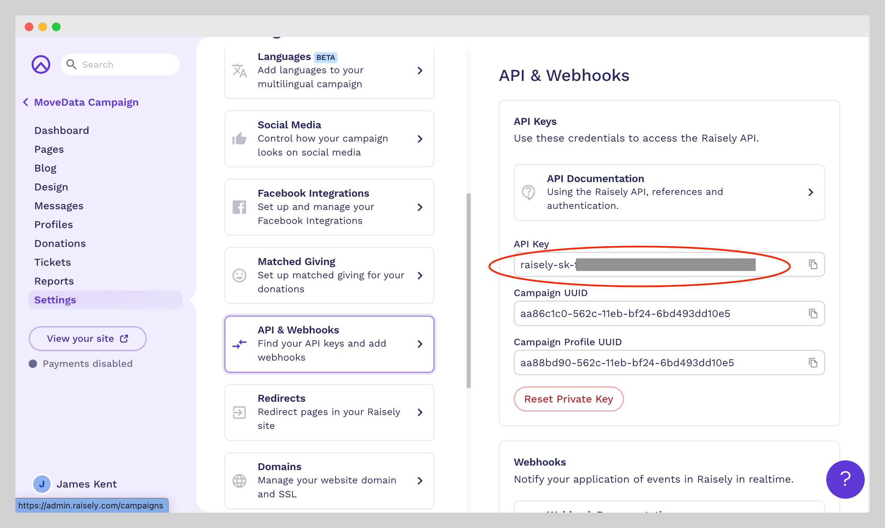
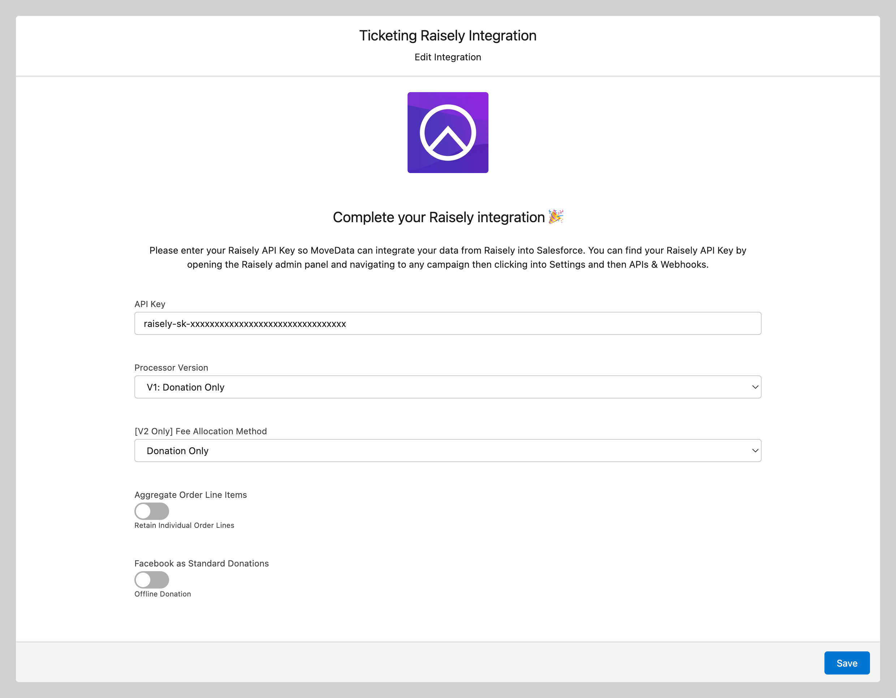
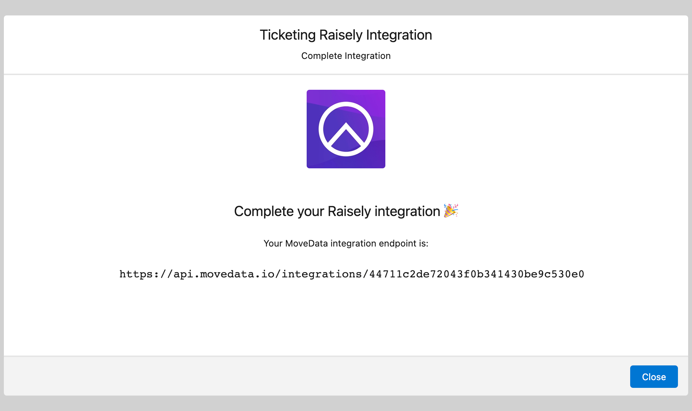
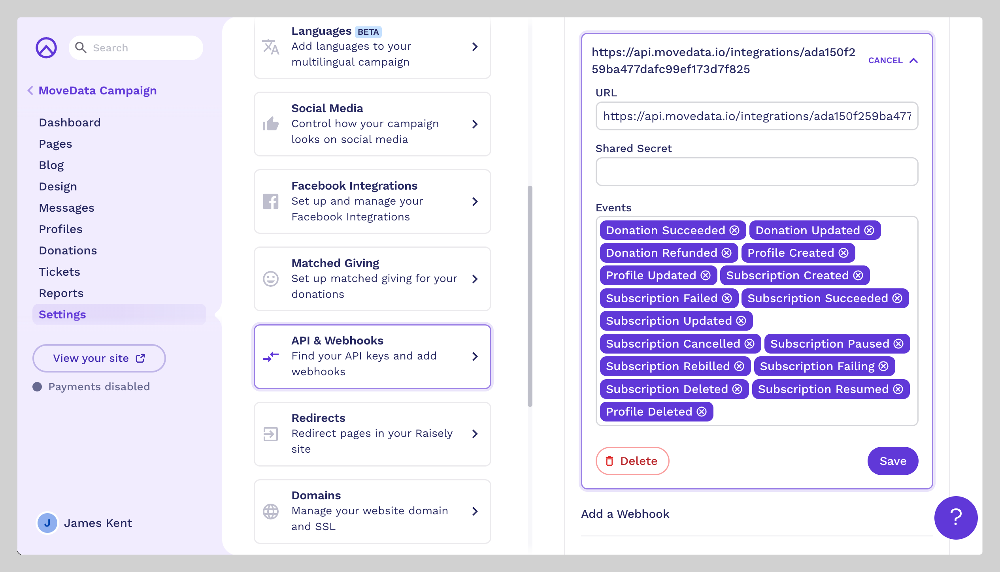

# Raisely

### Overview

The MoveData Raisely integration provides seamless, real-time synchronisation between your Raisely fundraising platform and Salesforce. This powerful integration ensures that all donation activities, supporter registrations, campaign and sales data are automatically transferred to your Salesforce environment, eliminating manual data entry whilst maintaining complete data accuracy.

**Key Benefits:**

* **Real-time synchronisation** of all Raisely activities
* **Comprehensive data mapping** to Salesforce NPSP and Nonprofit Cloud
* **Intelligent campaign hierarchy** management
* **Advanced financial tracking** including fees, taxes, and currency conversion

### Integration Summary

| Field     | Value                                        |
| --------- | -------------------------------------------- |
| Product   | [https://raisely.com/](https://raisely.com/) |
| Method    | Push (Webhooks)                              |
| Frequency | Real-Time                                    |

### Demonstration Video



### Supported Modes

Logic is required to map Raisely notifications to your Salesforce data. To quickly and easily do so we recommend using one of the supported MoveData Extensions.

| Extension                 | Supported |
| ------------------------- | --------- |
| Fundraising and Donations | ✅         |
| Commerce                  | ✅         |


* The Fundraising and Donations Extension is relevant to processing fundraising activity and donation information into Salesforce
* The Ticketing and Commerce Extension is relevant to processing order information into Salesforce


### Setup

#### Raisely API & Webhooks Adminstration

<figure><figcaption></figcaption></figure>

To set up Raisely you will need a Raisely API Key. To get this:

1. Login to [https://admin.raisely.com/](https://admin.raisely.com/)
2. Open any campaign and select **Settings → API & Webhooks** and note your API Key

Next, you will need to create your Raisely Integration in MoveData. To do this, open the MoveData app and select the **Integrations** tab. Click **New Integration** and select **JustGiving** from the list of available integrations. Add a Name and click **Save**.

#### MoveData Raisely Configuration Screen

<figure><figcaption></figcaption></figure>

Enter your Raisely API Key. Referring to the Raisely Configurable Options, complete your configuration and click **Save** to continue.

#### MoveData Raisely Endpoint URL

<figure><figcaption></figcaption></figure>

The final step is to register the MoveData Integration Endpoint as a target for the Raisely Webhooks. To complete this, return to the **API & Webhooks** in Raisely.

<figure><figcaption></figcaption></figure>

Scroll to the bottom and complete the **Add a Webhook** section. Paste the MoveData Integration Endpoint into the **URL** field and register the following events depending on your configuration:

| Processor Version      | Events                                                                                                                                                 |
| ---------------------- | ------------------------------------------------------------------------------------------------------------------------------------------------------ |
| \[All]                 | <ul><li>Profile Created</li></ul><ul><li>Profile Updated</li><li>Profile Deleted</li></ul>                                                             |
| V1: Donation Only      | <ul><li>Donation Created</li></ul><ul><li>Donation Succeeded</li><li>Donation Updated</li><li>Donation Refunded</li><li>Subscription Updated</li></ul> |
| V2: Donation & Tickets | 
All <code>V1: Donation Only</code> events plus: 
<ul><li>Order Succeeded</li></ul>                                                            |

After you click **Add Webhook**, you will have successfully configured Raisely to send notifications to Salesforce using MoveData.

### Configurable Options

| Option                           | Description                                                                                                                                                                                                                                                                                                                                                                                                                                                           |
| -------------------------------- | --------------------------------------------------------------------------------------------------------------------------------------------------------------------------------------------------------------------------------------------------------------------------------------------------------------------------------------------------------------------------------------------------------------------------------------------------------------------- |
| Processor Version                | 
<strong>V1: Donation Only:</strong>
<ul><li>Processes donations, profiles, and subscriptions only</li><li>Fundraising and donation activities</li><li>Simpler configuration with fewer options</li></ul>
 <strong>V2: Donation &#x26; Tickets:</strong>
<ul><li>All V1 functionality plus order/ticket processing</li><li>Ticketing and commerce activities</li><li>Advanced fee allocation rules</li><li>Order line item aggregation options</li></ul> |
| \[V2 Only] Fee Allocation Method | <ul><li><strong>Donation Only</strong> - Allocate all fees to donation records</li></ul><ul><li><strong>Order Only</strong> - Allocate all fees to order records</li><li><strong>Split 50/50</strong> - Distribute fees evenly between donations and orders</li></ul>                                                                                                                                                                                                 |

#### Advanced Configuration

* **Facebook Integration:** Handle Facebook donations as standard donations vs. offline donations (default: offline)
* **Address Handling**: Prioritise notification data over user profile data for addresses
* **Discount Processing:** Combine discounts into order items vs. separate line items
* **Order Aggregation:** Combine identical product line items (automatically applied when 20+ of same product)

### Data Migration

Data Migration is available upon request. This is a custom service provided by MoveData and is delivered by MoveData Professional Services.

* Requires a CSV export of Raisely donation, profile and order reports
* Records will only be imported if available via the Raisely API

### Additional Field Mappings

Where possible, all fields are mapped to the appropriate schemas. Often there are fields that do not fit explicitly into a schema and these are appended as custom fields. Raisely Questions are dynamically added to Questions entries within the produced schema objects.

#### Custom Fields

Raisely allows users to add custom fields to their forms. There are two types of custom fields which MoveData supports - Standard fields & Special fields.

Raisely's Special fields are listed below. If fields are added with specific Field IDs, MoveData will automatically enact business logic against those fields. For example, if you add the field `company` and this field has a value, then MoveData will construct an Organisation Account record based on the `company` value. Standard fields are passed through as a Question as part of the resulting notification.

| Attribute Name        | Field Type     | Description                                                                                                                                      |
| --------------------- | -------------- | ------------------------------------------------------------------------------------------------------------------------------------------------ |
| <kbd>address</kbd>    | Address Lookup | Sets Address information against the Contact                                                                                                     |
| <kbd>birthday</kbd>   | Date           | Sets Date of Birth information against the Contact                                                                                               |
| <kbd>company</kbd>    | Text           | Creates an Organisation Account for the company entered and establishes an Organisation Affiliation between the Contact and Organisation Account |
| <kbd>salutation</kbd> | Select Items   | Sets Salutation information against the Contact                                                                                                  |

### Reference

The following custom fields are automatically included in MoveData notifications:

#### Contact Custom Fields

| Attribute Name   | Description                           | Example                            |
| ---------------- | ------------------------------------- | ---------------------------------- |
| `facebookId`     | Facebook User ID                      | `123456789`                        |
| `accessToken`    | User Access Token                     | `88985ee81ea8cb1bfbf91fd120abdb59` |
| `unsubscribedAt` | Date & Time when Contact unsubscribed | `2024-01-15T10:30:00Z`             |
| `preferredName`  | User's Preferred Name                 | `Dan`                              |

#### Campaign Custom Fields

| Attribute Name      | Description                        | Example               |
| ------------------- | ---------------------------------- | --------------------- |
| `type`              | Raisely Profile Type               | `GROUP`, `INDIVIDUAL` |
| `apiSource`         | Raisely Notification Type          | `profile.created`     |
| `path`              | URL Path                           | `/my-fundraiser`      |
| `grandTotal`        | Grand Total                        | `15000.00`            |
| `campaignTotal`     | Total for Profile                  | `12000.00`            |
| `feeTotal`          | Fees Paid for Profile              | `450.00`              |
| `activityTotal`     | Total activity for Profile         | `25`                  |
| `exerciseGoal`      | Exercise goal for Profile          | `100`                 |
| `exerciseGoalTime`  | Time goal for Exercise for Profile | `3600`                |
| `exerciseTotal`     | Exercise for Profile               | `85`                  |
| `exerciseTotalTime` | Time Exercising for Profile        | `3200`                |

#### Donation Custom Fields

| Attribute Name       | Description                                  | Example                                                                                                   |
| -------------------- | -------------------------------------------- | --------------------------------------------------------------------------------------------------------- |
| `transactionId`      | Raisely Transaction ID                       | `fa644aa0-c0be-11ee-9ab5-95d96e0fdcf0`                                                                    |
| `apiSource`          | Raisely Notification Type                    | 
<code>profile.created</code>, <code>profile.updated</code>, 

<code>donation.succeeded</code>
 |
| `settlementDate`     | Transaction Settlement Date (when available) | `2024-02-05`                                                                                              |
| `ipAddress`          | Donor IP Address                             | `103.85.36.147`                                                                                           |
| `ipAddressTimezone`  | Timezone derived from IP Address             | `Australia/Sydney`                                                                                        |
| `customerId`         | Payment Gateway Customer ID                  | `cus_PTq5WeBEK9kyOL`                                                                                      |
| `giftAid`            | UK Gift Aid Flag (when relevant)             | `false`                                                                                                   |
| `processorToken`     | Payment Intent Token                         | `pi_3OesP72lDfjSkBhQ1RQ3pWox`                                                                             |
| `transactionToken`   | Balance Transaction Token                    | `txn_3OesP72lDfjSkBhQ1EwnXLBH`                                                                            |
| `responseCode`       | Response Code from Payment Gateway           | `00`                                                                                                      |
| `gatewayDescription` | Payment Gateway Transaction Description      | `Donation (18275406) of AUD22.85 from Dan RG21...`                                                        |
| `receiptDownloadUrl` | Raisely Receipt PDF Link                     | `https://api.raisely.com/v3/receipt/...pdf`                                                               |
| `cardMethodType`     | Payment Method Type                          | `card`                                                                                                    |

#### Recurring Donation Custom Fields

| Attribute Name | Description                          | Example                               |
| -------------- | ------------------------------------ | ------------------------------------- |
| `status`       | Original Raisely Subscription Status | `OK`, `FAILED`, `CANCELLED`, `PAUSED` |

#### Commerce Schema Fields

**Catalog Custom Fields**

| Attribute Name   | Description                                       | Example             |
| ---------------- | ------------------------------------------------- | ------------------- |
| `photoUrl`       | Product Photo URL                                 | `https://image.url` |
| `type`           | Raisely Product Type                              | `TICKET`            |
| `totalSold`      | Total Number Sold                                 | `150`               |
| `totalAvailable` | Max Number that can be Sold                       | `200`               |
| `startDate`      | Start Date that the Product is available for Sale | `2024-01-01`        |
| `endDate`        | Last Date that the Product is available for Sale  | `2024-12-31`        |

**Order Custom Fields:**

| Attribute Name       | Description                                  | Example               |
| -------------------- | -------------------------------------------- | --------------------- |
| `settlementDate`     | Transaction Settlement Date (when available) | `2024-01-16`          |
| `processorToken`     | Payment Gateway Card Token                   | `card_abc123`         |
| `responseCode`       | Response Code from Payment Gateway           | `00`                  |
| `gatewayDescription` | Payment Gateway Transaction Description      | `Order via Stripe`    |
| `receiptDownloadUrl` | Raisely Receipt PDF Link                     | `https://receipt.url` |

**Order Item Custom Fields:**

| Attribute Name     | Description       | Example     |
| ------------------ | ----------------- | ----------- |
| `status`           | Order Item Status | `CONFIRMED` |
| `attendanceStatus` | Attendance Status | `ATTENDED`  |

### Other Resources

**Raisely Data Fields:**\
[https://support.raisely.com/article/484-the-data-fields-explained](https://support.raisely.com/article/484-the-data-fields-explained)
