# Flow Command Reference

Flow Commands are special behaviours that can be triggered by setting a value in an output-enabled variable with a specific name.

## Cancel

| Diagram                                              | Flow                                    | Flow Detail                                                                                                                              |
| ---------------------------------------------------- | --------------------------------------- | ---------------------------------------------------------------------------------------------------------------------------------------- |
| .png>) | 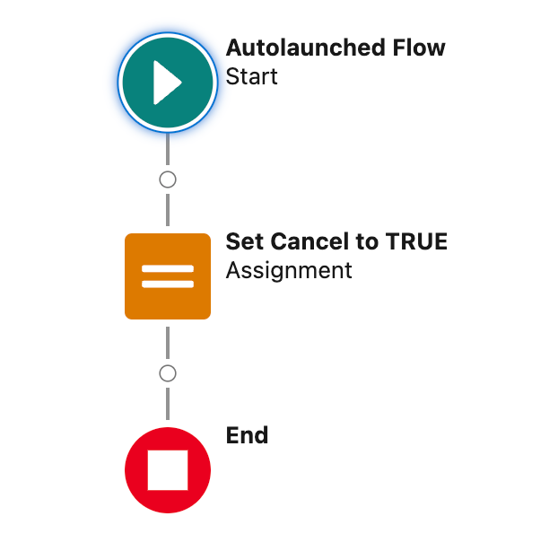 | 
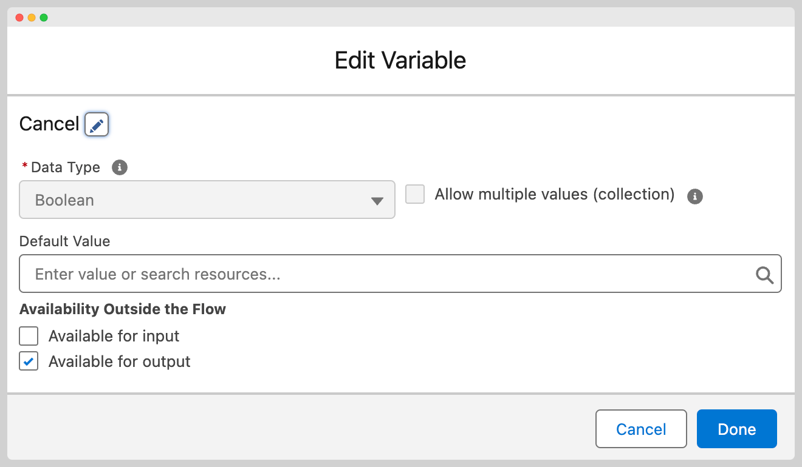  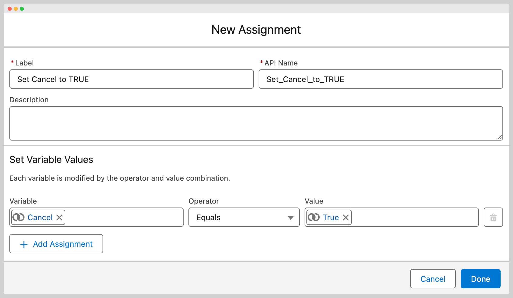
 |

If you wish to end the execution of a MoveData flow and mark it as `Failed`, you can create an output-enabled Boolean variable named `Cancel` and set it to `true`. It is best practice to output a message to the execution log before you end the flow to help with context.

## Break

| Diagram                                          | Flow                                   | Flow Detail                                                                                                                        |
| ------------------------------------------------ | -------------------------------------- | ---------------------------------------------------------------------------------------------------------------------------------- |
| 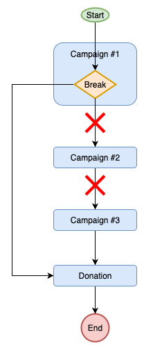 | 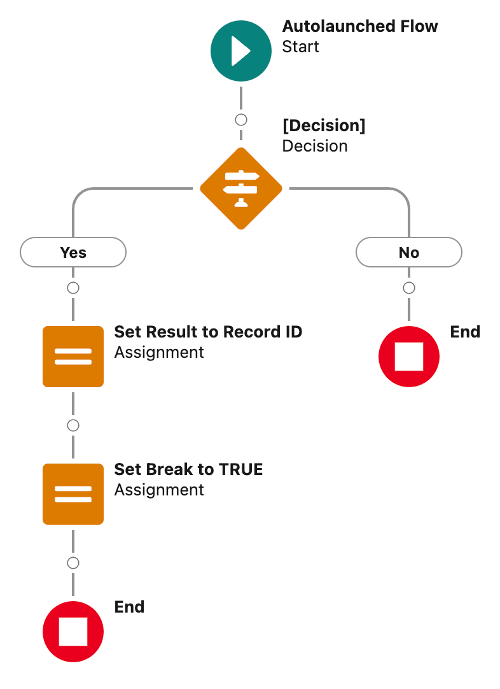 | 
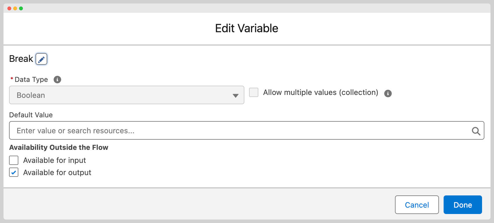 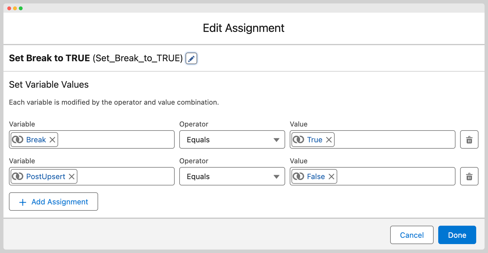
 |

This command is most commonly used during the “Record Match” action when finding the record for the phase. A common example is enabling a developer to select a record and skip any further entries in the phase (as there can be multiple campaigns) and to ensure the “Mapping” action does not run and overwrite the values on the determined record. To see this in action, please take a look at this knowledge base article.

## Continue

| Diagram                                          | Flow                                      | Flow Detail                                                                                                                                  |
| ------------------------------------------------ | ----------------------------------------- | -------------------------------------------------------------------------------------------------------------------------------------------- |
| 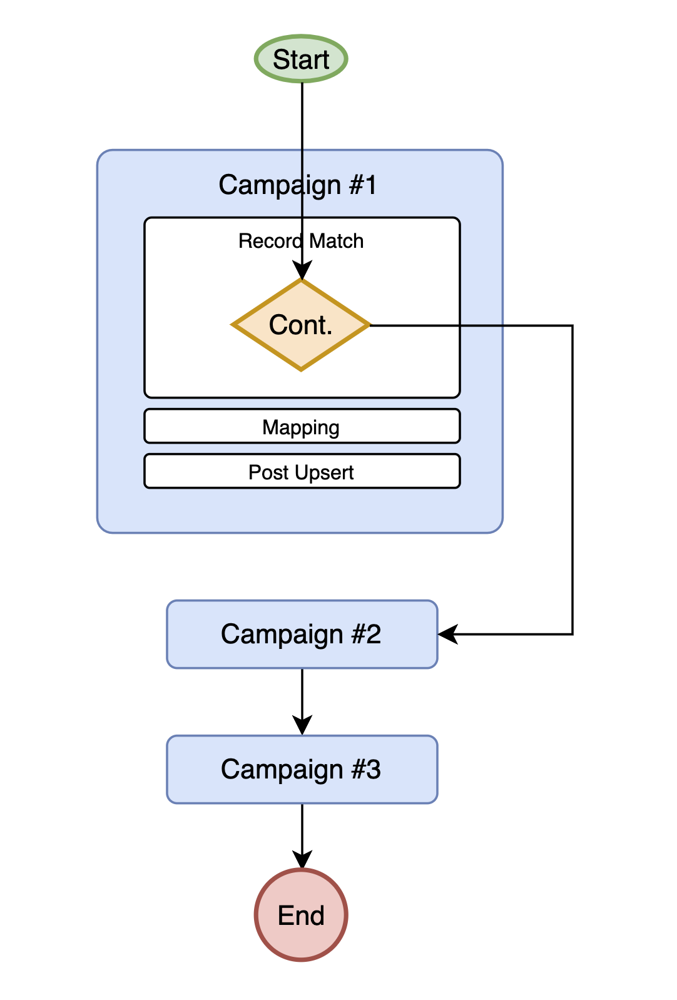 | 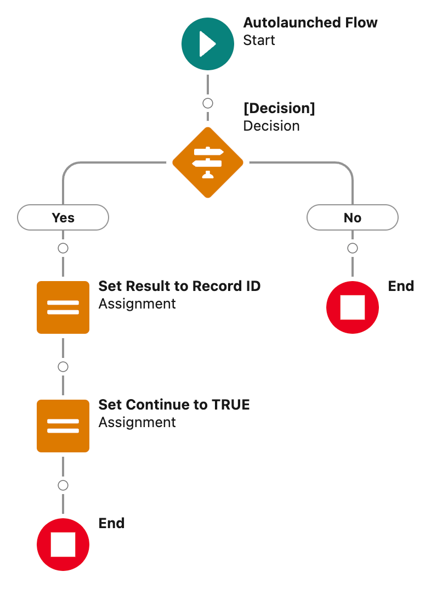 | 
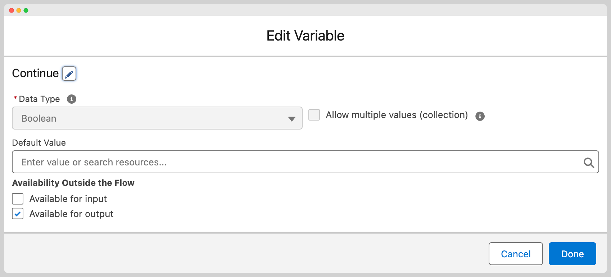  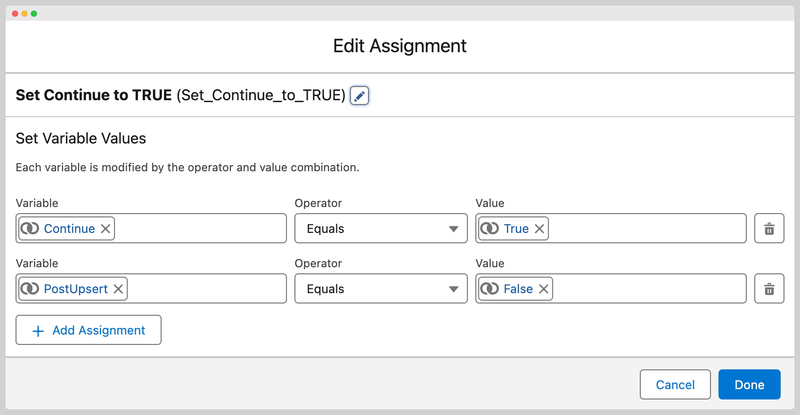
 |

This command is used to direct MoveData to no longer process the existing phase.  A common use for this is when custom logic has been implemented in a campaign record match to override the top level campaign with a different Salesforce Campaign record _but_ you want the child campaigns to still be processed.  By executing a "Continue" on the top level campaign, it is protected it's data being overwritten by the Mapping and following actions.

## PostUpsert


Only applicable when used with Break and Continue commands.


If you wish to use a “Break” or “Continue” command but also want the Post-Upsert action for the phase to run, then create an output-enabled Boolean variable named `PostUpsert` and set it to `true`.
