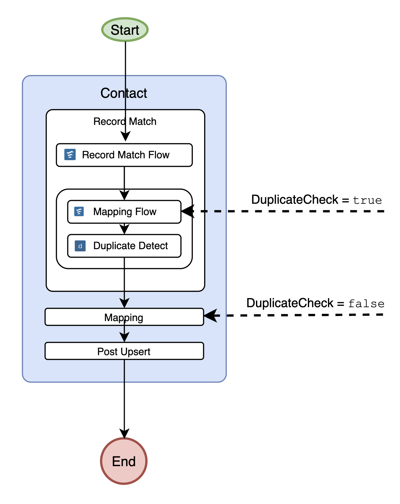
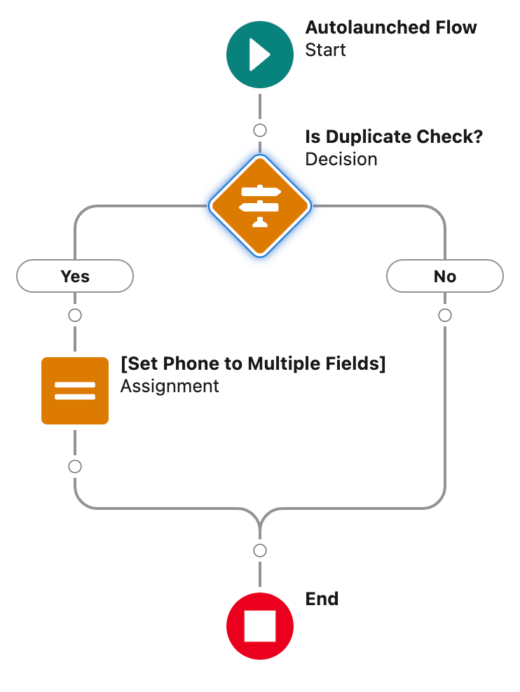
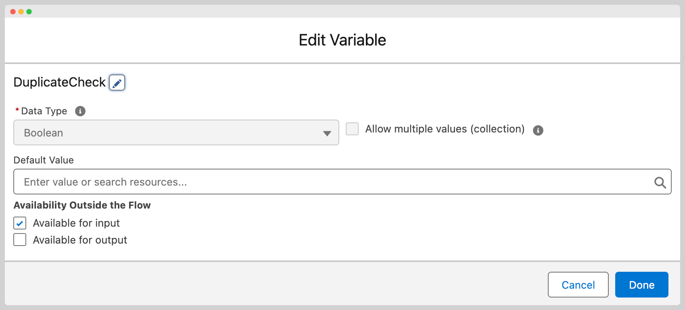
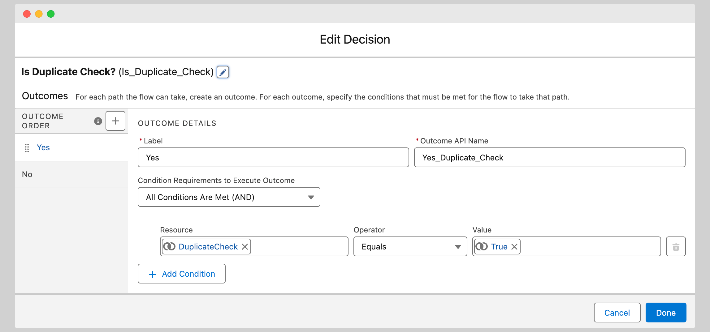
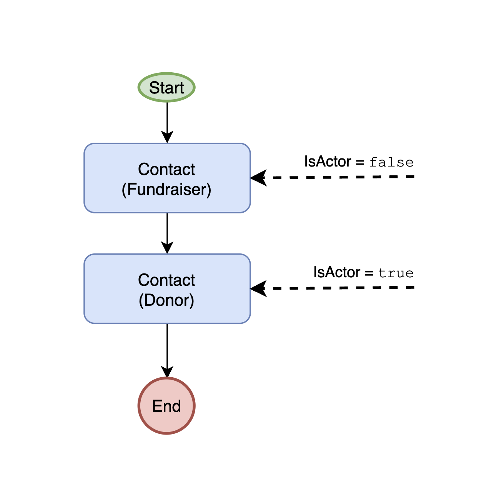
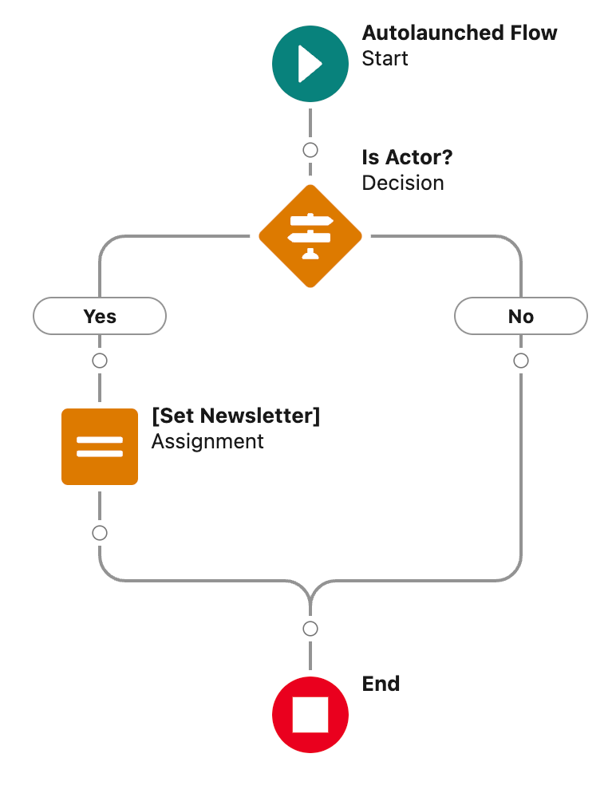
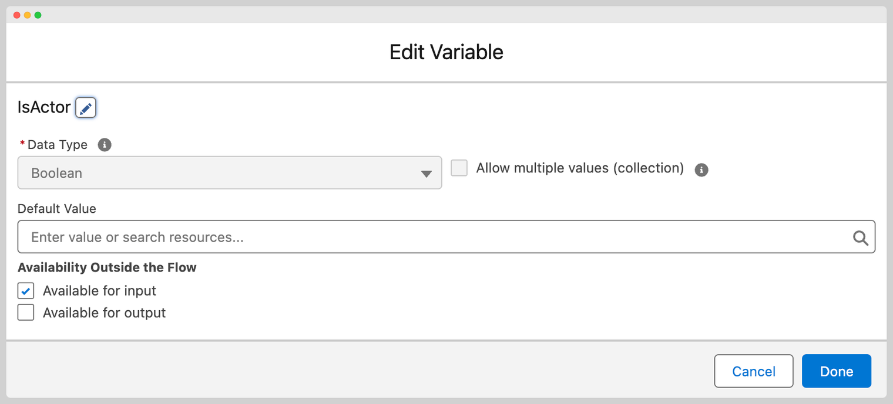
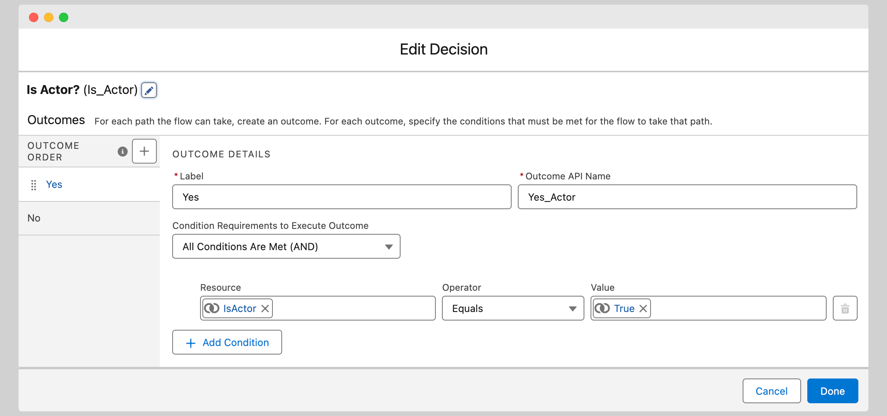

# Flow Variable Reference

A flow context variable is a special variable that has been passed to a flow to inform the workflow of a specific context that is executing.

## DuplicateCheck 

| Diagram                                           | Flow                                         | Flow Detail                                                                                                                                  |
| ------------------------------------------------- | -------------------------------------------- | -------------------------------------------------------------------------------------------------------------------------------------------- |
|  |  | 
  
 |

When the “Record Match” action is executing for a Lead, Contact or Account, MoveData will execute the Salesforce Duplicate Detection Rules. In order for this to run, an in-memory Salesforce Record needs to be created and populated; this is achieved by running the “Mapping” flows as part of the “Record Match” action.

When the mapping flows run, sometimes a developer will want to apply some additional mapping rules in their flow during the “Record Match” or duplicate check. This is often because the rules for Salesforce Duplicate Detection are quite narrow.

A common example is when performing a Salesforce Duplicate Detection on a Contact, writing a phone number to multiple phone fields (such as `Phone` and `Mobile`). This is to ensure a duplicate match if the provided phone number is in either of these fields; however, when persisting the record in Salesforce, the phone number should only be persisted to one of these fields.

## IsActor 

| Diagram                                         | Flow                                     | Flow Detail                                                                                                                          |
| ----------------------------------------------- | ---------------------------------------- | ------------------------------------------------------------------------------------------------------------------------------------ |
|  |  | 
  
 |

There are a number of notification variables that are contextual. For example, when a donation is made, `newsletter` is only relevant to the donor and no other individual in the notification. However, when a fundraiser registration is being processed, the `newsletter` is relevant to the fundraiser campaign's contact.  In summary, when processing a notification, the `IsActor` variable is set to `true` when processing the primary contact / the contact the notification centres around.

