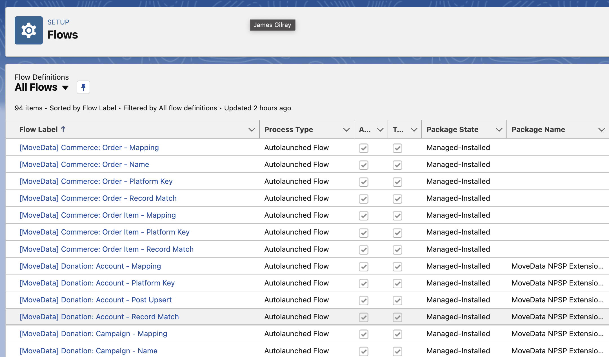

# Pipeline Stage Reference

## Overview

A multi-stage pipeline enables the execution of specific domains using pre-defined phases.  For example, the Donation pipeline has the following phases:  Account, Contact, Campaign, Recurring and Donation stages.  These pipelines handle the administration and complexity associated with each phase, enabling the abstraction of business rules.

Each phase is made up of "stages".  Each stage has a specific set of characteristics so the pipeline can predictably interface with each implementation.  Pipelines typically interface with Salesforce Lightning Flows to enable visible, configurable logic.

## Multi-Stage Pipelines


More about how pipelines can be found at [processing-pipelines.md](../pipelines/processing-pipelines.md "mention").


A pipeline implements a schema.  The Donation pipeline implements the `donation` schema, while the Commerce pipeline implements the `commerce` schema.  These are registered with MoveData in the Schema Mapping metadata.  Once registered, a pipeline will will execute when a notification with the registered schema type arrives.  This will direct the pipeline to execute it's phases; within each phase, it will contain a number of stages that are linked to metadata values or Salesforce Lightning flows.

MoveData provides two multi-stage pipelines out of the box.  These multi-stage pipelines are:

* MoveData Donation Pipeline (`MoveDataDonationPipeline` - handles `donation` schema)
* MoveData Commerce Pipeline (`MoveDataCommercePipeline` - handles `commerce` schema)

### MoveData Extensions

<figure><figcaption></figcaption></figure>

These pipelines are implemented by the following extensions using a series of flows:

* MoveData NPSP Fundraising & Donations Extension (Donation pipeline)
* MoveData Commerce Extension (Commerce pipeline)
* MoveData Non-Profit Cloud Extension (Donation & Commerce pipelines)

## Phase Order

* Disable Phase: Identifies if the stage should run.
* SObject Phase: Determines the SObject type for the `Record`.
* Fieldset Phase: Tells MoveData what fields should be loaded when an existing record is found.
* Platform Key Phase: Constructs a unique key for the stage.
* Record Match Phase: Logic that attempts to match with an existing record.
* Mapping Phase: Maps the stage's data to the SObject `Record`.
* Post-Upsert Phase: Executes logic that runs after the `Record` is created or updated.

## Reference

The following section details each of the possible phases for a stage.  This includes implementation options and input & output parameters of these phases.

### Disable Phase


**Working Example**: [disable-a-phase.md](../development-guides/table-of-contents/disable-a-phase.md "mention")


If you wish to disable a phase completely, you can do that through a metadata entry in the pipeline configuration metadata object (`movedata__MoveData_Pipeline__mdt)`.  Using a metadata pipeline key ending in `_DISABLE` (eg. `PIPELINE_DONATION_RECURRING_DISABLE`), if you create an entry using:

* Label: `PIPELINE_*_*_DISABLE` or similar (see [Broken link](broken-reference "mention"))
* Type: `Config`
* Handler: `true`

### SObject Phase

When working with a phase, you will have a base SObject type.  For example, in the NPSP Fundraising & Donations Extension, a donation will default to `Opportunity` and a contact will default to `Contact`.  The only time you need a metadata entry is if you are changing the default type.

If you wish to change the SObject type, then you can do this one of two ways; via a value in the metadata or as a flow.  Both require a metadata entry with a metadata pipeline key ending in `_SOBJECT` (eg. `PIPELINE_DONATION_CAMPAIGN_SOBJECT`).

When the SObject is changed from its default, the MoveData pipeline will change the name it gives to the record-typed variables.  For example, if a phase has a SObject type of `Campaign` and this is changed to any other value (such as `Event__c)`, reference to this variable will renamed in subsequent stages when it is referenced.  Continuing the example, in the following donation phase, the flow expects an input variable called `CampaignRecord` of type `Campaign`; however, since the data type has changed, this will now be passed in a `CampaignRecordAlt`.  This is to ensure that any existing flows can continue to run without crashing; when a record-typed variable is a different type to what is expected, Salesforce will crash the transaction.

#### Metadata Configuration

If using a static / fixed SObject type in the metadata, you need to create the following metadata entry:

* Label: `PIPELINE_*_*_SOBJECT` or similar (see [Broken link](broken-reference "mention"))
* Handler: SObject Type (including namespace) (eg. `Event__c` or `cs__Subscription__c`)
* Type: `Config`

#### Flow-Based Configuration


Advanced Concept



**Working Example**: Dynamic SObject Type


If you wish to dynamically determine the SObject type and/or would like to dynamically change the handlers for the rest of the phase, you will need to use a Salesforce Lightning Flow. &#x20;

Examples where this might be useful are where donation has multiple campaign entries and it is required that the first campaign uses a custom SObject (like `Event__c`) and the rest use another SObject like `Campaign`.  As part of this solution, you would need to have one set of phase handers as `Record` data type is changing.

If using a dynamic SObject type determined by a flow, you need to create the following metadata entry:

* Label: `PIPELINE_*_*_SOBJECT` or similar (see [Broken link](broken-reference "mention"))
* Handler: Salesforce Lightning Flow - Flow API Name
* Type: `Flow`

**Flow Parameters**

* _Input_
  * All Variables per the executing Phase (click `View Variables` in Execution Log)
* _Output_
  * `Result` (Type: Text, Direction: Output Enabled) - Contains the `SObject` name.
  * `ExecutionMap` (Type: Collection of Text, Direction: Output Enabled) - Contains all the Metadata Phase Keys to be replaced; used as the Key for the flows replacing particular phases.
  * `{Metadata Phase Key}` (Type: Collection of Text, Direction: Output Enabled) - Contains the flows or keys to be used as the handler for phase.

### Platform Key Flow

The purpose of the Platform Key flow is to create a unique key that can be used to retrieve and persist records in Salesforce.  For example, for a contact within a notification with a `key` of `1234` and a `platform` of `paypal`, a Platform Key flow can generate a unique key such as `paypal:1234` and ensure uniqueness across all integrated platforms.

Implementing your own Platform Key logic can be important if you are already persisting a key for existing data and want MoveData to use this format to retrieve and persist records. The `Result` is available in all flows that run after the Platform Key flow with the variable name `PlatformKey`.

To register a platform key generator, you need to create the following metadata entry:

* Label: `PIPELINE_*_*_PLATFORM_KEY` or similar (see [Broken link](broken-reference "mention"))
* Handler: Salesforce Lightning Flow - Flow API Name
* Type: `Flow`

**Flow Parameters**

* _Input_
  * All Variables per the executing Phase (click `View Variables` in Execution Log)
* _Output_
  * `Result` (Type: Text, Direction: Output Enabled) - generated Platform Key
* _Lifetime Variable_
  * `PlatformKey` (Type: Text) - generated Platform Key
    * Available in all subsequent stages of the phase.

### Record Match Flow

The Record Match flow is used to see if a record already exists. Generally, it will simply take the `PlatformKey` that has been generated and check to see if a record exists. If a record is found, the Salesforce Record Id must be returned as the `Result`; otherwise, the `Result` needs to be `null`.  &#x20;

If an organisation has specific needs such as mapping to a specific campaign when a donation belongs to a recurring donation, then this is where you would write an extension to achieve this.

You can register multiple flows for the stage.  You may wish to implement specific match logic but fall back a registered MoveData flow if no match is found.

To register a record match flow, you need to create the following metadata entry:

* Label: `PIPELINE_*_*_PLATFORM_KEY` or similar (see [Broken link](broken-reference "mention"))
* Handler: Salesforce Lightning Flow - Flow API Name
* Type: `Flow`
* Sort Order: (A number - lower values with run first)

**Flow Parameters**

* _Input_
  * All Variables per the executing Phase (click `View Variables` in Execution Log)
* _Output_
  * `Result` (Type: Text, Direction: Output Enabled) - generated Platform Key
* _Lifetime Variable_
  * `PlatformKey` (Type: Text) - generated Platform Key
    * Available in all subsequent stages of the phase.

### Mapping Flow

This is where the majority of business logic resides.

TODO: Finish Mapping Flow text

MoveData passes a `Record` variable as an input / output SObject Record variable to facilitate the setting of data using Salesforce Lightning Flows. This is where basic to complex business rules will often reside. For example, if a donation has a value greater than $500, mark the Contact as high value donor.

TODO: Finish Mapping Flow config

TODO: Finish Mapping Flow parameters

### Post Upsert Flow

TODO: Finish Post Upsert Flow text

Once MoveData has created or updated the record (known as an `upsert`), a flow can run to perform actions that can only take place once the record has been created. Often this is the setting of relationships such as creating a campaign member for a contact or linking an opportunity to a custom record.

TODO: Finish Post Upsert Flow config

TODO: Finish Post Upsert Flow parameters
