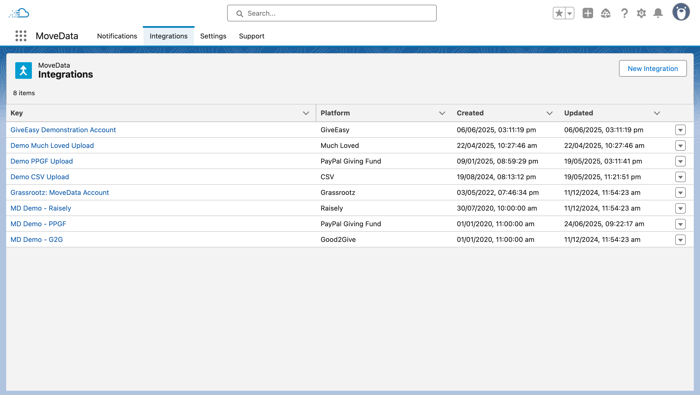
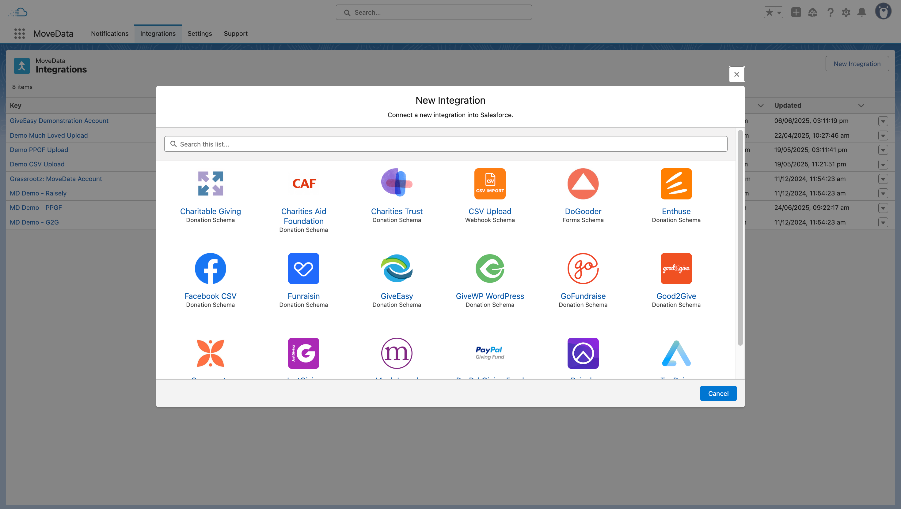
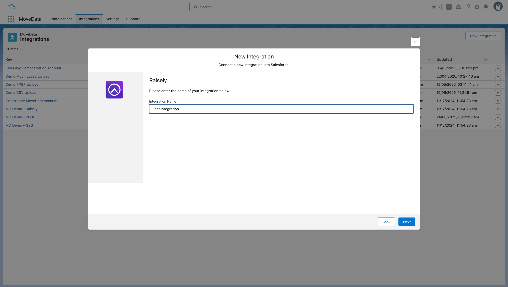
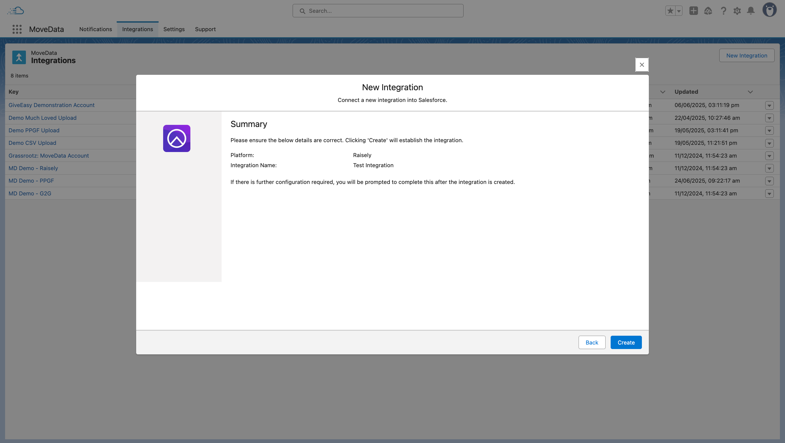

# Integrations

### Understanding MoveData Integrations

MoveData integrations are the connections between your fundraising platforms and Salesforce, enabling data synchronisation. The Integrations interface provides comprehensive management capabilities for setting up and maintaining these critical data connections that power your organisation's fundraising operations.

**What Are Integrations?**

An integration represents a configured connection between MoveData and a specific fundraising platform or data source. Each integration defines how data flows from external systems into your Salesforce org, including:

* **Platform connectivity** via APIs, webhooks, or file uploads
* **Authentication credentials** for secure data access
* **Data transformation rules** specific to each platform
* **Processing schedules** for polling-based integrations

### Accessing Integrations

**Navigation**

1. **Open MoveData**: From your Salesforce org, navigate to the App Launcher and select "MoveData"
2. **Access Integrations**: Click on the "Integrations" tab within the MoveData Lightning application
3. **View All Integrations**: The interface opens to display your complete list of configured integrations

### Integrations List View

<figure><figcaption></figcaption></figure>

The Integrations interface displays a comprehensive overview of all your configured integrations, providing quick access to connection status, platform types, and management options.

**List View Header**

* **Total Count**: Shows the number of configured integrations (e.g., "8 items")
* **New Integration Button**: Located in the top right for creating new platform connections
* **Search Functionality**: Available for finding specific integrations by name or platform

**Integration Columns**

The list view displays the following key information for each integration:

* **Key**: Unique integration identifier with clickable link to detailed configuration
* **Platform**: Source platform type (Raisely, GiveEasy, PayPal Giving Fund, etc.)
* **Created**: Date and time when the integration was first established
* **Updated**: Date and time of the most recent configuration change

Your integrations list will show various platform types, each with specific capabilities.  To learn more about a specific platform, navigate to the [Integrations](integrations.md) section of this guide.

**Context Menu Actions**

Each integration row includes an action menu (accessed via the dropdown arrow) with the following options:

**Upload File**: Only enabled for file-based integrations; allows you to manually upload data files for immediate processing.

### New Integration Wizard

The "New Integration" button launches a comprehensive wizard that guides you through establishing connections with supported fundraising platforms.

#### New Integration Wizard

<figure><figcaption></figcaption></figure>

**Step 1: Platform Selection**

The wizard opens with a platform selection screen displaying all available integration options.

**Platform Selection Process**

1. **Browse Available Platforms**: Scroll through the visual grid of platform logos and names
2. **Search Functionality**: Use the search bar to quickly locate specific platforms
3. **Platform Information**: Each tile shows the platform name and integration type
4. **Selection**: Click on your desired platform to proceed to configuration

**Step 2: Integration Name Assignment**

<figure><figcaption></figcaption></figure>

The wizard requires you to assign a meaningful name to your integration:

**Naming Guidelines**

* **Descriptive Names**: Use names that clearly identify the purpose (e.g., "Annual Appeal Campaign", "Monthly Donor Integration")
* **Environment Indicators**: Include environment information if managing multiple instances (e.g., "Raisely Production", "Raisely Testing")

**Step 3: Integration Summary**

<figure><figcaption></figcaption></figure>

Review the integration and click "Create" to create the integration.  The wizard will navigate to the Integration Detail View. &#x20;

If further information is required, a second wizard will appear with platform-specific configuration options.
