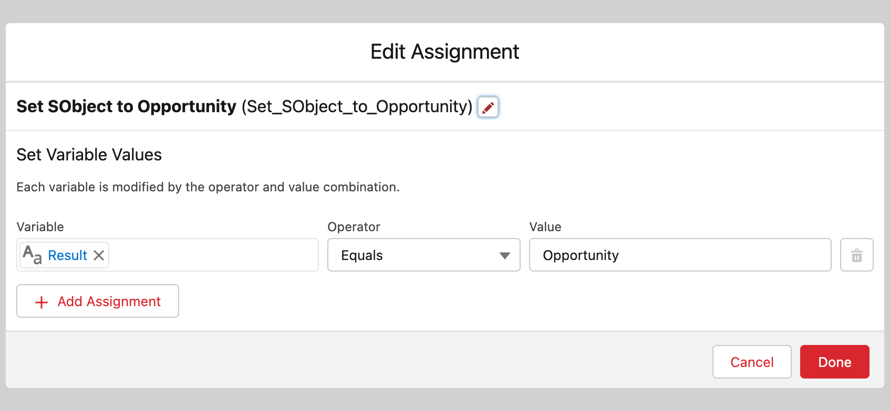

# Change the SObject Type within a Phase


Metadata

* category=Technical
* subtitle=How to change the SObject type within a phase
* integration=all
* tags=sobject,type,phase,advanced


This article details how to configure MoveData to use a different SObject type instead of the MoveData Extension defaults. In this example we will focus on the `Campaign` phase but note that the below logic is compatible in all phases of the execution. This article will also describe how to use a combination of SObjects for different types of Campaign records.

### Overview 

MoveData creates a hierarchical set of campaign records depending on the data contained within a notification:

* Campaign
  * Team
    * Fundraiser

Whilst this standard configuration works for the majority of customers, occasionally an organisation may have different requirements as to how they structure their campaign data.

In this example we will be using the Opportunity record for the fundraiser campaigns.

| **Default**               | **Required**              |
| ------------------------- | ------------------------- |
| \[Insert] Draw.io Example | \[Insert] Draw.io Example |

### Implementation 

#### Creating an SObject Flow 

Create a new flow (from `Setup → Process Automation → Flows`) of type `Autolaunched Flow (No Trigger)`.

In this example, the first check is to evaluate the `Type` of campaign being executed. We perform an evaluation for the input-enabled Text variable named `Type`:

<figure><figcaption>
Evaluate Type Flow Action
</figcaption></figure>

If `Type` equals `fundraiser` then MoveData will override the SObject and associated metadata entries. If not, the NPSP extension flows will continue to execute per their default behaviour.

<figure><figcaption>
SObject Flow Diagram Example
</figcaption></figure>

When setting an alternative SObject type, there are two distinct actions you need implement in your flow: setting the SObject Type and remapping the flow metadata to be used for the rest of the execution. The reason the flow must the remap flow metadata is because the the existing flows are expecting a `Record` of type `Campaign`. If the wrong SObject type is sent to these existing flows, there will be a critical error and the processing will fail.

#### Setting the SObject Type 

<figure><figcaption>
Set SObject Flow Action
</figcaption></figure>

This step sets the output-enabled Text variable `Result` to `Opportunity`. The value that must be used is the API name of the SObject. If you are using a custom object, this will look like `Fundraiser__c`. If the custom object belongs to a namespace, it will look like `npsp__Fundraiser__c`.

#### Dynamically Remapping the MoveData Metadata 

<figure><figcaption>
Remapping Key Flow Action
</figcaption></figure>

MoveData is directed by Pipeline Metadata Entries; these tell the engine when to execute specific Pipeline Metadata flows. For this example, we have installed the MoveData NPSP Extensions which adds a suite of metadata entries to execute its flows. When we have a campaign `Type` of `fundraiser`, we have determined we want to work with an `Opportunity` record. This means we will need to dynamically set alternative metadata that works with the `Opportunity` object.

To do this, we need to create an output-enabled Text collection variable named `ExecutionMap` that will contain all the replacement metadata keys. The keys we replace can be found in the appropriate extension documentation; the Fundraising & Donation extension documentation ([link](https://intercom.help/movedata/en/collections/9038154)).

Each value used in the Remap must also be configured as an output-enabled Text collection variable. In this example, we have six variables we have created with the following names:

* `PIPELINE_DONATION_CAMPAIGN_FIELDSET`
* `PIPELINE_DONATION_CAMPAIGN_PLATFORM_KEY`
* `PIPELINE_DONATION_CAMPAIGN_DUPLICATE`
* `PIPELINE_DONATION_CAMPAIGN_NAME`
* `PIPELINE_DONATION_CAMPAIGN_MAPPING`
* `PIPELINE_DONATION_CAMPAIGN_POST`

The below table details the settings for each one of these metadata entries. Please note that you will have to create the fieldset and flows that contain the new logic and the values below are for reference only.

**Campaign Fieldset Metadata Replacement**

<figure><figcaption></figcaption></figure>

* Variable: `PIPELINE_DONATION_CAMPAIGN_FIELDSET`
  * Output-Enabled Text Collection
* Action: Add the API name of the Fieldset from the Opportunity object
* Behaviour: Contains the fields required by the new flows

**Campaign Platform Key Metadata Replacement**

<figure><figcaption></figcaption></figure>

* Variable: `PIPELINE_DONATION_CAMPAIGN_PLATFORM_KEY`
  * Output-Enabled Text Collection
* Action: Add the API name of the opportunity Platform Key flow
* Behaviour: Return the unique identifier for the record

**Campaign Record Match Metadata Replacement**

<figure><figcaption></figcaption></figure>

* Variable: `PIPELINE_DONATION_CAMPAIGN_PLATFORM_KEY`
  * Output-Enabled Text Collection
* Action: Add the API name of the opportunity Record Match flow
* Behaviour: Return the Salesforce ID for any matched record

**Campaign Name Metadata Replacement**

<figure><figcaption></figcaption></figure>

* Variable: `PIPELINE_DONATION_CAMPAIGN_NAME`
  * Output-Enabled Text Collection
* Action: Add the API name of the opportunity Name flow
* Behaviour: Return the name to be used by mapping & post flow

**Campaign Mapping Metadata Replacement**

<figure><figcaption></figcaption></figure>

* Variable: `PIPELINE_DONATION_CAMPAIGN_MAPPING`
  * Output-Enabled Text Collection
* Action: Add the API name of the opportunity Mapping flow
* Behaviour: Return the record to be created / updated with data mapped

**Campaign Post Upsert Metadata Replacement**

<figure><figcaption></figcaption></figure>

* Variable: `PIPELINE_DONATION_CAMPAIGN_POST`
  * Output-Enabled Text Collection
* Action: Add the API name of the opportunity post-upsert flow
* Behaviour: Perform any post-upsert actions

If a metadata entry needs to be removed but not replaced with another flow, this can be done by leaving the value field empty when adding a value to the appropriate text collection.

We have now created the appropriate configuration for replacing the `fundraiser` campaign records with an Opportunity record and, in this scenario, will dynamically direct MoveData to execute an alternative set of metadata entries.

### Registering the SObject Flow 


**Related Article**

For information on how MoveData handles the registration of flows, please see:

* \[Insert] How MoveData Handles Registration of Flows


We need to register our new SObject flow for the Campaign phase. This is done by creating a new entry in the MoveData Pipeline metadata settings with following details:

<figure><figcaption>
Campaign Phase SObject Registration Example
</figcaption></figure>

* `Label` is an explicit key used by MoveData to located the registered entry, and in this case, it will be `PIPELINE_DONATION_CAMPAIGN_SOBJECT`
* `MoveData Pipeline Setting Name` is not consumed by MoveData and as such can be anything you like
* Set `Handler` is the API Name of your Flow
* `Sort Order` is not important unless there are multiple flows trying to reset the SObject type and can have any numerical value (default MoveData flows use a sort order of 5)
* Set `Type` to `Flow`

### Outcome 

Below is an example of a before and after for the created Flow.

**Before SObject Type Change**

<figure><figcaption></figcaption></figure>

**After SObject Type Change**

<figure><figcaption></figcaption></figure>

From the execution log, we can see the SObject types for each of the campaign entries:

* Campaign

<figure><figcaption></figcaption></figure>

<figure><figcaption></figcaption></figure>
