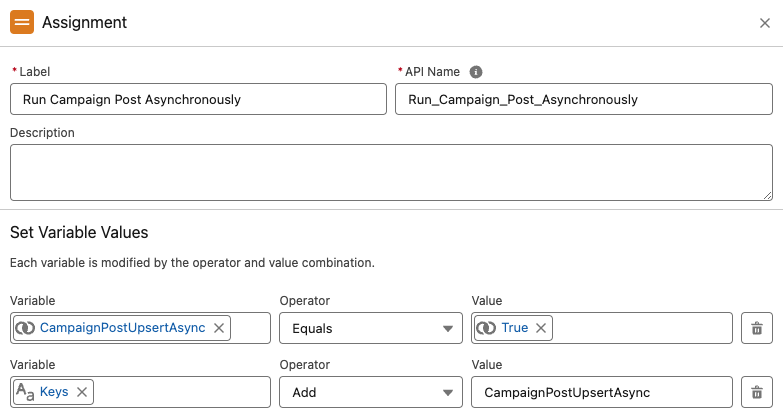
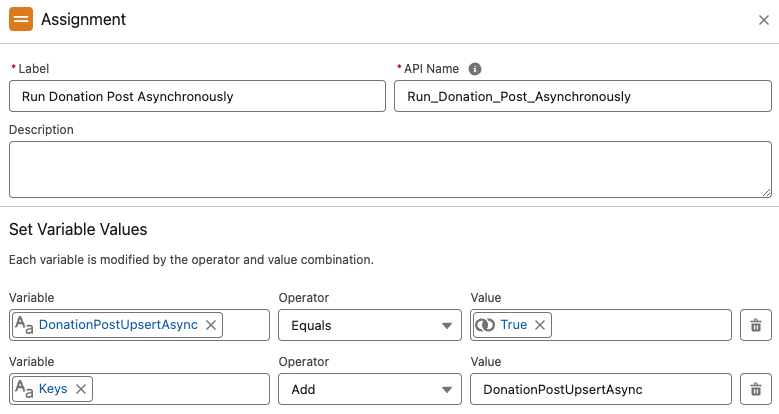
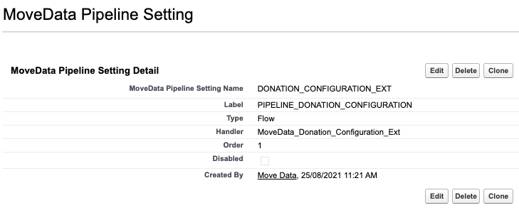

# Run Campaign Post and Donation Post Asynchronously


Metadata

* category=technical
* tags=sync,limits


### Context 

In certain scenarios you may want to run Campaign and/or Donation Post Flows asynchronously. Doing so moves these Flows (and associated Extension Flows) out of the MoveData execution and into their own separate thread, which can provide SOQL relief in the form of:

* MoveData Campaign Post and Donation Post Flows are not subject to the SOQL limits of the core transaction
* Non-MoveData triggers which run against records created or updated by these flows are not subject to the SOQL limits of the core transaction

In a practical sense, this can provide SOQL relief where your processes are creating or updating records on the basis of Campaign, Campaign Member, or Opportunity records being created or updated.


Related Article: [Too many SOQL queries: 101](too-many-soql-queries-101.md)


### Disadvantages 

We advise implementing asynchronous only when strictly necessary. This is because:

* **Asynchronous errors are unsupported by MoveData**\
  Because triggers which fire on create / update are moved out of the MoveData execution, MoveData will not receive an error should one of these processes fail. This means your desired functions may not complete due to said error, and MoveData will not be able to alert you to this.\
  ​
* **Log information unavailable in MoveData Notification**\
  For the same reason, you are unable to report on the outcome of asynchronous processes via the MoveData Execution Logs, which can make debugging and troubleshooting more difficult\
  ​
* **No Dependencies**\
  For the same reason, a subsequent MoveData Flow cannot depend on a change which is made in the Flow which has been set to Asynchronous, for that change will not have been made during the MoveData execution

### Implementation 

#### Create Configuration Flow 

* Create a new Autolaunched Flow
* We will use a Flow Label of `[MoveData-Extension] Donation: Configuration` and Flow API Name of `MoveData_Donation_Configuration_Ext`

#### Configure Configuration Flow 

* From the Toolbox, create the following resources:

| API Name                           | `Keys` |
| ---------------------------------- | ------ |
| Data Type                          | Text   |
| Allow multiple values (collection) | True   |
| Available for input                | False  |
| Available for output               | True   |

| API Name                           | `CampaignPostUpsertAsync` |
| ---------------------------------- | ------------------------- |
| Data Type                          | Boolean                   |
| Allow multiple values (collection) | False                     |
| Available for input                | False                     |
| Available for output               | True                      |

| API Name                           | `DonationPostUpsertAsync` |
| ---------------------------------- | ------------------------- |
| Data Type                          | Boolean                   |
| Allow multiple values (collection) | False                     |
| Available for input                | False                     |
| Available for output               | True                      |

#### Campaigns

* If you wish to set Campaign Post to asynchronous, perform the following assignment then save & activate your flow.

<figure><figcaption></figcaption></figure>

#### Donations

* If you wish to set Donation Post to asynchronous, perform the following assignment then save & activate your flow.

<figure><figcaption></figcaption></figure>

### Register Configuration Flow in MetaData

* Open the MoveData Pipeline Setting from Setup → Custom Metadata Types and click "Manage Records"
* Click "New" to add a new entry
* Register your Configuration Flow by adding the following information:

| MoveData Pipeline Setting Name | DONATION\_CONFIGURATION\_EXT           |
| ------------------------------ | -------------------------------------- |
| Label                          | PIPELINE\_DONATION\_CONFIGURATION      |
| Type                           | Flow                                   |
| Handler                        | MoveData\_Donation\_Configuration\_Ext |
| Order                          | 1                                      |
| Disabled                       | False                                  |

<figure><figcaption></figcaption></figure>

### Review 

Your Campaign and Donation Post Flows will now run asynchronously. You can now reprocess a failed notification to observe if doing so has bypassed your SOQL issue.
